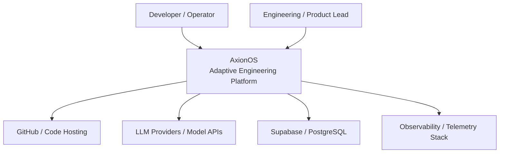

<p align="center">
  <h1 align="center">AxionOS</h1>
  <p align="center"><strong>Governed Autonomous Product Creation</strong></p>
  <p align="center">
    Submit an idea → receive a validated, deployable repository.<br/>
    Architecture, code, validation, repair, and delivery — autonomously.
  </p>
</p>

---

## What is AxionOS?

AxionOS is a **governed Operating System for Autonomous Product Creation** that transforms ideas into governed, validated repositories and live deployments — while improving its own ability to do so over time through evidence, learning, and adaptive coordination.

AxionOS creates a new category: **Governed Autonomous Product Creation**. It is not merely a workflow engine or AI code generator. Operations build institutional memory.

You describe what you want to build. AxionOS executes the full engineering pipeline:

| Phase | What Happens |
|-------|-------------|
| **Idea** | Capture and structure the idea with AI-generated blueprint |
| **Discovery** | Market analysis, opportunity validation, revenue strategy, PRD |
| **Architecture** | System design, simulation, preventive validation, scaffold |
| **Engineering** | Domain modeling, code generation (DB, API, UI), agent swarm execution |
| **Deploy** | Fix Loop → Deep Static → Runtime Validation → Build Repair → Publish |

Everything runs inside a **32-stage deterministic pipeline** with full cost tracking and observability.

---

## Value Thesis & Strategic Moat

In AxionOS, execution is not terminal. The core sequence is:
`Execution → Evidence → Structured Learning → Governed Canon → Reusable Guidance → Better Execution`

The system's moat emerges from accumulated runtime evidence, canonized learning, adaptive coordination logic, operational memory, and institutional governance. These assets compound with every governed execution and cannot be replicated without equivalent history and runtime.

**Core Invariants:**
- Advisory-first outputs (recommendations over autonomous mutations)
- Governance before autonomy
- Tenant isolation
- Bounded adaptation and rollback everywhere

---

## Maturity & Roadmap

**Current Mode:** Level 10+ — Adaptive Operational Organism / 147 Sprints Complete

| Level | Name | Status |
|-------|------|--------|
| Level 1-3 | Code Generator to Autonomous Engineering | Complete |
| Level 4-5 | Self-Learning Factory & M-Aware Platform | Operational (needs data) |
| Level 6-10 | Sovereign, Strategic & Autonomous OS | Complete (Sprints 1-147) |

**Operational Maturity Phases:**

| Phase | Status |
|-------|--------|
| Phase 1-5 | UI, Navigation, Metrics, Readiness, Canon — Complete |
| Phase 6 | AgentOS Decision Contract — Partial |
| Phase 7 | Action Engine — Planned (next) |
| Phase 8-10 | Governance Flow, Self-Healing, Learning Loop — Planned |

**Roadmap History (Completed Blocks):**
- **Foundation - M:** Pipeline, Extensibility, Product Experience (Sprints 1-70)
- **N - R:** Evidence-Governed Improvement, Multi-Agent Swarms, Delivery Optimization, Distributed Runtime (Sprints 72-90)
- **S - Y:** Architecture Research, Governed Intelligence OS, Sovereign Intelligence, Reflexive Governance, Canon Governance (Sprints 91-118)
- **Z - AD:** Runtime Sovereignty, Runtime Proof, Learning Canonization, Adaptive Coordination, Adaptive Operational Organism (Sprints 119-147)

*(For deep architectural breakdown, see `docs/ARCHITECTURE.md`)*

---

## Core Capabilities

- **Project Brain:** Persistent knowledge graph storing architecture, errors, and patterns.
- **AI Efficiency Layer:** Prompt compression (60-90% reduction), semantic cache, and model routing.
- **Self-Healing Pipeline:** Runtime validation (tsc + vite builds) that triggers automated fix swarms on CI failure.
- **Error Pattern & Predictive Intelligence:** Generates prevention rule candidates from error patterns and routes repair strategies predictively.
- **Agent Swarm:** Specialized agents running in parallel waves using DAG-based topological scheduling.
- **Governed Execution:** Operations rely on stage gates, SLA enforcement, and approval workflows.
- **Multi-Agent Coordination:** Role arbitration, debate & resolution, shared working memory.
- **Delivery Optimization & Distributed Runtime:** Reliable post-deploy learning, tenant-isolated scale runtime, and cross-region resilience.

---

## System Architecture

AxionOS runs atop Supabase Edge Functions in a Deno runtime. Each of the 32 pipeline stages is deployed independently. The platform comprises 200+ Edge Functions and 100+ architectural layers.

**Operational Decision Chain:**

```
Canon / Library → Readiness / Metrics → Policy / Governance → Action Engine → AgentOS → Executor
```

> Canon informs. Readiness evaluates. Policy constrains. Action Engine formalizes. AgentOS orchestrates. Executors act.



> **Full Architecture & Agents Guide:**
> - [**Architecture & Ledger**](docs/ARCHITECTURE.md): System architecture, operational decision chain, C4 diagrams, and sprint ledger.
> - [**Governance & Agents**](docs/GOVERNANCE.md): Agent Operating System, pipeline contracts, safety boundaries.

---

## For Whom

- **Indie Hackers** — launch MVPs in hours
- **Technical Founders** — validate ideas rapidly
- **Micro SaaS Creators** — build and iterate fast
- **Early-Stage Teams** — multiply engineering capacity

---

## Technology Stack

- **Frontend**: Vite + React 18 + TypeScript + Tailwind CSS + shadcn/ui
- **State**: TanStack React Query + React Context
- **Backend**: Supabase (PostgreSQL, Auth, Edge Functions, RLS)
- **AI Engine**: Lovable AI Gateway (Gemini 2.5 Flash/Pro) or OpenAI (gpt-4o-mini)
- **Deploy**: Vercel/Netlify auto-generated configs

---

## License
MIT License

---

## Manifesto

> The traditional software development model was built for large teams.
> But the new generation of builders **works alone**.
>
> AxionOS was built for that reality.
>
> **So that a single builder can operate with the power of an entire engineering team.**


