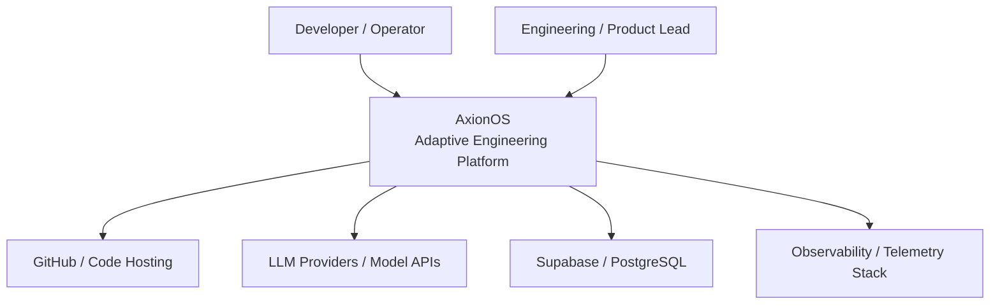
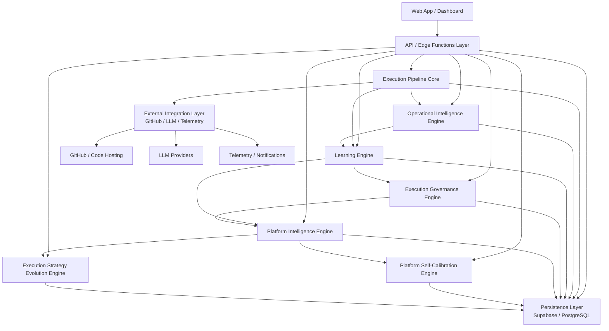

<p align="center">
  <h1 align="center">AxionOS</h1>
  <p align="center"><strong>Autonomous Software Engineering Platform</strong></p>
  <p align="center">
    Submit an idea → receive a validated, deployable repository.<br/>
    Architecture, code, validation, repair, and delivery — autonomously.
  </p>
</p>

---

## What is AxionOS?

AxionOS is a **governed Operating System for Autonomous Product Creation** that transforms ideas into governed, validated repositories and live deployments — while improving its own ability to do so over time through evidence, learning, and adaptive coordination.

You describe what you want to build. AxionOS executes the full engineering pipeline:

| Phase | What Happens |
|-------|-------------|
| **Idea** | Capture and structure the idea with AI-generated blueprint |
| **Discovery** | Market analysis, opportunity validation, revenue strategy, PRD |
| **Architecture** | System design, simulation, preventive validation, scaffold |
| **Engineering** | Domain modeling, code generation (DB, API, UI), agent swarm execution |
| **Deploy** | Fix Loop → Deep Static → Runtime Validation → Build Repair → Publish |

Everything runs inside a **32-stage deterministic pipeline** with full cost tracking and observability.

---

## System Maturity

| Level | Name | Status |
|-------|------|--------|
| Level 1 | Code Generator | ✅ Complete |
| Level 2 | Software Builder | ✅ Complete |
| Level 3 | Autonomous Engineering System | ✅ Complete |
| Level 4 | Self-Learning Software Factory | 🔄 Operational (requires historical data to reach full potential) |
| Level 4.5 | Meta-Aware Engineering Platform | 🔄 Operational (requires historical data to reach full potential) |
| Level 5 | Institutional Engineering Memory | 🔄 Active (memory accumulates over time with usage) |

> ⚠️ Levels 4–5 capabilities are implemented but reach full effectiveness as the system accumulates production data over time.

---

## Roadmap

| Scope | Sprints | Status |
|-------|---------|--------|
| Foundation through Product Experience | 1–70 | ✅ Complete |
| Governed Extensibility (Bridge Sprint) | 71 | ✅ Complete |
| Evidence-Governed Improvement Loop (Block N) | 72–74 | ✅ Complete |
| Advanced Multi-Agent Coordination (Block O) | 75–78 | ✅ Complete |
| Governed Capability Ecosystem (Block P) | 79–82 | ✅ Complete |
| Delivery Optimization (Block Q) | 83–86 | ✅ Complete |
| Distributed Runtime (Block R) | 87–90 | ✅ Complete |
| Research Sandbox (Block S) | 91–94 | ✅ Complete |
| Runtime Sovereignty (Block Z) | 119–122 | ✅ Complete |
| Runtime Proof & Adaptive Governance (Block AA) | 123–126 | ✅ Complete |

> Full roadmap: [ROADMAP.md](docs/ROADMAP.md) · Value thesis: [VALUE_THESIS.md](docs/VALUE_THESIS.md) · Sprint ledger: [PLAN.md](docs/PLAN.md)

> **Canon Note:** Public documentation reflects the stable public architecture line through Sprint 138. Internal roadmap and experimental canon may be ahead of this baseline.

---

## Core Capabilities

### Project Brain
Persistent knowledge graph that stores architecture decisions, errors, patterns, and learned rules. Every agent prompt is enriched with relevant context.

### AI Efficiency Layer
Prompt compression (60-90% token reduction), semantic cache, and intelligent model routing. Makes pipeline execution economically viable.

### Self-Healing Pipeline
Runtime validation via real tsc + vite builds. When errors are detected, a fix swarm analyzes logs, generates patches, and submits corrections automatically. Every repair attempt is recorded as structured evidence.

> **Note:** The fix swarm is triggered automatically on CI failure, but human review is recommended for complex repair attempts.

### Error Pattern Intelligence
Repair evidence is aggregated into recurring patterns with strategy effectiveness tracking. The system identifies which repair strategies work best per error category and generates prevention rule candidates.

### Preventive Engineering
Known failure patterns are converted into active prevention rules that block or warn before code generation, reducing pipeline failures proactively.

### Adaptive Repair Routing
Repair strategies are selected based on historical success rates, pattern similarity, and stage context — not just static mapping. Every routing decision is persisted for auditability.

### Learning Foundation
Structured learning records aggregate signals from repair evidence, prevention events, routing decisions, and stage executions. This substrate prepares future prompt optimization and self-improving agents.

### Agent Swarm
Specialized agents execute tasks in parallel waves using DAG-based topological scheduling (6 concurrent workers).

### Product-Level Observability
Full initiative lifecycle metrics: pipeline/build/deploy success rates, time from idea to repo/deploy, cost per initiative, repair success rates, and outcome tracking.

### Governed Execution
Stage gates, SLA enforcement, approval workflows, and complete audit logging. Every action is traceable and bounded.

### Evidence-Governed Improvement
Operational evidence is captured, distilled into improvement candidates, benchmarked in sandbox conditions, and promoted through human-governed decisions.

### Multi-Agent Coordination
Role arbitration, structured debate & resolution, shared working memory, task-state negotiation, and bounded swarm execution for complex initiatives.

### Governed Capability Ecosystem
Capability packaging, trust/entitlements, partner marketplace, and outcome-aware capability exchange — all governed and reversible.

### Delivery Optimization
Delivery outcome causality analysis, post-deploy learning, reliability-aware tuning, and outcome assurance 2.0 for higher-confidence software delivery.

### Distributed Runtime
Distributed job control plane, cross-region resilience, tenant-isolated scale runtime, and resilient large-scale orchestration.

### Architecture Research
Hypothesis generation, simulated evolution campaigns, cross-tenant pattern synthesis, and human-governed architecture promotion.

---

## System Architecture

### C4 Context



### C4 Containers



> Full C4 component diagrams available in [Architecture docs](docs/ARCHITECTURE.md) and [PlantUML sources](docs/diagrams/).

---

## How It Works

```
  Idea → Discovery → Architecture → Engineering → Deploy
    │         │            │              │           │
    │         │            │              │           └─ Validated, published repository
    │         │            │              └─ All code generated and tested
    │         │            └─ Complete technical plan with simulation
    │         └─ Validated opportunity with market strategy
    └─ User's raw idea captured
```

1. **Describe your idea** — what you want to build
2. **AxionOS runs the full pipeline automatically** — each phase chains into the next
3. **Result:** A governed, validated, deployable Git repository

---

## For Whom

- **Indie Hackers** — launch MVPs in hours
- **Technical Founders** — validate ideas rapidly
- **Micro SaaS Creators** — build and iterate fast
- **Early-Stage Teams** — multiply engineering capacity

---

## Documentation

| Document | Description |
|----------|-------------|
| [Pipeline Contracts](docs/PIPELINE_CONTRACTS.md) | Product contracts per phase: inputs, outputs, success criteria, user actions |
| [Architecture](docs/ARCHITECTURE.md) | System architecture, 32-stage pipeline, tech stack |
| [Agent OS](docs/AGENTS.md) | Agent Operating System: 14 modules, 5 planes, contracts |
| [Roadmap](docs/ROADMAP.md) | Implementation priorities and evolution plan |
| [Execution Plan](docs/PLAN.md) | Current sprint priorities and success metrics |

---

## Technology Stack

| Layer | Technology |
|-------|-----------|
| Frontend | Vite + React 18 + TypeScript + Tailwind CSS + shadcn/ui |
| State | TanStack React Query + React Context |
| Backend | Supabase (PostgreSQL, Auth, Edge Functions, RLS) |
| AI Engine | Lovable AI Gateway (Gemini 2.5 Flash/Pro) + Efficiency Layer |
| Git | GitHub API v3 (Tree API for atomic commits) |
| Deploy | Vercel/Netlify auto-generated configs |

---

## Contributing

Contributions are welcome:

- Open an **issue**
- Propose **improvements**
- Submit **pull requests**

---

## License

MIT License

---

## Manifesto

> The traditional software development model was built for large teams.
> But the new generation of builders **works alone**.
>
> AxionOS was built for that reality.
>
> **So that a single builder can operate with the power of an entire engineering team.**
