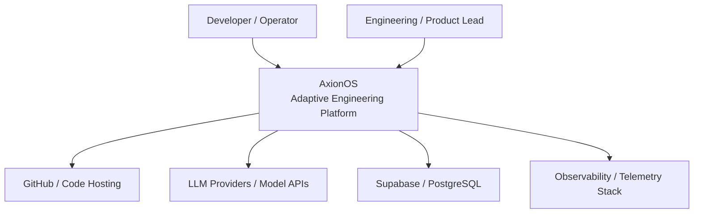
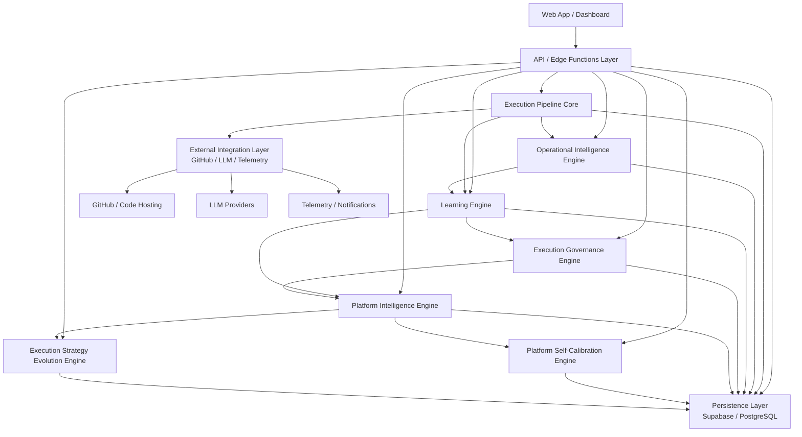
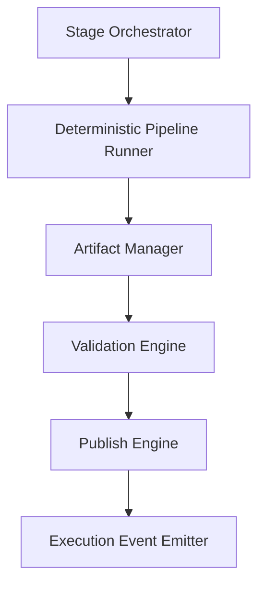
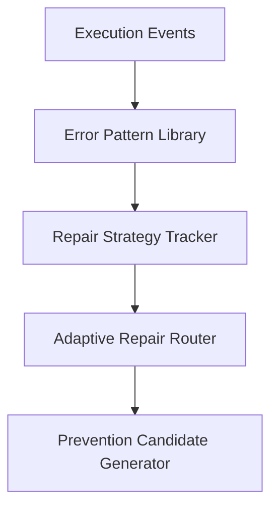
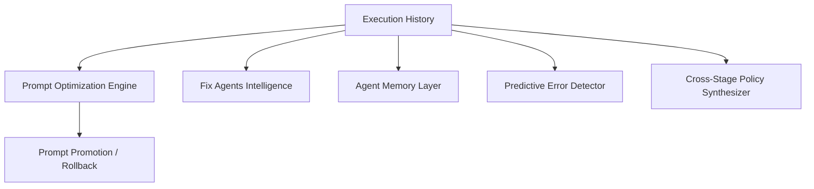
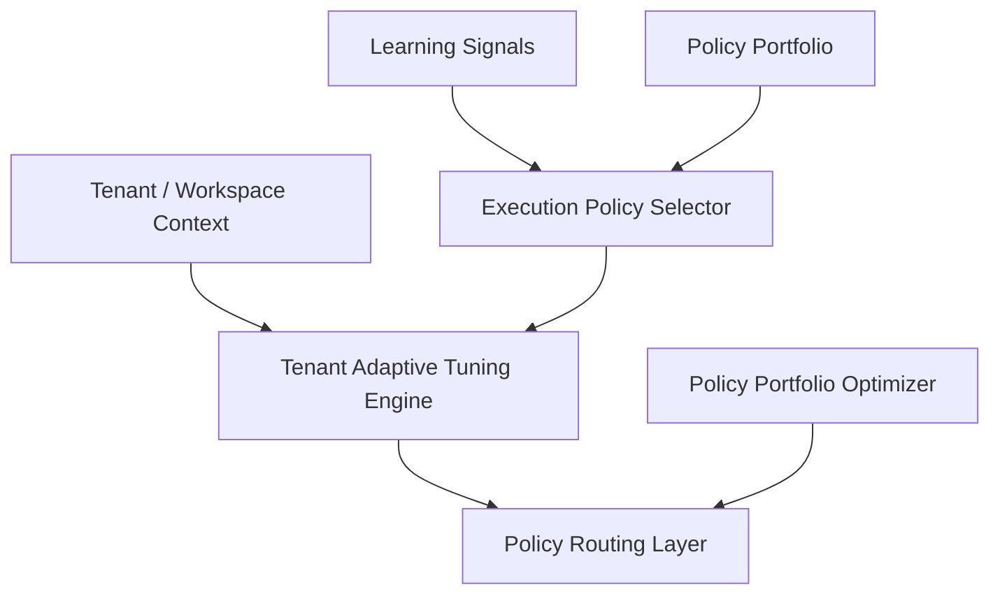
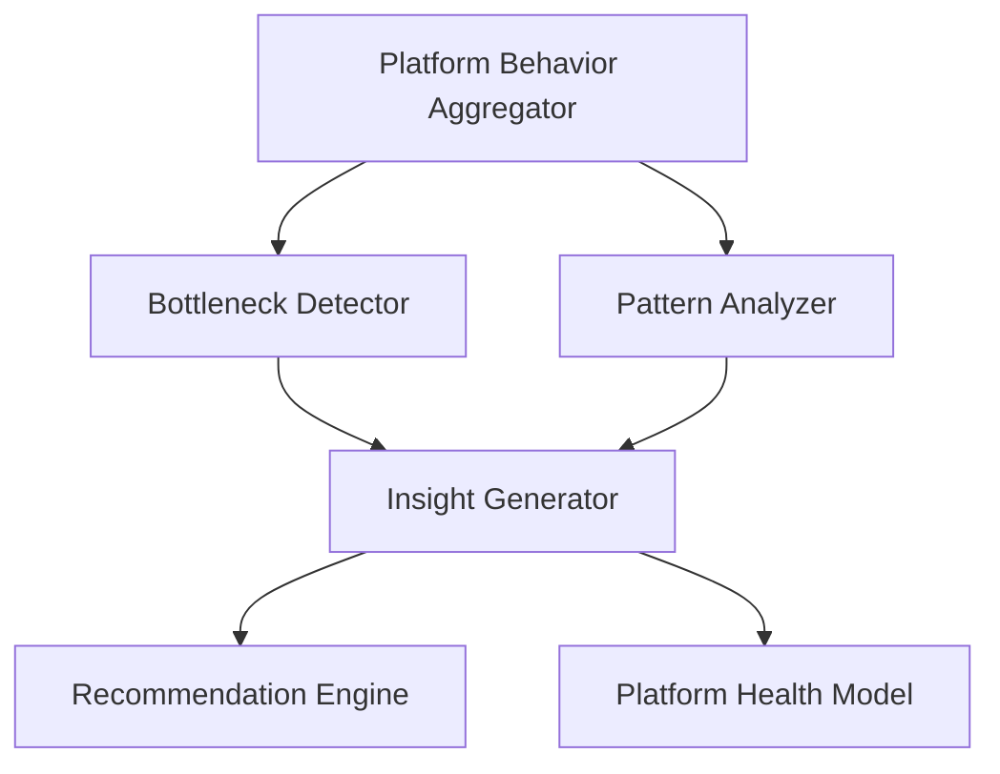
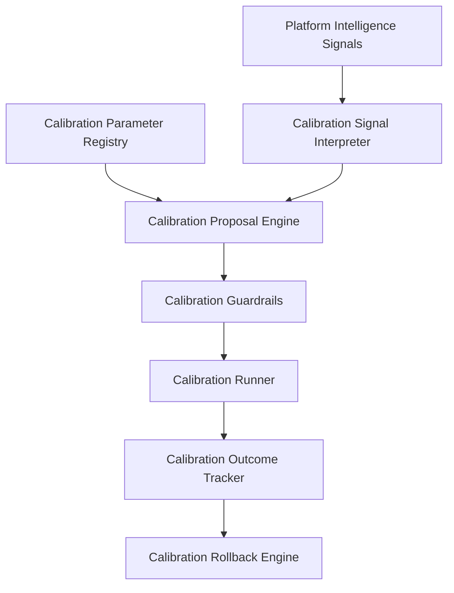
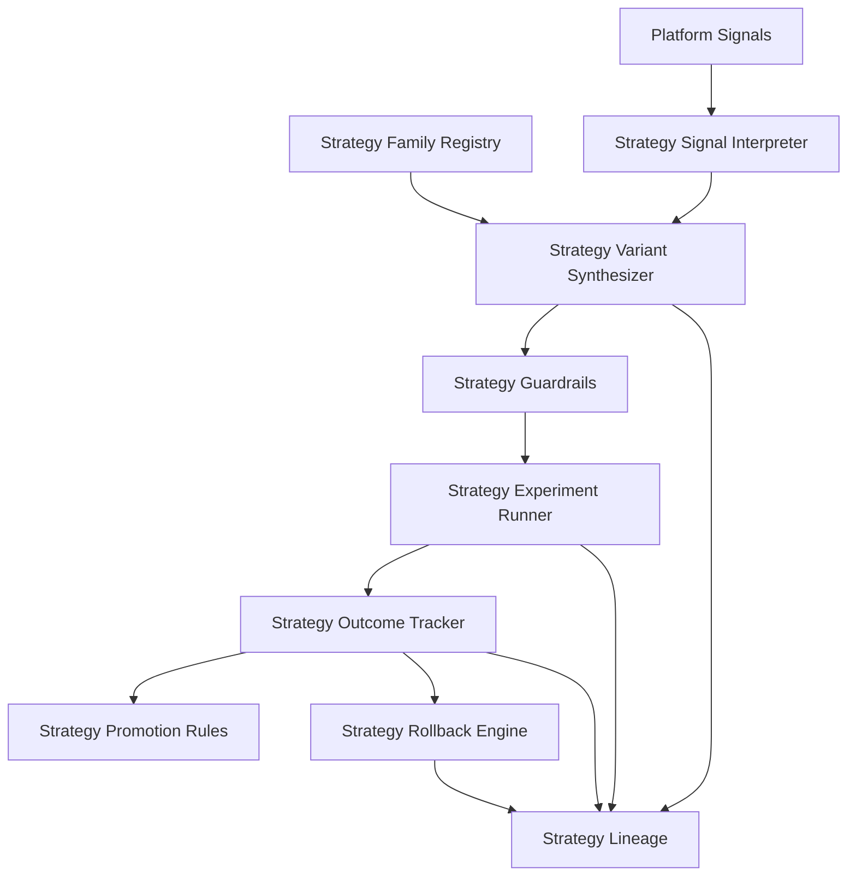
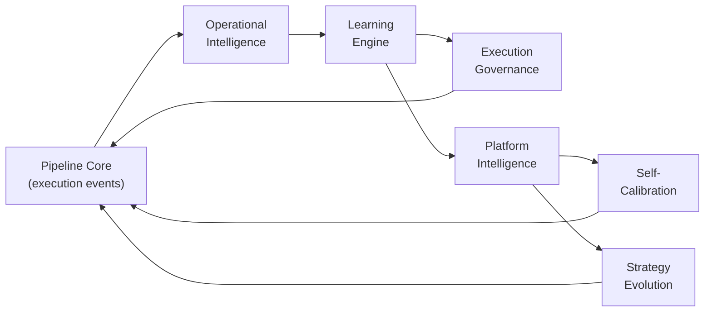

# AxionOS — System Architecture

> Technical architecture of the autonomous software engineering system.
>
> **Last updated:** 2026-03-07
>
> **Current state:** Level 5 — Institutional Engineering Memory Platform.
> Twenty-two architectural layers active. Discovery-Driven Architecture Signals (Sprint 37). Semantic Retrieval & Embedding Memory Expansion (Sprint 36). Autonomous Engineering Advisor (Sprint 35). Platform Self-Stabilization (Sprint 34). Strategy Portfolio Governance (Sprint 33). Execution Strategy Evolution (Sprint 32). Platform Self-Calibration (Sprint 31). Platform Intelligence Entry (Sprint 30). Workspace / Tenant Adaptive Policy Tuning (Sprint 29). Execution Mode Portfolio Optimization (Sprint 28). Execution Policy Intelligence (Sprint 27). Learning Agents v2 with Cross-Stage Policy Synthesis (Sprint 26). Predictive Error Detection Operationalization (Sprint 25). Agent Memory Layer Operationalization (Sprint 24). Self-Improving Fix Agents v2 with memory-aware repair policies (Sprint 23). Prompt Optimization closed-loop with Bounded Promotion & Rollback Guard (Sprint 22). Advisory Calibration Layer operational (Sprint 20).

---

## 1. System Context



**Actors:**
- **Developer / Operator** — submits ideas, monitors execution, reviews artifacts
- **Engineering / Product Lead** — governs strategy, reviews proposals, approves promotions

**External Systems:**
- **GitHub** — publish artifacts, PRs, atomic commits
- **LLM Providers** — reasoning, generation (Gemini 2.5 Flash/Pro via Lovable AI Gateway)
- **Supabase / PostgreSQL** — persistence, auth, RLS, Edge Functions
- **Observability** — metrics, logs, telemetry events

---

## 2. Container Architecture



**Containers:**

| Container | Technology | Responsibility |
|-----------|-----------|----------------|
| Web App / Dashboard | React 18 + Vite + Tailwind + shadcn/ui | User interaction, observability views, governance UI |
| API / Edge Functions | Supabase Edge Functions (Deno) | All backend logic, ~77 functions |
| Execution Pipeline Core | Edge Functions + shared modules | 32-stage deterministic pipeline |
| Operational Intelligence | Shared modules | Error patterns, repair routing, prevention |
| Learning Engine | Shared modules | Prompt optimization, agent memory, prediction |
| Execution Governance | Shared modules | Policy selection, portfolio, tenant tuning |
| Platform Intelligence | Shared modules | Aggregation, bottleneck detection, health model |
| Platform Self-Calibration | Shared modules | Bounded threshold tuning with rollback |
| Strategy Evolution | Shared modules | Variant experimentation and promotion |
| Persistence Layer | Supabase PostgreSQL | 80+ tables with RLS |
| External Integration | GitHub API v3, Lovable AI Gateway | Code hosting, LLM reasoning |

---

## 3. Component Architecture

### 3.1 Execution Pipeline Core



**Modules:**
- `pipeline-bootstrap.ts` — Pipeline lifecycle initialization with usage enforcement
- `dependency-scheduler.ts` — Kahn's algorithm, wave computation, 6 workers
- `pipeline-execution-orchestrator` / `pipeline-execution-worker` — DAG agent swarm
- `pipeline-helpers.ts` — Standardized logging, jobs, messages
- `autonomous-build-repair` — Self-healing builds from CI error logs
- `pipeline-fix-orchestrator` — Multi-iteration fix coordination
- `pipeline-preventive-validation` — Pre-generation guard
- `prevention-rule-engine` — Active prevention rule management
- `repair-routing-engine` — Adaptive strategy selection
- `error-pattern-library-engine` — Pattern extraction and indexing
- `observability-engine` / `initiative-observability-engine` — Telemetry
- `usage-limit-enforcer.ts` — Plan limits enforcement
- 50+ Edge Functions covering all 32 stages

**Persistence:** `initiative_jobs`, `active_prevention_rules`, `error_patterns`, `prevention_rule_candidates`, `repair_routing_log`, `pipeline_gate_permissions`, `stage_sla_configs`, `audit_logs`, `initiative_observability`

### 3.2 Operational Intelligence Engine



**Modules:**
- `error-pattern-library-engine` — Pattern extraction and indexing
- `repair-routing-engine` — Adaptive strategy selection based on historical success rates
- `prevention-rule-engine` — Active prevention rule management
- `repair-learning-engine` — Routing weight adaptation

**Persistence:** `error_patterns`, `repair_routing_log`, `prevention_rule_candidates`, `active_prevention_rules`, `repair_strategy_weights`

### 3.3 Learning Engine



**Sub-layers:**

| Sub-layer | Sprint | Modules |
|-----------|--------|---------|
| Prompt Optimization + Rollback | 21-22 | `learning/prompt-variant-selector.ts`, `prompt-promotion-rules.ts`, `prompt-rollout-engine.ts`, `prompt-rollback-engine.ts`, `prompt-health-guard.ts` |
| Self-Improving Fix Agents v2 | 23 | `repair/repair-policy-engine.ts`, `repair-policy-updater.ts`, `repair-policy-explainer.ts`, `repair-memory-retriever.ts`, `retry-path-intelligence.ts` |
| Agent Memory Operationalization | 24 | `agent-memory/agent-memory-retriever.ts`, `agent-memory-injector.ts`, `agent-memory-writer.ts`, `agent-memory-quality.ts` |
| Predictive Error Detection | 25 | `predictive/predictive-risk-engine.ts`, `predictive-checkpoint-runner.ts`, `preventive-action-engine.ts`, `predictive-outcome-tracker.ts` |
| Cross-Stage Policy Synthesis (LA v2) | 26 | `cross-stage/cross-stage-policy-synthesizer.ts`, `cross-stage-policy-evaluator.ts`, `cross-stage-policy-runner.ts`, `cross-stage-policy-lineage.ts` |

### 3.4 Execution Governance Engine



**Sub-layers:**

| Sub-layer | Sprint | Modules |
|-----------|--------|---------|
| Execution Policy Intelligence | 27 | `execution-policy/execution-context-classifier.ts`, `execution-policy-selector.ts`, `execution-policy-adjuster.ts`, `execution-policy-runner.ts`, `execution-policy-feedback.ts` |
| Portfolio Optimization | 28 | `execution-policy/execution-policy-portfolio-evaluator.ts`, `execution-policy-ranking-engine.ts`, `execution-policy-lifecycle-manager.ts`, `execution-policy-conflict-resolver.ts` |
| Tenant Adaptive Tuning | 29 | `tenant-policy/tenant-policy-tuning-engine.ts`, `tenant-policy-override-guard.ts`, `tenant-aware-policy-selector.ts`, `tenant-policy-drift-detector.ts` |

### 3.5 Platform Intelligence Engine



**Modules:** `platform-intelligence/platform-behavior-aggregator.ts`, `platform-bottleneck-detector.ts`, `platform-pattern-analyzer.ts`, `platform-insight-generator.ts`, `platform-recommendation-engine.ts`, `platform-health-model.ts`

**Health Indices:** reliability_index, execution_stability_index, repair_burden_index, cost_efficiency_index, deploy_success_index, policy_effectiveness_index

**Persistence:** `platform_insights`, `platform_recommendations`

### 3.6 Platform Self-Calibration Engine



**Modules:** `platform-calibration/platform-calibration-signal-interpreter.ts`, `platform-calibration-proposal-engine.ts`, `platform-calibration-guardrails.ts`, `platform-calibration-runner.ts`, `platform-calibration-outcome-tracker.ts`, `platform-calibration-rollback-engine.ts`

**Persistence:** `platform_calibration_parameters`, `platform_calibration_proposals`, `platform_calibration_applications`, `platform_calibration_rollbacks`

**Forbidden Families:** pipeline_topology, governance_rules, billing_logic, plan_enforcement, execution_contracts, hard_safety_constraints

**Max delta:** 0.2 per calibration. Advisory-first by default.

### 3.7 Execution Strategy Evolution Engine



**Modules:** `execution-strategy/execution-strategy-signal-interpreter.ts`, `execution-strategy-variant-synthesizer.ts`, `execution-strategy-guardrails.ts`, `execution-strategy-experiment-runner.ts`, `execution-strategy-outcome-tracker.ts`, `execution-strategy-promotion-rules.ts`, `execution-strategy-rollback-engine.ts`, `execution-strategy-lineage.ts`

**Strategy Families:** repair_escalation_sequencing, retry_switching_heuristics, validation_intensity_ladders, predictive_checkpoint_ordering, review_escalation_timing, deploy_hardening_sequencing, context_enrichment_sequencing, strategy_fallback_ladders

**Persistence:** `execution_strategy_families`, `execution_strategy_variants`, `execution_strategy_experiments`, `execution_strategy_outcomes`

**Max delta:** 0.25 per mutation. Advisory-first default.

---

## 4. Architectural Principles

| Principle | Description |
|-----------|-------------|
| **Deterministic Core** | 32-stage pipeline executes in a fixed, reproducible order via DAG scheduling |
| **Bounded Adaptation** | All learning, calibration, and strategy evolution operate within declared envelopes |
| **Advisory-First by Default** | All intelligent systems produce recommendations; humans approve structural changes |
| **Rollback Everywhere** | Every promotion, calibration, and strategy experiment preserves rollback capability |
| **Explainability and Lineage** | Every decision, variant, and outcome is traceable with full provenance |
| **Forbidden Mutation Families** | Pipeline topology, governance rules, billing logic, plan enforcement, execution contracts, and hard safety constraints are immutable by automated systems |
| **Multi-Tenant Isolation** | All data scoped by `organization_id` with RLS enforcement |
| **Additive Learning** | Learning modules consume existing data; they never modify the kernel directly |
| **Human Authority** | All structural evolution requires human review and approval |

---

## 5. Capability Layers

```
  ═══════════════════════════════════════════════════════════════════
  TIER 7: SEMANTIC RETRIEVAL LAYER
  ═══════════════════════════════════════════════════════════════════
  Layer 21: Semantic Retrieval & Embedding Memory   ← Active (Sprint 36)

  ═══════════════════════════════════════════════════════════════════
  TIER 6: STRATEGY EVOLUTION LAYER
  ═══════════════════════════════════════════════════════════════════
  Layer 17: Execution Strategy Evolution          ← Active (Sprint 32)

  ═══════════════════════════════════════════════════════════════════
  TIER 5: PLATFORM INTELLIGENCE & CALIBRATION LAYER
  ═══════════════════════════════════════════════════════════════════
  Layer 16: Platform Self-Calibration             ← Active (Sprint 31)
  Layer 15: Platform Intelligence Entry           ← Active (Sprint 30)

  ═══════════════════════════════════════════════════════════════════
  TIER 4: EXECUTION GOVERNANCE LAYER
  ═══════════════════════════════════════════════════════════════════
  Layer 14: Tenant/Workspace Adaptive Tuning      ← Active (Sprint 29)
  Layer 13: Execution Mode Portfolio Optimization  ← Active (Sprint 28)
  Layer 12: Execution Policy Intelligence         ← Active (Sprint 27)

  ═══════════════════════════════════════════════════════════════════
  TIER 3: LEARNING & INTELLIGENCE LAYER
  ═══════════════════════════════════════════════════════════════════
  Layer 11: Cross-Stage Policy Synthesis (LA v2)  ← Active (Sprint 26)
  Layer 10: Predictive Error Detection            ← Active (Sprint 25)
  Layer 9:  Agent Memory Operationalization       ← Active (Sprint 24)
  Layer 8:  Self-Improving Fix Agents v2          ← Active (Sprint 23)
  Layer 7:  Prompt Optimization + Rollback        ← Active (Sprints 21-22)

  ═══════════════════════════════════════════════════════════════════
  TIER 2: META-INTELLIGENCE & MEMORY LAYER
  ═══════════════════════════════════════════════════════════════════
  Layer 6:  Proposal Quality & Calibration        ← Active (Sprints 19-20)
  Layer 5:  Engineering Memory Architecture       ← Cross-layer (Sprints 15-18)
  Layer 4:  Proposal Generation + Meta-Agents     ← Active (Sprints 13-14)

  ═══════════════════════════════════════════════════════════════════
  TIER 1: FOUNDATION LAYER
  ═══════════════════════════════════════════════════════════════════
  Layer 3:  Learning Agents v1                    ← Active (Sprint 12)
  Layer 2:  Commercial Readiness                  ← Active (Sprint 11)
  Layer 1:  Execution Kernel                      ← Active (Sprints 1-10)
            (Pipeline + Prevention + Routing + Governance + Observability)
```

Engineering Memory (Layer 5) is a **cross-layer infrastructure** that captures knowledge from all layers but does not interfere with their operation.

---

## 6. Agent Operating System (Agent OS) — v1.0 GA

The Agent OS is the runtime architecture governing how agents are selected, executed, governed and coordinated. It consists of 14 modules organized into 5 architectural planes.

### Architecture Map

```
+-------------------------------------------------------------------+
|                       ECOSYSTEM PLANE                              |
|   Marketplace - Capability Registry - Package Manager - Trust      |
+-------------------------------+-----------------------------------+
                                | discovery
+-------------------------------+-----------------------------------+
|                       EXECUTION PLANE                              |
|   Orchestrator - Coordination - Distributed Runtime                |
|   LLM Adapter - Tool Adapter - Event Bus - Agent Registry          |
+-----------+-----------------------+-------------------+-----------+
            | decisions             | persistence       | telemetry
+-----------+----------+  +---------+---------+  +------+----------+
|    CONTROL PLANE     |  |    DATA PLANE     |  |   DATA PLANE    |
|   Selection Engine   |  |   Artifact Store  |  |  Observability  |
|   Policy Engine      |  |   Memory System   |  |  Audit Ledger   |
|   Governance Layer   |  |                   |  |                 |
|   Adaptive Routing   |  |                   |  |                 |
+-----------+----------+  +---------+---------+  +------+----------+
            |                       |                    |
+-----------+-----------------------+--------------------+----------+
|                         CORE PLANE                                 |
|   Runtime Protocol - Capability Model - Core Types                 |
|   (Contracts, Schemas, Identity -- no state, no side effects)      |
+-------------------------------------------------------------------+
```

### Five Fundamental Agent Types

| Agent Type | Responsibility | Example Modes |
|-----------|---------------|---------------|
| **Perception Agent** | Interprets ideas, requirements, market signals, context | `idea_intake`, `requirement_analysis`, `market_signal` |
| **Design Agent** | Creates architecture, domain models, data models, API designs | `architecture`, `domain_modeling`, `data_modeling`, `api_design` |
| **Build Agent** | Generates code, UI, configs, migrations, artifacts | `business_logic`, `api_generation`, `ui_generation` |
| **Validation Agent** | Static analysis, runtime validation, QA, architectural checks | `static_analysis`, `runtime_build`, `drift_detection` |
| **Evolution Agent** | Repair, learning, pattern extraction, prompt optimization | `build_repair`, `error_learning`, `pattern_extraction` |

```
Agent Specialization = Mode + Tools + Memory + Contract
```

### Plane Implementation Status

| Plane | Status | Notes |
|-------|--------|-------|
| **Core** | ✅ Implemented | Identity, contracts, types fully specified |
| **Control** | ✅ Implemented | Selection, policy, governance, adaptive routing operational |
| **Execution** | ✅ Partial | Orchestrator + DAG operational. Advanced coordination/distributed runtime frozen |
| **Data** | ✅ Implemented | Artifact store, memory, observability operational |
| **Ecosystem** | ❄️ Frozen | Marketplace designed but not needed |

### Module Inventory

| # | Module | File | Plane | Version |
|---|--------|------|-------|---------|
| 1 | Runtime Protocol | `protocol.ts` | Core | v0.1 |
| 2 | Capability Model | `capabilities.ts` | Core | v0.2 |
| 3 | Core Types | `types.ts` | Core | v0.1 |
| 4 | Selection Engine | `selection.ts` | Control | v0.2 |
| 5 | Policy Engine | `policy-engine.ts` | Control | v0.2 |
| 6 | Governance Layer | `governance.ts` | Control | v1.1 |
| 7 | Adaptive Routing | `adaptive-routing.ts` | Control | v0.7 |
| 8 | Orchestrator | `orchestrator.ts` | Execution | v0.1 |
| 9 | Agent Registry | `registry.ts` | Execution | v0.1 |
| 10 | Event Bus | `event-bus.ts` | Execution | v0.1 |
| 11 | Multi-Agent Coordination | `coordination.ts` | Execution | v0.8 |
| 12 | Distributed Runtime | `distributed-runtime.ts` | Execution | v0.9 |
| 13 | LLM Adapter | `llm-adapter.ts` | Execution | v0.4 |
| 14 | Tool Adapter | `tool-adapter.ts` | Execution | v0.5 |
| 15 | Artifact Store | `artifact-store.ts` | Data | v0.1 |
| 16 | Memory System | `memory-system.ts` | Data | v0.6 |
| 17 | Observability | `observability.ts` | Data | v0.3 |
| 18 | Marketplace | `marketplace.ts` | Ecosystem | v1.0 |

---

## 7. Pipeline — 32-Stage Model

```
===============================================================
  VENTURE INTELLIGENCE LAYER (Stages 1-5)              FUTURE
===============================================================

  Stage 01: Idea Intake
  Stage 02: Opportunity Discovery Engine
  Stage 03: Market Signal Analyzer
  Stage 04: Product Validation Engine
  Stage 05: Revenue Strategy Engine

===============================================================
  DISCOVERY & ARCHITECTURE (Stages 6-10)               NOW
===============================================================

  Stage 06: Discovery Intelligence (pipeline-comprehension) -- 4 agents
  Stage 07: Market Intelligence (pipeline-architecture) -- 4 agents
  Stage 08: Technical Feasibility (pipeline-architecture-simulation)
  Stage 09: Project Structuring (pipeline-preventive-validation)
  Stage 10: Squad Formation (pipeline-squad)

===============================================================
  INFRASTRUCTURE & MODELING (Stages 11-16)             NOW
===============================================================

  Stage 11: Architecture Planning
  Stage 12: Domain Model Generation
  Stage 13: AI Domain Analysis
  Stage 14: Schema Bootstrap
  Stage 15: DB Provisioning
  Stage 16: Data Model Generation

===============================================================
  CODE GENERATION (Stages 17-19)                       NOW
===============================================================

  Stage 17: Business Logic Synthesis
  Stage 18: API Generation
  Stage 19: UI Generation

===============================================================
  VALIDATION & PUBLISH (Stages 20-23)                  NOW
===============================================================

  Stage 20: Validation Engine (Fix Loop + Deep Static + Drift Detection)
  Stage 21: Build Engine (Runtime Validation via CI)
  Stage 22: Test Engine (Autonomous Build Repair)
  Stage 23: Publish Engine (Atomic Git Tree API)

===============================================================
  GROWTH & EVOLUTION LAYER (Stages 24-32)
===============================================================

  Stage 24: Observability Engine                       NOW
  Stage 25: Product Analytics Engine                   LATER
  Stage 26: User Behavior Analyzer                     LATER
  Stage 27: Growth Optimization Engine                 LATER
  Stage 28: Adaptive Learning Engine                   NOW
  Stage 29: Product Evolution Engine                   LATER
  Stage 30: Architecture Evolution Engine              LATER
  Stage 31: Startup Portfolio Manager                  FUTURE
  Stage 32: System Evolution Engine                    FUTURE
```

---

## 8. Data Flow Between Layers



**Flow description:**
1. **Pipeline Core** emits execution events (success, failure, timing, cost)
2. **Operational Intelligence** extracts patterns, tracks repair strategies
3. **Learning Engine** optimizes prompts, builds memory, predicts errors, synthesizes cross-stage policies
4. **Execution Governance** selects policies based on learning signals, adapts per tenant
5. **Platform Intelligence** aggregates system-level behavior, detects bottlenecks
6. **Self-Calibration** proposes bounded threshold adjustments based on intelligence signals
7. **Strategy Evolution** proposes and tests strategy variants against baselines
8. All calibrations and strategy changes flow back into the pipeline as bounded adjustments

---

## 9. Safety Architecture

### Structural Safety Rules

1. **Recommendations do not execute changes.** All recommendations require human review.
2. **Artifacts do not execute changes.** Engineering artifacts are documents for review.
3. **Memory is not a mutation engine.** Engineering Memory is informational infrastructure only.
4. **Calibration is advisory-first.** Calibration signals diagnose; humans decide.
5. **Strategy evolution is bounded.** Variants stay within declared mutation envelopes.
6. **Human review remains required for structural evolution.** Any pipeline/governance/billing change requires human action.
7. **Tenant isolation is absolute.** All data scoped by `organization_id` with RLS enforcement.
8. **Learning is bounded and reversible.** Weight adjustments have min/max constraints.
9. **Forbidden domains are immutable.** Pipeline topology, governance, billing, enforcement, execution contracts, and hard safety constraints cannot be calibrated or mutated by any automated system.

---

## 10. AI Efficiency Layer

### Prompt Compression Engine
**File:** `_shared/prompt-compressor.ts`
**Result:** 60-90% token reduction while preserving engineering-critical information

### Semantic Cache Engine
**File:** `_shared/semantic-cache.ts`
**Table:** `ai_prompt_cache` (with `vector(768)` column)
**Threshold:** cosine similarity > 0.92 returns cached response

### Model Router Engine
**File:** `_shared/model-router.ts`

| Complexity | Model | Cost Multiplier |
|-----------|-------|-----------------|
| Low | `google/gemini-2.5-flash-lite` | 0.2x |
| Medium | `google/gemini-2.5-flash` | 0.5x |
| High | `google/gemini-2.5-pro` | 1.0x |

### Integration Point
All modules integrate transparently in `callAI()` (`_shared/ai-client.ts`):
```
callAI() -> compress -> cache lookup -> route model -> LLM call -> cache store -> return
```

---

## 11. Edge Function Architecture

```
supabase/functions/
+-- Discovery & Architecture       (5 functions)
+-- Infrastructure & Modeling       (8 functions)
+-- Code Generation                 (3 functions)
+-- Validation & Publish            (6 functions)
+-- Growth & Evolution              (9 functions)
+-- Pipeline Control                (7 functions)
+-- Commercial Readiness            (2 functions -- Sprint 11)
+-- Learning Agents                 (6 functions -- Sprint 12)
+-- Meta-Agents                     (3 functions -- Sprint 13-14, 18)
+-- Engineering Memory              (2 functions -- Sprint 15, 17)
+-- Proposal Quality                (1 function -- Sprint 19)
+-- Advisory Calibration            (1 function -- Sprint 20)
+-- Prompt Optimization             (1 function -- Sprint 21-22)
+-- Repair Policy                   (1 function -- Sprint 23)
+-- Agent Memory                    (1 function -- Sprint 24)
+-- Predictive Error Detection      (2 functions -- Sprint 25)
+-- Cross-Stage Learning            (1 function -- Sprint 26)
+-- Execution Policy Intelligence   (1 function -- Sprint 27)
+-- Portfolio Optimization          (1 function -- Sprint 28)
+-- Tenant Adaptive Tuning          (1 function -- Sprint 29)
+-- Platform Intelligence           (1 function -- Sprint 30)
+-- Platform Self-Calibration       (1 function -- Sprint 31)
+-- Strategy Evolution              (1 function -- Sprint 32)
+-- Support                         (11 functions)
+-- _shared/                        (15+ helper modules)
    +-- agent-os/                   (14 Agent OS modules)
    +-- meta-agents/               (Meta-agent types, scoring, validation, memory, quality)
    +-- calibration/               (Calibration types, scoring, analysis service)
    +-- learning/                  (Prompt optimization, promotion, rollback)
    +-- repair/                    (Repair policies, strategies, memory, intelligence)
    +-- prevention/                (Prevention evaluator)
    +-- agent-memory/              (Agent memory retriever, injector, writer, quality)
    +-- predictive/                (Risk engine, checkpoint runner, preventive actions, outcome tracker)
    +-- cross-stage/               (Policy synthesizer, evaluator, runner, lineage)
    +-- execution-policy/          (Classifier, selector, adjuster, runner, feedback, portfolio, ranking, lifecycle, conflict)
    +-- tenant-policy/             (Tuning engine, override guard, selector, drift detector)
    +-- platform-intelligence/     (Behavior aggregator, bottleneck detector, pattern analyzer, insight generator, recommendation engine, health model)
    +-- platform-calibration/      (Signal interpreter, proposal engine, guardrails, runner, outcome tracker, rollback engine)
    +-- execution-strategy/        (Signal interpreter, variant synthesizer, guardrails, experiment runner, outcome tracker, promotion rules, rollback engine, lineage)
```

---

## 12. Implementation Status

### Implemented

| # | System | Sprint | Details |
|---|--------|--------|---------|
| 1 | Pipeline (32 stages) | 1-10 | 50+ independent Edge Functions |
| 2 | Project Brain | 1-10 | Nodes, edges, decisions, errors, prevention rules, tsvector, pgvector |
| 3 | Dependency Scheduler | 1-10 | DAG builder, topological sort, wave computation |
| 4 | Agent Swarm | 1-10 | Orchestrator + Worker, parallel execution (6 workers) |
| 5 | Data Model Generator | 1-10 | Domain model to SQL tables, FK, indexes, RLS |
| 6 | Autonomous UI Generator | 1-10 | Pages, components, hooks, navigation |
| 7 | Adaptive Learning Engine | 1-10 | Prevention rules, patterns, cross-project |
| 8 | CI-Triggered Fix Swarm | 1-10 | Webhook + Fix Orchestrator + auto-PR |
| 9 | Self-Healing Codebase | 1-10 | Prevention rules with confidence scoring |
| 10 | Architectural Drift Detection | 1-10 | Rule-based + AI hybrid |
| 11 | Atomic Git Commits | 1-10 | Tree API for publish + fix PRs |
| 12 | Runtime Validation | 1-10 | Real tsc + vite build via GitHub Actions CI |
| 13 | Smart Context Window | 1-10 | ~60-80% token reduction |
| 14 | AI Efficiency Layer | 1-10 | Prompt compression + semantic cache + model router |
| 15 | Agent OS v1.0 | 1-10 | 14 modules, 5 planes, full TypeScript contracts |
| 16 | Commercial Readiness | 11 | Plans, billing, workspace roles, usage enforcement |
| 17 | Learning Agents v1 | 12 | Prompt analysis, strategy tracking, prediction, weight adaptation |
| 18 | Meta-Agents v1.4 | 13+18+19+20 | 4 memory-aware meta-agents, quality feedback, advisory calibration |
| 19 | Controlled Proposal Generation | 14 | 5 artifact types, review lifecycle, idempotency |
| 20 | Engineering Memory Foundation | 15 | Memory tables, capture events, retrieval API, observability |
| 21 | Memory Retrieval Surfaces | 16 | Structured retrieval for repair, meta-agents, artifacts, review |
| 22 | Memory Summaries | 17 | 6 summary types, signal strength, generation service |
| 23 | Memory-Aware Meta-Agents | 18 | Historical context, continuity scoring, redundancy guard, proposal v2 |
| 24 | Proposal Quality Feedback Loop | 19 | Quality scoring, outcome tracking, confidence calibration |
| 25 | Advisory Calibration Layer | 20 | 6 calibration domains, deterministic scoring, advisory-only signals |
| 26 | Prompt Optimization Engine | 21 | A/B testing, variant selection, performance metrics |
| 27 | Bounded Promotion & Rollback Guard | 22 | Phased rollout, health monitoring, auto-rollback |
| 28 | Self-Improving Fix Agents v2 | 23 | Memory-aware repair policies, bounded adjustments, retry intelligence |
| 29 | Agent Memory Operationalization | 24 | Per-agent memory profiles, structured memory records, quality scoring |
| 30 | Predictive Error Detection | 25 | Runtime risk scoring, checkpoint evaluation, preventive actions |
| 31 | Cross-Stage Policy Synthesis (LA v2) | 26 | Learning graph, policy synthesis, spillover detection |
| 32 | Execution Policy Intelligence | 27 | Context classification, policy selection, bounded adjustments |
| 33 | Portfolio Optimization | 28 | Portfolio evaluation, ranking, lifecycle, conflict detection |
| 34 | Tenant Adaptive Tuning | 29 | Tenant preferences, override guards, drift detection |
| 35 | Platform Intelligence Entry | 30 | Behavior aggregation, bottleneck detection, health model |
| 36 | Platform Self-Calibration | 31 | Parameter registry, bounded proposals, guardrails, rollback |
| 37 | Execution Strategy Evolution | 32 | Strategy families, variant synthesis, experiment runner, promotion/rollback |

### Frozen

| Module | Reason |
|--------|--------|
| Marketplace ecosystem | Not needed until product intelligence layer |
| Global capability registry expansion | Architecture sufficient |
| Advanced distributed runtime | Current runtime is adequate |
| Advanced multi-agent coordination | Existing coordination works |

### Planned

| Horizon | Module | Priority |
|---------|--------|----------|
| FUTURE | Autonomous Implementation | P3 |
| FUTURE | Cross-Family Strategy Coordination | P2 |

---

## 13. Database Schema (80+ tables)

### Core Tables
- `organizations`, `organization_members`, `profiles`
- `workspaces`, `initiatives`, `initiative_jobs`
- `agents`, `agent_messages`, `agent_memory`, `agent_outputs`

### Pipeline Tables
- `stories`, `story_phases`, `story_subtasks`
- `squads`, `squad_members`
- `planning_sessions`
- `code_artifacts`, `content_documents`, `adrs`

### Brain Tables
- `project_brain_nodes` (with `vector(768)` embedding)
- `project_brain_edges`
- `project_decisions`
- `project_errors`
- `project_prevention_rules`

### Governance Tables
- `pipeline_gate_permissions`
- `stage_sla_configs`
- `org_usage_limits`
- `audit_logs`
- `artifact_reviews`

### Efficiency Tables
- `ai_prompt_cache` (with `vector(768)` embedding, TTL, hit tracking)
- `ai_rate_limits`

### Knowledge Tables
- `org_knowledge_base`
- `git_connections`
- `supabase_connections`
- `validation_runs`
- `usage_monthly_snapshots`

### Commercial Tables (Sprint 11)
- `product_plans` — Starter / Pro / Enterprise with limits
- `billing_accounts` — Stripe-ready with period tracking
- `workspace_members` — Granular roles per workspace

### Learning Tables (Sprint 12)
- `prompt_strategy_metrics` — Prompt performance aggregation
- `strategy_effectiveness_metrics` — Repair strategy effectiveness
- `predictive_error_patterns` — Recurring failure predictions
- `repair_strategy_weights` — Adjusted routing weights
- `learning_recommendations` — Structured improvement suggestions
- `learning_records` — Learning foundation substrate

### Meta-Agent Tables (Sprint 13-14)
- `meta_agent_recommendations` — Architectural recommendations
- `meta_agent_artifacts` — Engineering proposals

### Engineering Memory Tables (Sprints 15-17)
- `engineering_memory_entries` — Core memory storage with type taxonomy
- `memory_links` — Typed relationships between memory entries
- `memory_retrieval_log` — Retrieval tracking
- `memory_summaries` — Periodic historical synthesis

### Proposal Quality Tables (Sprint 19)
- `proposal_quality_feedback` — Quality and outcome tracking
- `proposal_quality_summaries` — Periodic quality summaries

### Advisory Calibration Tables (Sprint 20)
- `advisory_calibration_signals` — Structured diagnostic signals
- `advisory_calibration_summaries` — Periodic calibration summaries

### Prompt Optimization Tables (Sprints 21-22)
- `prompt_variants` — Prompt variant registry with A/B testing
- `prompt_variant_executions` — Execution telemetry per variant
- `prompt_variant_metrics` — Aggregated variant performance metrics
- `prompt_variant_promotions` — Promotion events with lineage
- `prompt_rollout_windows` — Phased rollout tracking
- `prompt_promotion_health_checks` — Post-promotion health monitoring
- `prompt_rollback_events` — Rollback events

### Repair Policy Tables (Sprint 23)
- `repair_policy_profiles` — Memory-aware repair strategy profiles
- `repair_policy_decisions` — Logged repair decisions
- `repair_policy_adjustments` — Bounded, reversible adjustments

### Agent Memory Tables (Sprint 24)
- `agent_memory_profiles` — Per-agent persistent memory profiles
- `agent_memory_records` — Reusable memory units

### Predictive Error Detection Tables (Sprint 25)
- `predictive_risk_assessments` — Runtime risk scoring
- `predictive_runtime_checkpoints` — Checkpoint evaluations
- `predictive_preventive_actions` — Preventive actions

### Cross-Stage Learning Tables (Sprint 26)
- `cross_stage_learning_edges` — Learning graph edges
- `cross_stage_policy_profiles` — Synthesized cross-stage policies
- `cross_stage_policy_outcomes` — Policy outcome tracking

### Execution Policy Intelligence Tables (Sprint 27)
- `execution_policy_profiles` — Bounded execution policy modes
- `execution_policy_outcomes` — Outcome tracking per policy
- `execution_policy_decisions` — Audit trail of policy decisions

### Execution Mode Portfolio Tables (Sprint 28)
- `execution_policy_portfolio_entries` — Portfolio entries with scores
- `execution_policy_portfolio_recommendations` — Portfolio recommendations

### Tenant Adaptive Policy Tuning Tables (Sprint 29)
- `tenant_policy_preference_profiles` — Org/workspace preferences
- `tenant_policy_outcomes` — Tenant-specific outcomes
- `tenant_policy_recommendations` — Tenant recommendations

### Platform Intelligence Tables (Sprint 30)
- `platform_insights` — Platform-level insights
- `platform_recommendations` — Prioritized advisory recommendations

### Platform Self-Calibration Tables (Sprint 31)
- `platform_calibration_parameters` — Calibratable parameter registry
- `platform_calibration_proposals` — Calibration proposals
- `platform_calibration_applications` — Applied calibrations
- `platform_calibration_rollbacks` — Rollback records

### Execution Strategy Evolution Tables (Sprint 32)
- `execution_strategy_families` — Strategy family registry
- `execution_strategy_variants` — Bounded variant proposals
- `execution_strategy_experiments` — Controlled experiments
- `execution_strategy_outcomes` — Experiment outcome tracking

---

## 14. Technology Stack

| Layer | Technology |
|-------|-----------|
| Frontend | Vite + React 18 + TypeScript + Tailwind CSS + shadcn/ui |
| State Management | TanStack React Query + React Context |
| Backend | Supabase (PostgreSQL, Auth, Edge Functions, RLS) |
| AI Engine | Lovable AI Gateway (Gemini 2.5 Flash/Pro) + Efficiency Layer |
| Git Integration | GitHub API v3 (Tree API for atomic commits, PRs) |
| Deployment | Vercel/Netlify configs auto-generated |

### Multi-Tenancy Model

- **Organizations** → **Workspaces** → **Initiatives**
- RLS policies enforce isolation per `organization_id`
- Role-based access: `owner`, `admin`, `editor`, `reviewer`, `viewer`
- Auto-provisioning: first login creates a default org via `create_organization_with_owner` RPC

### System Maturity

| Level | Name | Status |
|-------|------|--------|
| Level 1 | Code Generator | ✅ Complete |
| Level 2 | Software Builder | ✅ Complete |
| Level 3 | Autonomous Engineering System | ✅ Complete |
| Level 4 | Self-Learning Software Factory | ✅ Complete |
| Level 4.5 | Meta-Aware Engineering Platform | ✅ Complete |
| Level 5 | Institutional Engineering Memory | ✅ Current |
| Level 5.5 | Contextual / Self-Improving Platform | 🔮 Future horizon |
| Level 6 | Discovery-Driven Engineering | 🔮 Long-term |

---

## 15. Governing Principle

> The Agent OS is a contract-driven, plane-separated architecture where decisions flow down from Control, execution flows through Execution, state flows into Data, identity is defined in Core, and discovery extends through Ecosystem. No plane may assume the responsibilities of another. Learning is additive, auditable, and bounded — it cannot mutate the kernel directly. Engineering Memory is informational infrastructure — it informs but never commands. Memory-aware reasoning enriches analysis with historical context but preserves human authority over all structural decisions. Calibration signals diagnose where tuning should happen, but humans decide when and how tuning is applied. Repair policies are memory-aware and self-improving, but bounded to strategy selection only. Agent memory profiles persist per-agent operational context but remain non-invasive — they inform reasoning without dictating execution. Predictive error detection scores runtime risk and recommends bounded preventive actions, but cannot force pipeline changes or bypass governance. Cross-stage policy synthesis extends learning beyond local optimization, synthesizing bounded policies across stage boundaries while preserving kernel safety and auditability. Execution policy intelligence selects global operating modes based on context classification, applying bounded adjustments at safe runtime boundaries without mutating kernel structure. Execution mode portfolio optimization governs the set of available policies as a managed portfolio, ranking, evaluating lifecycle status, detecting conflicts, and generating recommendations — all auditable, reversible, and organization-isolated. Tenant adaptive policy tuning specializes global policy behavior per organization and workspace while preserving central governance, override guards, drift detection, and safe fallback to global defaults. Platform Intelligence observes system-level behavior across all layers, detecting structural bottlenecks and cross-platform patterns, generating advisory insights and prioritized recommendations without mutating kernel architecture. Platform Self-Calibration tunes operational thresholds within safe envelopes based on platform intelligence signals, with guardrails, rollback, and advisory-first governance preserving kernel integrity. Execution Strategy Evolution enables bounded experimentation with strategy variants, comparing them against baselines under governed conditions, and supporting safe promotion or rollback based on real outcome evidence.

---

## Source of Truth

The following documents must remain synchronized:

| Document | Purpose |
|----------|---------|
| `docs/ARCHITECTURE.md` | System architecture, C4 diagrams, capability layers (this file) |
| `docs/ROADMAP.md` | Maturity horizons, execution priorities |
| `docs/PLAN.md` | Sprint-level implementation phases |
| `docs/AGENTS.md` | Agent OS module reference, agent types, contracts |
| `docs/PIPELINE_CONTRACTS.md` | Operational contracts for the 5 pipeline phases |
| `docs/diagrams/` | PlantUML source files for C4 diagrams (export/print-ready) |

Diagrams in this file use **Mermaid** for GitHub rendering. PlantUML versions are in `docs/diagrams/` for corporate export.
