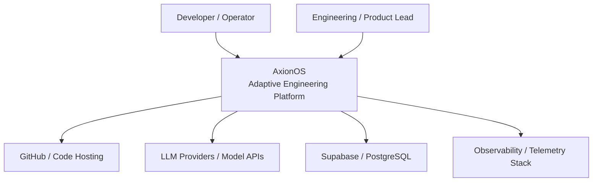
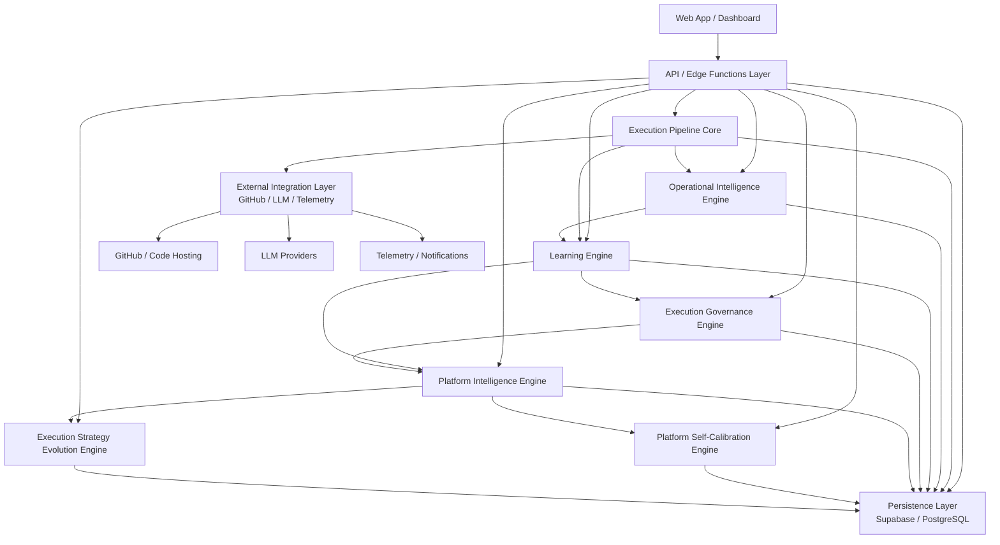
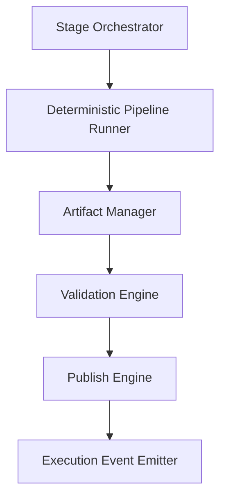
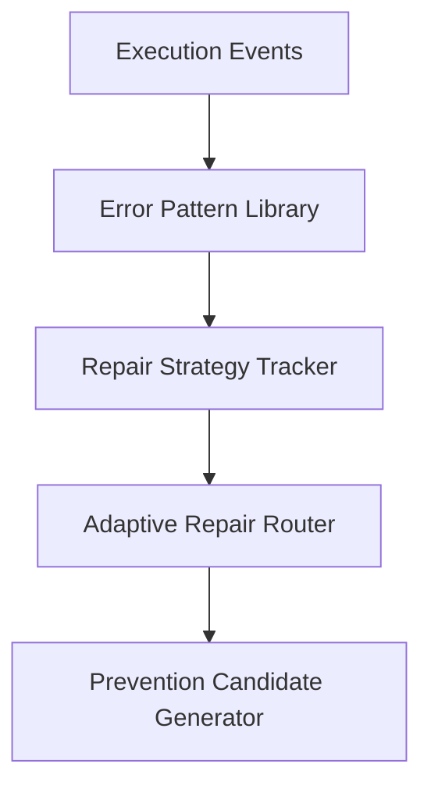
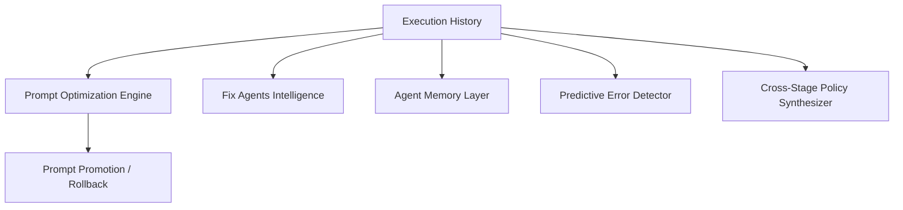
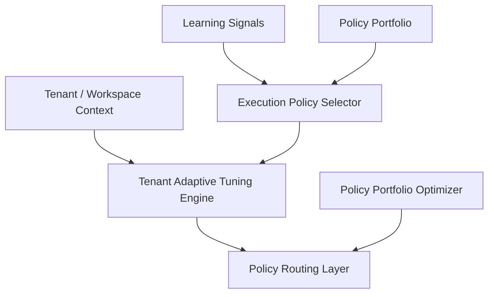
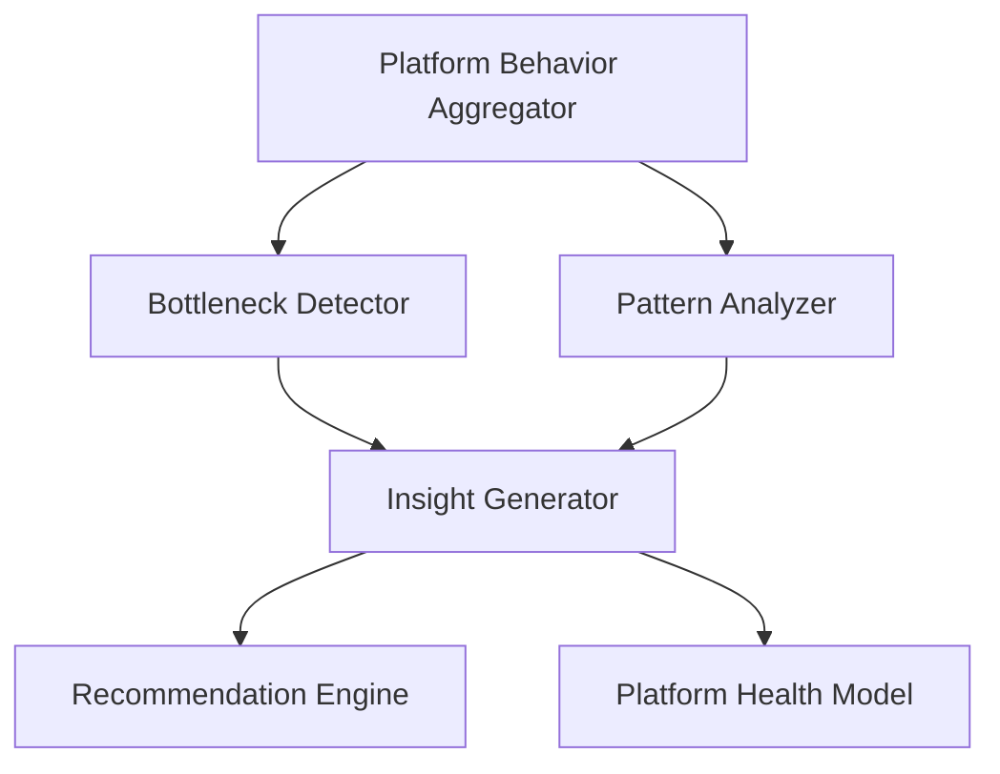
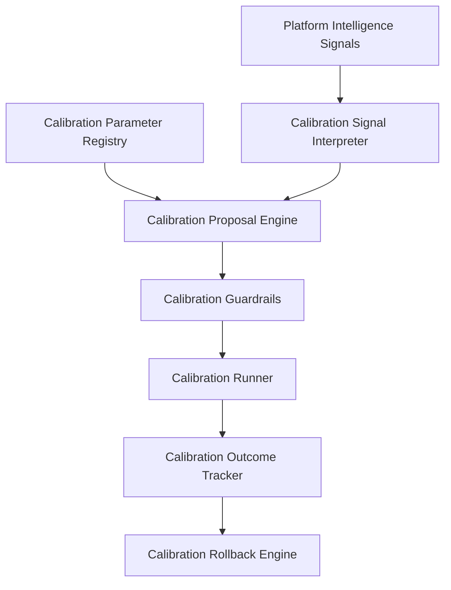
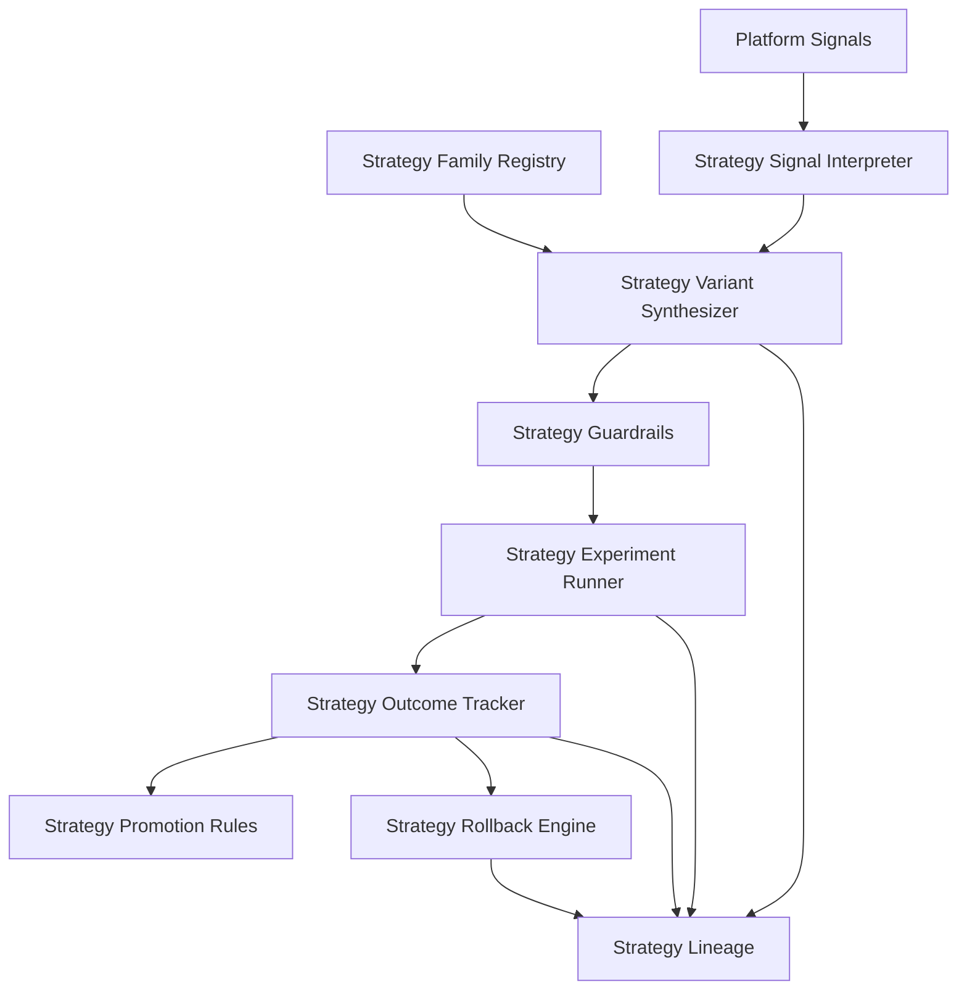
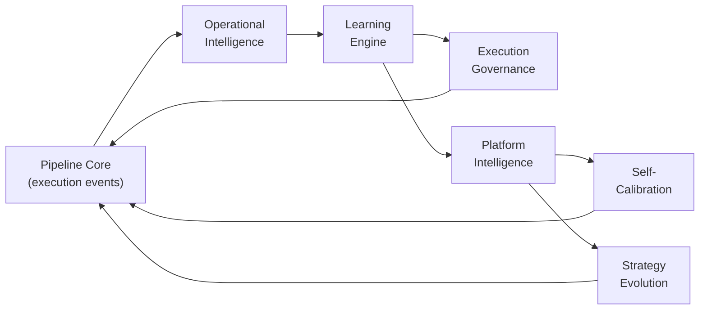

# AxionOS — System Architecture

> Technical architecture of the autonomous software engineering system.
>
> **Last updated:** 2026-03-08
> **Current state:** Level 5 — Institutional Engineering Memory Platform. 51 architectural layers active (through Sprint 67 — Role-Based Experience Layer).
> **Maturity canonical source:** [ROADMAP.md](ROADMAP.md) · **Sprint details:** [PLAN.md](PLAN.md)

## Document Authority

| Scope | Rule |
|-------|------|
| **Owns** | System architecture, C4 diagrams, capability layers, containers, components, data flow, safety rules, AI efficiency layer, edge function architecture, database schema, technology stack, governing principle |
| **Must not define** | Sprint-by-sprint execution ledger (→ PLAN.md), full roadmap/strategic narrative (→ ROADMAP.md), detailed Agent OS module specs (→ AGENTS.md), pipeline phase UX contracts (→ PIPELINE_CONTRACTS.md) |
| **Derived from** | PLAN.md for sprint context in layer descriptions; AGENTS.md for Agent OS summary |
| **Update rule** | Update when system structure or active architectural layers change |

---

## 1. System Context



**Actors:**
- **Developer / Operator** — submits ideas, monitors execution, reviews artifacts
- **Engineering / Product Lead** — governs strategy, reviews proposals, approves promotions

**External Systems:**
- **GitHub** — publish artifacts, PRs, atomic commits
- **LLM Providers** — reasoning, generation (Gemini 2.5 Flash/Pro via Lovable AI Gateway)
- **Supabase / PostgreSQL** — persistence, auth, RLS, Edge Functions
- **Observability** — metrics, logs, telemetry events

---

## 2. Container Architecture



**Containers:**

| Container | Technology | Responsibility |
|-----------|-----------|----------------|
| Web App / Dashboard | React 18 + Vite + Tailwind + shadcn/ui | User interaction, observability views, governance UI |
| API / Edge Functions | Supabase Edge Functions (Deno) | All backend logic, ~77 functions |
| Execution Pipeline Core | Edge Functions + shared modules | 32-stage deterministic pipeline |
| Operational Intelligence | Shared modules | Error patterns, repair routing, prevention |
| Learning Engine | Shared modules | Prompt optimization, agent memory, prediction |
| Execution Governance | Shared modules | Policy selection, portfolio, tenant tuning |
| Platform Intelligence | Shared modules | Aggregation, bottleneck detection, health model |
| Platform Self-Calibration | Shared modules | Bounded threshold tuning with rollback |
| Strategy Evolution | Shared modules | Variant experimentation and promotion |
| Persistence Layer | Supabase PostgreSQL | 80+ tables with RLS |
| External Integration | GitHub API v3, Lovable AI Gateway | Code hosting, LLM reasoning |

---

## 3. Component Architecture

### 3.1 Execution Pipeline Core



**Modules:**
- `pipeline-bootstrap.ts` — Pipeline lifecycle initialization with usage enforcement
- `dependency-scheduler.ts` — Kahn's algorithm, wave computation, 6 workers
- `pipeline-execution-orchestrator` / `pipeline-execution-worker` — DAG agent swarm
- `pipeline-helpers.ts` — Standardized logging, jobs, messages
- `autonomous-build-repair` — Self-healing builds from CI error logs
- `pipeline-fix-orchestrator` — Multi-iteration fix coordination
- `pipeline-preventive-validation` — Pre-generation guard
- `prevention-rule-engine` — Active prevention rule management
- `repair-routing-engine` — Adaptive strategy selection
- `error-pattern-library-engine` — Pattern extraction and indexing
- `observability-engine` / `initiative-observability-engine` — Telemetry
- `usage-limit-enforcer.ts` — Plan limits enforcement
- 50+ Edge Functions covering all 32 stages

**Persistence:** `initiative_jobs`, `active_prevention_rules`, `error_patterns`, `prevention_rule_candidates`, `repair_routing_log`, `pipeline_gate_permissions`, `stage_sla_configs`, `audit_logs`, `initiative_observability`

### 3.2 Operational Intelligence Engine



**Modules:**
- `error-pattern-library-engine` — Pattern extraction and indexing
- `repair-routing-engine` — Adaptive strategy selection based on historical success rates
- `prevention-rule-engine` — Active prevention rule management
- `repair-learning-engine` — Routing weight adaptation

**Persistence:** `error_patterns`, `repair_routing_log`, `prevention_rule_candidates`, `active_prevention_rules`, `repair_strategy_weights`

### 3.3 Learning Engine



**Sub-layers:**

| Sub-layer | Sprint | Modules |
|-----------|--------|---------|
| Prompt Optimization + Rollback | 21-22 | `learning/prompt-variant-selector.ts`, `prompt-promotion-rules.ts`, `prompt-rollout-engine.ts`, `prompt-rollback-engine.ts`, `prompt-health-guard.ts` |
| Self-Improving Fix Agents v2 | 23 | `repair/repair-policy-engine.ts`, `repair-policy-updater.ts`, `repair-policy-explainer.ts`, `repair-memory-retriever.ts`, `retry-path-intelligence.ts` |
| Agent Memory Operationalization | 24 | `agent-memory/agent-memory-retriever.ts`, `agent-memory-injector.ts`, `agent-memory-writer.ts`, `agent-memory-quality.ts` |
| Predictive Error Detection | 25 | `predictive/predictive-risk-engine.ts`, `predictive-checkpoint-runner.ts`, `preventive-action-engine.ts`, `predictive-outcome-tracker.ts` |
| Cross-Stage Policy Synthesis (LA v2) | 26 | `cross-stage/cross-stage-policy-synthesizer.ts`, `cross-stage-policy-evaluator.ts`, `cross-stage-policy-runner.ts`, `cross-stage-policy-lineage.ts` |

### 3.4 Execution Governance Engine



**Sub-layers:**

| Sub-layer | Sprint | Modules |
|-----------|--------|---------|
| Execution Policy Intelligence | 27 | `execution-policy/execution-context-classifier.ts`, `execution-policy-selector.ts`, `execution-policy-adjuster.ts`, `execution-policy-runner.ts`, `execution-policy-feedback.ts` |
| Portfolio Optimization | 28 | `execution-policy/execution-policy-portfolio-evaluator.ts`, `execution-policy-ranking-engine.ts`, `execution-policy-lifecycle-manager.ts`, `execution-policy-conflict-resolver.ts` |
| Tenant Adaptive Tuning | 29 | `tenant-policy/tenant-policy-tuning-engine.ts`, `tenant-policy-override-guard.ts`, `tenant-aware-policy-selector.ts`, `tenant-policy-drift-detector.ts` |

### 3.5 Platform Intelligence Engine



**Modules:** `platform-intelligence/platform-behavior-aggregator.ts`, `platform-bottleneck-detector.ts`, `platform-pattern-analyzer.ts`, `platform-insight-generator.ts`, `platform-recommendation-engine.ts`, `platform-health-model.ts`

**Health Indices:** reliability_index, execution_stability_index, repair_burden_index, cost_efficiency_index, deploy_success_index, policy_effectiveness_index

**Persistence:** `platform_insights`, `platform_recommendations`

### 3.6 Platform Self-Calibration Engine



**Modules:** `platform-calibration/platform-calibration-signal-interpreter.ts`, `platform-calibration-proposal-engine.ts`, `platform-calibration-guardrails.ts`, `platform-calibration-runner.ts`, `platform-calibration-outcome-tracker.ts`, `platform-calibration-rollback-engine.ts`

**Persistence:** `platform_calibration_parameters`, `platform_calibration_proposals`, `platform_calibration_applications`, `platform_calibration_rollbacks`

**Forbidden Families:** pipeline_topology, governance_rules, billing_logic, plan_enforcement, execution_contracts, hard_safety_constraints

**Max delta:** 0.2 per calibration. Advisory-first by default.

### 3.7 Execution Strategy Evolution Engine



**Modules:** `execution-strategy/execution-strategy-signal-interpreter.ts`, `execution-strategy-variant-synthesizer.ts`, `execution-strategy-guardrails.ts`, `execution-strategy-experiment-runner.ts`, `execution-strategy-outcome-tracker.ts`, `execution-strategy-promotion-rules.ts`, `execution-strategy-rollback-engine.ts`, `execution-strategy-lineage.ts`

**Strategy Families:** repair_escalation_sequencing, retry_switching_heuristics, validation_intensity_ladders, predictive_checkpoint_ordering, review_escalation_timing, deploy_hardening_sequencing, context_enrichment_sequencing, strategy_fallback_ladders

**Persistence:** `execution_strategy_families`, `execution_strategy_variants`, `execution_strategy_experiments`, `execution_strategy_outcomes`

**Max delta:** 0.25 per mutation. Advisory-first default.

---

## 4. Architectural Principles

| Principle | Description |
|-----------|-------------|
| **Deterministic Core** | 32-stage pipeline executes in a fixed, reproducible order via DAG scheduling |
| **Bounded Adaptation** | All learning, calibration, and strategy evolution operate within declared envelopes |
| **Advisory-First by Default** | All intelligent systems produce recommendations; humans approve structural changes |
| **Rollback Everywhere** | Every promotion, calibration, and strategy experiment preserves rollback capability |
| **Explainability and Lineage** | Every decision, variant, and outcome is traceable with full provenance |
| **Forbidden Mutation Families** | Pipeline topology, governance rules, billing logic, plan enforcement, execution contracts, and hard safety constraints are immutable by automated systems |
| **Multi-Tenant Isolation** | All data scoped by `organization_id` with RLS enforcement |
| **Additive Learning** | Learning modules consume existing data; they never modify the kernel directly |
| **Human Authority** | All structural evolution requires human review and approval |

---

## 5. Capability Layers

```
  ═══════════════════════════════════════════════════════════════════
  TIER 7: SEMANTIC RETRIEVAL LAYER
  ═══════════════════════════════════════════════════════════════════
  Layer 21: Semantic Retrieval & Embedding Memory   ← Active (Sprint 36)

  ═══════════════════════════════════════════════════════════════════
  TIER 6: STRATEGY EVOLUTION LAYER
  ═══════════════════════════════════════════════════════════════════
  Layer 17: Execution Strategy Evolution          ← Active (Sprint 32)

  ═══════════════════════════════════════════════════════════════════
  TIER 5: PLATFORM INTELLIGENCE & CALIBRATION LAYER
  ═══════════════════════════════════════════════════════════════════
  Layer 16: Platform Self-Calibration             ← Active (Sprint 31)
  Layer 15: Platform Intelligence Entry           ← Active (Sprint 30)

  ═══════════════════════════════════════════════════════════════════
  TIER 4: EXECUTION GOVERNANCE LAYER
  ═══════════════════════════════════════════════════════════════════
  Layer 14: Tenant/Workspace Adaptive Tuning      ← Active (Sprint 29)
  Layer 13: Execution Mode Portfolio Optimization  ← Active (Sprint 28)
  Layer 12: Execution Policy Intelligence         ← Active (Sprint 27)

  ═══════════════════════════════════════════════════════════════════
  TIER 3: LEARNING & INTELLIGENCE LAYER
  ═══════════════════════════════════════════════════════════════════
  Layer 11: Cross-Stage Policy Synthesis (LA v2)  ← Active (Sprint 26)
  Layer 10: Predictive Error Detection            ← Active (Sprint 25)
  Layer 9:  Agent Memory Operationalization       ← Active (Sprint 24)
  Layer 8:  Self-Improving Fix Agents v2          ← Active (Sprint 23)
  Layer 7:  Prompt Optimization + Rollback        ← Active (Sprints 21-22)

  ═══════════════════════════════════════════════════════════════════
  TIER 2: META-INTELLIGENCE & MEMORY LAYER
  ═══════════════════════════════════════════════════════════════════
  Layer 6:  Proposal Quality & Calibration        ← Active (Sprints 19-20)
  Layer 5:  Engineering Memory Architecture       ← Cross-layer (Sprints 15-18)
  Layer 4:  Proposal Generation + Meta-Agents     ← Active (Sprints 13-14)

  ═══════════════════════════════════════════════════════════════════
  TIER 1: FOUNDATION LAYER
  ═══════════════════════════════════════════════════════════════════
  Layer 3:  Learning Agents v1                    ← Active (Sprint 12)
  Layer 2:  Commercial Readiness                  ← Active (Sprint 11)
  Layer 1:  Execution Kernel                      ← Active (Sprints 1-10)
            (Pipeline + Prevention + Routing + Governance + Observability)
```

Engineering Memory (Layer 5) is a **cross-layer infrastructure** that captures knowledge from all layers but does not interfere with their operation.

---

## 6. Agent Operating System (Agent OS) — v1.0 GA

The Agent OS is the runtime architecture governing how agents are selected, executed, governed and coordinated. It consists of 18 modules organized into 5 architectural planes.

> **Full specification:** [AGENTS.md](AGENTS.md) — canonical reference for planes, modules, agent types, contracts, safety boundaries, and events.

| Plane | Status | Key Modules |
|-------|--------|-------------|
| **Core** | ✅ Implemented | Runtime Protocol, Capability Model, Core Types |
| **Control** | ✅ Implemented | Selection Engine, Policy Engine, Governance Layer, Adaptive Routing |
| **Execution** | ✅ Partial | Orchestrator, Coordination, LLM/Tool Adapters (advanced coordination/distributed runtime frozen) |
| **Data** | ✅ Implemented | Artifact Store, Memory System, Observability |
| **Ecosystem** | ❄️ Frozen | Marketplace (designed, not needed) |

---

## 7. Pipeline — 32-Stage Model

```
===============================================================
  VENTURE INTELLIGENCE LAYER (Stages 1-5)              FUTURE
===============================================================

  Stage 01: Idea Intake
  Stage 02: Opportunity Discovery Engine
  Stage 03: Market Signal Analyzer
  Stage 04: Product Validation Engine
  Stage 05: Revenue Strategy Engine

===============================================================
  DISCOVERY & ARCHITECTURE (Stages 6-10)               NOW
===============================================================

  Stage 06: Discovery Intelligence (pipeline-comprehension) -- 4 agents
  Stage 07: Market Intelligence (pipeline-architecture) -- 4 agents
  Stage 08: Technical Feasibility (pipeline-architecture-simulation)
  Stage 09: Project Structuring (pipeline-preventive-validation)
  Stage 10: Squad Formation (pipeline-squad)

===============================================================
  INFRASTRUCTURE & MODELING (Stages 11-16)             NOW
===============================================================

  Stage 11: Architecture Planning
  Stage 12: Domain Model Generation
  Stage 13: AI Domain Analysis
  Stage 14: Schema Bootstrap
  Stage 15: DB Provisioning
  Stage 16: Data Model Generation

===============================================================
  CODE GENERATION (Stages 17-19)                       NOW
===============================================================

  Stage 17: Business Logic Synthesis
  Stage 18: API Generation
  Stage 19: UI Generation

===============================================================
  VALIDATION & PUBLISH (Stages 20-23)                  NOW
===============================================================

  Stage 20: Validation Engine (Fix Loop + Deep Static + Drift Detection)
  Stage 21: Build Engine (Runtime Validation via CI)
  Stage 22: Test Engine (Autonomous Build Repair)
  Stage 23: Publish Engine (Atomic Git Tree API)

===============================================================
  GROWTH & EVOLUTION LAYER (Stages 24-32)
===============================================================

  Stage 24: Observability Engine                       NOW
  Stage 25: Product Analytics Engine                   LATER
  Stage 26: User Behavior Analyzer                     LATER
  Stage 27: Growth Optimization Engine                 LATER
  Stage 28: Adaptive Learning Engine                   NOW
  Stage 29: Product Evolution Engine                   LATER
  Stage 30: Architecture Evolution Engine              LATER
  Stage 31: Startup Portfolio Manager                  FUTURE
  Stage 32: System Evolution Engine                    FUTURE
```

---

## 8. Data Flow Between Layers



**Flow description:**
1. **Pipeline Core** emits execution events (success, failure, timing, cost)
2. **Operational Intelligence** extracts patterns, tracks repair strategies
3. **Learning Engine** optimizes prompts, builds memory, predicts errors, synthesizes cross-stage policies
4. **Execution Governance** selects policies based on learning signals, adapts per tenant
5. **Platform Intelligence** aggregates system-level behavior, detects bottlenecks
6. **Self-Calibration** proposes bounded threshold adjustments based on intelligence signals
7. **Strategy Evolution** proposes and tests strategy variants against baselines
8. All calibrations and strategy changes flow back into the pipeline as bounded adjustments

---

## 9. Safety Architecture

### Structural Safety Rules

1. **Recommendations do not execute changes.** All recommendations require human review.
2. **Artifacts do not execute changes.** Engineering artifacts are documents for review.
3. **Memory is not a mutation engine.** Engineering Memory is informational infrastructure only.
4. **Calibration is advisory-first.** Calibration signals diagnose; humans decide.
5. **Strategy evolution is bounded.** Variants stay within declared mutation envelopes.
6. **Human review remains required for structural evolution.** Any pipeline/governance/billing change requires human action.
7. **Tenant isolation is absolute.** All data scoped by `organization_id` with RLS enforcement.
8. **Learning is bounded and reversible.** Weight adjustments have min/max constraints.
9. **Forbidden domains are immutable.** Pipeline topology, governance, billing, enforcement, execution contracts, and hard safety constraints cannot be calibrated or mutated by any automated system.

---

## 10. AI Efficiency Layer

### Prompt Compression Engine
**File:** `_shared/prompt-compressor.ts`
**Result:** 60-90% token reduction while preserving engineering-critical information

### Semantic Cache Engine
**File:** `_shared/semantic-cache.ts`
**Table:** `ai_prompt_cache` (with `vector(768)` column)
**Threshold:** cosine similarity > 0.92 returns cached response

### Model Router Engine
**File:** `_shared/model-router.ts`

| Complexity | Model | Cost Multiplier |
|-----------|-------|-----------------|
| Low | `google/gemini-2.5-flash-lite` | 0.2x |
| Medium | `google/gemini-2.5-flash` | 0.5x |
| High | `google/gemini-2.5-pro` | 1.0x |

### Integration Point
All modules integrate transparently in `callAI()` (`_shared/ai-client.ts`):
```
callAI() -> compress -> cache lookup -> route model -> LLM call -> cache store -> return
```

---

## 11. Edge Function Architecture

```
supabase/functions/
+-- Discovery & Architecture       (5 functions)
+-- Infrastructure & Modeling       (8 functions)
+-- Code Generation                 (3 functions)
+-- Validation & Publish            (6 functions)
+-- Growth & Evolution              (9 functions)
+-- Pipeline Control                (7 functions)
+-- Commercial Readiness            (2 functions -- Sprint 11)
+-- Learning Agents                 (6 functions -- Sprint 12)
+-- Meta-Agents                     (3 functions -- Sprint 13-14, 18)
+-- Engineering Memory              (2 functions -- Sprint 15, 17)
+-- Proposal Quality                (1 function -- Sprint 19)
+-- Advisory Calibration            (1 function -- Sprint 20)
+-- Prompt Optimization             (1 function -- Sprint 21-22)
+-- Repair Policy                   (1 function -- Sprint 23)
+-- Agent Memory                    (1 function -- Sprint 24)
+-- Predictive Error Detection      (2 functions -- Sprint 25)
+-- Cross-Stage Learning            (1 function -- Sprint 26)
+-- Execution Policy Intelligence   (1 function -- Sprint 27)
+-- Portfolio Optimization          (1 function -- Sprint 28)
+-- Tenant Adaptive Tuning          (1 function -- Sprint 29)
+-- Platform Intelligence           (1 function -- Sprint 30)
+-- Platform Self-Calibration       (1 function -- Sprint 31)
+-- Strategy Evolution              (1 function -- Sprint 32)
+-- Strategy Portfolio Governance   (1 function -- Sprint 33)
+-- Platform Self-Stabilization     (1 function -- Sprint 34)
+-- Engineering Advisor             (1 function -- Sprint 35)
+-- Semantic Retrieval              (1 function -- Sprint 36)
+-- Discovery Architecture          (1 function -- Sprint 37)
+-- Architecture Simulation         (1 function -- Sprint 38)
+-- Architecture Change Planning    (1 function -- Sprint 39)
+-- Architecture Rollout Sandbox    (1 function -- Sprint 40)
+-- Support                         (11 functions)
+-- _shared/                        (15+ helper modules)
    +-- agent-os/                   (14 Agent OS modules)
    +-- meta-agents/               (Meta-agent types, scoring, validation, memory, quality)
    +-- calibration/               (Calibration types, scoring, analysis service)
    +-- learning/                  (Prompt optimization, promotion, rollback)
    +-- repair/                    (Repair policies, strategies, memory, intelligence)
    +-- prevention/                (Prevention evaluator)
    +-- agent-memory/              (Agent memory retriever, injector, writer, quality)
    +-- predictive/                (Risk engine, checkpoint runner, preventive actions, outcome tracker)
    +-- cross-stage/               (Policy synthesizer, evaluator, runner, lineage)
    +-- execution-policy/          (Classifier, selector, adjuster, runner, feedback, portfolio, ranking, lifecycle, conflict)
    +-- tenant-policy/             (Tuning engine, override guard, selector, drift detector)
    +-- platform-intelligence/     (Behavior aggregator, bottleneck detector, pattern analyzer, insight generator, recommendation engine, health model)
    +-- platform-calibration/      (Signal interpreter, proposal engine, guardrails, runner, outcome tracker, rollback engine)
    +-- execution-strategy/        (Signal interpreter, variant synthesizer, guardrails, experiment runner, outcome tracker, promotion rules, rollback engine, lineage)
    +-- strategy-portfolio/        (Portfolio lifecycle, health scoring, conflict resolution)
    +-- platform-stabilization/    (Drift detector, oscillation detector, stability guard, safe modes)
    +-- engineering-advisor/       (Advisor synthesis, signal processor, review manager, explainer)
    +-- semantic-retrieval/        (Session manager, index manager, context builders, guardrails)
    +-- discovery-architecture/    (Signal correlation, recommendation generator, evidence linker)
    +-- architecture-simulation/   (Impact simulator, boundary analyzer, guardrails, review manager, explainer)
    +-- architecture-planning/     (Dependency planner, readiness assessor, validation/rollback blueprints, clustering, review)
    +-- architecture-rollout/      (Migration rehearsal, fragility analyzer, readiness assessor, rollback viability, sandbox guardrails)
```

---

## 12. Implementation Status

> **Canonical sprint-by-sprint record:** [PLAN.md](PLAN.md)
> **Summary:** 65 sprints complete. 49 architectural layers active. First mature operating baseline achieved.

| Block | Sprints | Status |
|-------|---------|--------|
| Foundation + Operational Intelligence | 1–12 | ✅ Complete |
| Meta-Intelligence & Memory | 13–20 | ✅ Complete |
| Learning & Repair Intelligence | 21–26 | ✅ Complete |
| Execution Governance | 27–29 | ✅ Complete |
| Platform Intelligence & Calibration | 30–31 | ✅ Complete |
| Strategy Evolution & Governance | 32–33 | ✅ Complete |
| Platform Stabilization & Advisory | 34–37 | ✅ Complete |
| Architecture Intelligence | 38–40 | ✅ Complete |
| Architecture-Governed | 41–43 | ✅ Complete |
| Architecture-Operating | 44–45 | ✅ Complete |
| Architecture-Scaled | 46–48 | ✅ Complete |
| Platform Convergence | 49 | ✅ Complete |
| Convergence Governance | 50 | ✅ Complete |
| Institutional Convergence Memory | 51 | ✅ Complete |
| Operating Profiles & Policy Packs | 52 | ✅ Complete |
| Product Intelligence Entry | 53 | ✅ Complete |
| Product Intelligence Operations | 54 | ✅ Complete |
| Product Opportunity Portfolio Governance | 55 | ✅ Complete |
| Controlled Ecosystem Readiness | 56 | ✅ Complete |
| Trusted Ecosystem Foundation (J) | 57–59 | ✅ Complete |
| Controlled Ecosystem Activation (K) | 60–62 | ✅ Complete |
| System Roundness & Operating Completion (L) | 63–65 | ✅ Complete |

### Frozen

| Module | Reason |
|--------|--------|
| Marketplace ecosystem (full) | Bounded by pilot controls — full activation deferred |
| Advanced distributed runtime | Current runtime handles workload adequately |
| Advanced multi-agent coordination | Existing coordination works |

---

## 13. Database Schema (80+ tables)

### Core Tables
- `organizations`, `organization_members`, `profiles`
- `workspaces`, `initiatives`, `initiative_jobs`
- `agents`, `agent_messages`, `agent_memory`, `agent_outputs`

### Pipeline Tables
- `stories`, `story_phases`, `story_subtasks`
- `squads`, `squad_members`
- `planning_sessions`
- `code_artifacts`, `content_documents`, `adrs`

### Brain Tables
- `project_brain_nodes` (with `vector(768)` embedding)
- `project_brain_edges`
- `project_decisions`
- `project_errors`
- `project_prevention_rules`

### Governance Tables
- `pipeline_gate_permissions`
- `stage_sla_configs`
- `org_usage_limits`
- `audit_logs`
- `artifact_reviews`

### Efficiency Tables
- `ai_prompt_cache` (with `vector(768)` embedding, TTL, hit tracking)
- `ai_rate_limits`

### Knowledge Tables
- `org_knowledge_base`
- `git_connections`
- `supabase_connections`
- `validation_runs`
- `usage_monthly_snapshots`

### Commercial Tables (Sprint 11)
- `product_plans` — Starter / Pro / Enterprise with limits
- `billing_accounts` — Stripe-ready with period tracking
- `workspace_members` — Granular roles per workspace

### Learning Tables (Sprint 12)
- `prompt_strategy_metrics` — Prompt performance aggregation
- `strategy_effectiveness_metrics` — Repair strategy effectiveness
- `predictive_error_patterns` — Recurring failure predictions
- `repair_strategy_weights` — Adjusted routing weights
- `learning_recommendations` — Structured improvement suggestions
- `learning_records` — Learning foundation substrate

### Meta-Agent Tables (Sprint 13-14)
- `meta_agent_recommendations` — Architectural recommendations
- `meta_agent_artifacts` — Engineering proposals

### Engineering Memory Tables (Sprints 15-17)
- `engineering_memory_entries` — Core memory storage with type taxonomy
- `memory_links` — Typed relationships between memory entries
- `memory_retrieval_log` — Retrieval tracking
- `memory_summaries` — Periodic historical synthesis

### Proposal Quality Tables (Sprint 19)
- `proposal_quality_feedback` — Quality and outcome tracking
- `proposal_quality_summaries` — Periodic quality summaries

### Advisory Calibration Tables (Sprint 20)
- `advisory_calibration_signals` — Structured diagnostic signals
- `advisory_calibration_summaries` — Periodic calibration summaries

### Prompt Optimization Tables (Sprints 21-22)
- `prompt_variants` — Prompt variant registry with A/B testing
- `prompt_variant_executions` — Execution telemetry per variant
- `prompt_variant_metrics` — Aggregated variant performance metrics
- `prompt_variant_promotions` — Promotion events with lineage
- `prompt_rollout_windows` — Phased rollout tracking
- `prompt_promotion_health_checks` — Post-promotion health monitoring
- `prompt_rollback_events` — Rollback events

### Repair Policy Tables (Sprint 23)
- `repair_policy_profiles` — Memory-aware repair strategy profiles
- `repair_policy_decisions` — Logged repair decisions
- `repair_policy_adjustments` — Bounded, reversible adjustments

### Agent Memory Tables (Sprint 24)
- `agent_memory_profiles` — Per-agent persistent memory profiles
- `agent_memory_records` — Reusable memory units

### Predictive Error Detection Tables (Sprint 25)
- `predictive_risk_assessments` — Runtime risk scoring
- `predictive_runtime_checkpoints` — Checkpoint evaluations
- `predictive_preventive_actions` — Preventive actions

### Cross-Stage Learning Tables (Sprint 26)
- `cross_stage_learning_edges` — Learning graph edges
- `cross_stage_policy_profiles` — Synthesized cross-stage policies
- `cross_stage_policy_outcomes` — Policy outcome tracking

### Execution Policy Intelligence Tables (Sprint 27)
- `execution_policy_profiles` — Bounded execution policy modes
- `execution_policy_outcomes` — Outcome tracking per policy
- `execution_policy_decisions` — Audit trail of policy decisions

### Execution Mode Portfolio Tables (Sprint 28)
- `execution_policy_portfolio_entries` — Portfolio entries with scores
- `execution_policy_portfolio_recommendations` — Portfolio recommendations

### Tenant Adaptive Policy Tuning Tables (Sprint 29)
- `tenant_policy_preference_profiles` — Org/workspace preferences
- `tenant_policy_outcomes` — Tenant-specific outcomes
- `tenant_policy_recommendations` — Tenant recommendations

### Platform Intelligence Tables (Sprint 30)
- `platform_insights` — Platform-level insights
- `platform_recommendations` — Prioritized advisory recommendations

### Platform Self-Calibration Tables (Sprint 31)
- `platform_calibration_parameters` — Calibratable parameter registry
- `platform_calibration_proposals` — Calibration proposals
- `platform_calibration_applications` — Applied calibrations
- `platform_calibration_rollbacks` — Rollback records

### Execution Strategy Evolution Tables (Sprint 32)
- `execution_strategy_families` — Strategy family registry
- `execution_strategy_variants` — Bounded variant proposals
- `execution_strategy_experiments` — Controlled experiments
- `execution_strategy_outcomes` — Experiment outcome tracking

### Strategy Portfolio Governance Tables (Sprint 33)
- `strategy_portfolio_entries` — Strategy family portfolio entries
- `strategy_portfolio_health_snapshots` — Portfolio health snapshots
- `strategy_portfolio_recommendations` — Governance recommendations

### Platform Self-Stabilization Tables (Sprint 34)
- `platform_stability_signals` — Stability signals (drift, oscillation)
- `platform_stabilization_proposals` — Stabilization proposals
- `platform_stabilization_applications` — Applied stabilizations
- `platform_safe_mode_profiles` — Safe mode profiles

### Autonomous Engineering Advisor Tables (Sprint 35)
- `engineering_advisor_signals` — Cross-layer advisory signals
- `engineering_advisor_recommendations` — Advisory recommendations
- `engineering_advisor_reviews` — Recommendation review lifecycle

### Semantic Retrieval Tables (Sprint 36)
- `semantic_retrieval_sessions` — Retrieval sessions with audit
- `semantic_retrieval_feedback` — Retrieval usefulness feedback
- `semantic_index_profiles` — Index profiles per domain

### Discovery Architecture Tables (Sprint 37)
- `discovery_architecture_signals` — External/product signals
- `discovery_architecture_recommendations` — Architecture recommendations
- `discovery_architecture_evidence_links` — Evidence linkage

### Architecture Simulation Tables (Sprint 38)
- `architecture_change_proposals` — Change proposal registry
- `architecture_simulation_scope_profiles` — Simulation scope profiles
- `architecture_simulation_outcomes` — Simulation results
- `architecture_simulation_reviews` — Simulation review lifecycle

### Architecture Planning Tables (Sprint 39)
- `architecture_change_plans` — Implementation plans with blast radius
- `architecture_rollout_mode_profiles` — Rollout mode profiles
- `architecture_change_plan_reviews` — Plan review lifecycle

### Architecture Rollout Sandbox Tables (Sprint 40)
- `architecture_rollout_sandboxes` — Sandbox rehearsal environments
- `architecture_validation_hooks` — Validation hook registry
- `architecture_rollout_sandbox_outcomes` — Sandbox rehearsal results
- `architecture_rollout_governance_profiles` — Sandbox governance profiles
- `architecture_rollout_sandbox_reviews` — Sandbox review lifecycle

---

## 14. Technology Stack

| Layer | Technology |
|-------|-----------|
| Frontend | Vite + React 18 + TypeScript + Tailwind CSS + shadcn/ui |
| State Management | TanStack React Query + React Context |
| Backend | Supabase (PostgreSQL, Auth, Edge Functions, RLS) |
| AI Engine | Lovable AI Gateway (Gemini 2.5 Flash/Pro) + Efficiency Layer |
| Git Integration | GitHub API v3 (Tree API for atomic commits, PRs) |
| Deployment | Vercel/Netlify configs auto-generated |

### Multi-Tenancy Model

- **Organizations** → **Workspaces** → **Initiatives**
- RLS policies enforce isolation per `organization_id`
- Role-based access: `owner`, `admin`, `editor`, `reviewer`, `viewer`
- Auto-provisioning: first login creates a default org via `create_organization_with_owner` RPC

### System Maturity

> **Canonical maturity table:** [ROADMAP.md](ROADMAP.md)
> **Current:** Level 5 — Institutional Engineering Memory ✅

---

## 15. Governing Principle

> The Agent OS is a contract-driven, plane-separated architecture. Decisions flow through Control, execution through Execution, state into Data, identity from Core, discovery via Ecosystem. No plane assumes another's responsibilities.
>
> **Core invariants:**
> - Learning is additive, auditable, bounded — it cannot mutate the kernel directly
> - Engineering Memory informs but never commands
> - Calibration signals diagnose; humans decide when and how tuning is applied
> - All structural evolution requires human review and approval
> - Tenant isolation is absolute (organization_id + RLS)
> - Forbidden mutation families: pipeline topology, governance rules, billing logic, plan enforcement, execution contracts, hard safety constraints
> - Every promotion, calibration, strategy experiment, and architecture change preserves rollback capability
> - All advisory layers remain bounded, explainable, and review-driven
> - Internal sophistication serves the product experience — unnecessary complexity must not leak into the default user-facing journey

---

## 16. Product Boundary Model

AxionOS distinguishes three architectural surface layers. This distinction is critical for post-65 development:

| Surface Layer | Audience | Purpose | Examples |
|---------------|----------|---------|----------|
| **Internal System Architecture** | Platform engineers | Governance, intelligence, memory, calibration, observability, ecosystem controls, policy engines, orchestration | All 49 architectural layers, Agent OS modules, learning/repair/calibration engines |
| **Advanced Operator Surface** | Operators / leads | Governance dashboards, risk posture, policy management, product ops, ecosystem readiness, audit | Observability tabs, governance reviews, policy frames, fitness dimensions |
| **User-Facing Product Journey** | End users | Idea → Discovery → Architecture → Engineering → Validation → Deploy → Delivered Software | Pipeline stages, progress indicators, approval gates, deploy status |

**Key principle:** Internal architecture powers the system. Operator surfaces expose governance and advanced controls. The **default product surface** should present the journey from idea to deployed software without unnecessary internal complexity.

The user should always understand:
- Where they are in the journey
- What was generated at each step
- What is next
- What requires approval
- What has been deployed

Internal sophistication makes the product trustworthy. It does not need to be the default experience.

---

## 17. Forthcoming Architectural Direction After Sprint 65

> **Canonical strategic narrative:** [ROADMAP.md](ROADMAP.md)

With 65 sprints complete and the first mature operating baseline achieved, the platform's architectural direction shifts from internal system building to **product experience and delivery maturity**.

### Completed Internal Canon (Sprints 1–66)
- ✅ All layers from execution kernel through institutional assurance and canon integrity
- ✅ 50 architectural layers active
- ✅ First internally coherent operating canon + user journey orchestration

### Next Architectural Direction — Block M: Product Experience & Delivery Maturity

The next architectural work supports:
- **User journey orchestration** — clear state, transitions, approvals, and progress across the full idea-to-deploy lifecycle
- **Role-based product surfaces** — separating the default user journey from operator/governance views
- **Delivery/deploy assurance experience** — seamless, governed one-click path from validated code to deployed software
- **Onboarding/template-driven initiation** — reducing time-to-value with guided flows and reusable starting points
- **Adoption intelligence and customer success feedback** — closing the loop between product usage and platform improvement

These are **not yet implemented**. They represent the committed and reserved architectural direction for Block M (Sprints 66–70).

**Governing constraint:** Advisory-first, governance-before-autonomy. No autonomous architecture mutation. Internal sophistication serves the product experience — it does not replace it.

---

## Architecture / Documentation Boundaries

- **ARCHITECTURE.md** (this file) defines system structure — containers, components, layers, data flow, safety rules
- **ROADMAP.md** defines strategic direction — maturity, horizons, what comes next; this file references maturity from there
- **PLAN.md** defines sprint execution — canonical sprint-by-sprint ledger; this file references sprint blocks from there
- **AGENTS.md** defines Agent OS module reference — planes, modules, contracts, events; this file summarizes Agent OS but defers to AGENTS.md for full specs
- **PIPELINE_CONTRACTS.md** defines product-level pipeline UX — phase behavior, inputs/outputs, control rules; this file defines pipeline stages architecturally but defers to PIPELINE_CONTRACTS.md for user-visible contracts
- **docs/registry/** contains lightweight canonical metadata (sprints.yml, doc-authority.yml)
- **docs/README.md** is the navigation and maintenance guide

> Diagrams in this file use **Mermaid** for GitHub rendering. PlantUML versions are in `docs/diagrams/` for corporate export.
