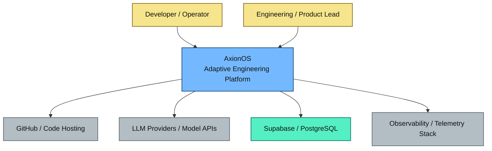
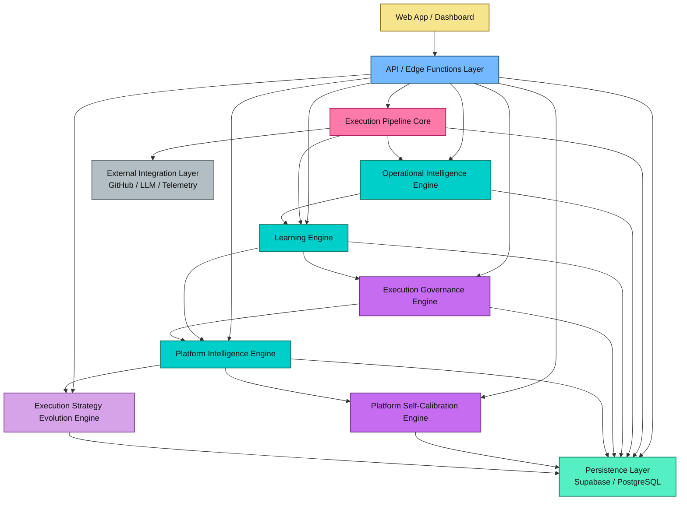
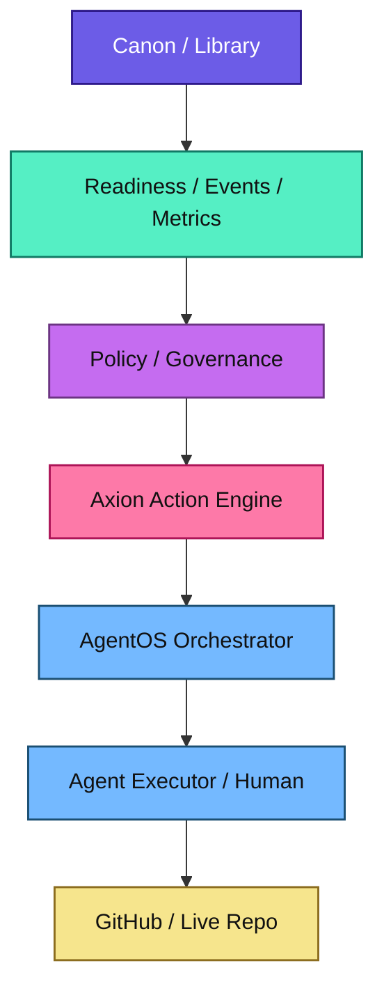
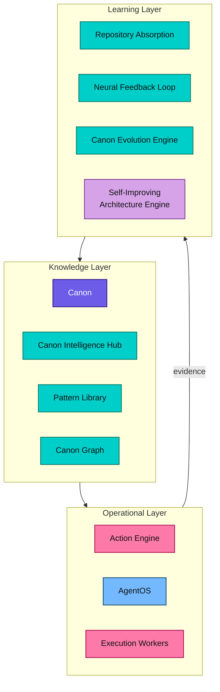

# AxionOS -- System Architecture

> Technical architecture of the autonomous software engineering system.
>
> **Last updated:** 2026-03-12
> **Current state:** Level 13 -- Knowledge Provenance & Trust-Weighted Intelligence. 181 sprints complete. All blocks (Foundation through AK).
> **Completed blocks:** Foundation through AK (Sprints 1--181)
> **Sprint details:** See `docs/registry/sprints.yml`

## Document Authority

| Scope | Rule |
|-------|------|
| **Owns** | System architecture, C4 diagrams, capability layers, containers, components, data flow, safety rules, AI efficiency layer, edge function architecture, database schema, technology stack, governing principle |
| **Must not define** | Full Agent OS module specs (-> GOVERNANCE.md), Canon Intelligence Engine details (-> CANON_INTELLIGENCE_ENGINE.md) |
| **Update rule** | Update when system structure or active architectural layers change |

### Core Subsystems

| Subsystem | Reference |
|-----------|-----------|
| Agent OS | [GOVERNANCE.md](GOVERNANCE.md) -- planes, modules, agent types, contracts |
| Canon Intelligence Engine | [CANON_INTELLIGENCE_ENGINE.md](CANON_INTELLIGENCE_ENGINE.md) -- knowledge layer, Agent-Contract model, canonization workflow |

---

## Mermaid Diagram Color Canon

| Function | Color | classDef |
|----------|-------|----------|
| Human / operator interaction | warm yellow | `fill:#F6E58D,stroke:#8C6D1F,color:#111` |
| Core system / platform structure | blue | `fill:#74B9FF,stroke:#1B4F72,color:#111` |
| Governance / policy / control | purple | `fill:#C56CF0,stroke:#6C3483,color:#111` |
| Intelligence / analysis / cognition | teal | `fill:#00CEC9,stroke:#117A65,color:#111` |
| Runtime / execution / repair loops | pink-magenta | `fill:#FD79A8,stroke:#AD1457,color:#111` |
| Data / memory / persistence | green | `fill:#55EFC4,stroke:#117A65,color:#111` |
| External systems / providers / connectors | neutral gray | `fill:#B2BEC3,stroke:#636E72,color:#111` |
| Strategic coordination layers | soft violet | `fill:#D6A2E8,stroke:#7D3C98,color:#111` |
| Reflexive governance / self-regulation | red | `fill:#FF7675,stroke:#922B21,color:#111` |
| Canonical knowledge / implementation intelligence | indigo | `fill:#6C5CE7,stroke:#2E1A8A,color:#fff` |

---

## 1. System Context



**Actors:**
- **Developer / Operator** -- submits ideas, monitors execution, reviews artifacts
- **Engineering / Product Lead** -- governs strategy, reviews proposals, approves promotions

**External Systems:**
- **GitHub** -- publish artifacts, PRs, atomic commits
- **LLM Providers** -- reasoning, generation (via Lovable AI Gateway)
- **Supabase / PostgreSQL** -- persistence, auth, RLS, Edge Functions
- **Observability** -- metrics, logs, telemetry events

---

## 2. Container Architecture



| Container | Technology | Responsibility |
|-----------|-----------|----------------|
| Web App / Dashboard | React 18 + Vite + Tailwind + shadcn/ui | User interaction, observability views, governance UI |
| API / Edge Functions | Supabase Edge Functions (Deno) | All backend logic, ~200+ functions |
| Execution Pipeline Core | Edge Functions + shared modules | 32-stage deterministic pipeline |
| Operational Intelligence | Shared modules | Error patterns, repair routing, prevention |
| Learning Engine | Shared modules | Prompt optimization, agent memory, prediction |
| Execution Governance | Shared modules | Policy selection, portfolio, tenant tuning |
| Platform Intelligence | Shared modules | Aggregation, bottleneck detection, health model |
| Platform Self-Calibration | Shared modules | Bounded threshold tuning with rollback |
| Strategy Evolution | Shared modules | Variant experimentation and promotion |
| Persistence Layer | Supabase PostgreSQL | 80+ tables with RLS |
| External Integration | GitHub API v3, Lovable AI Gateway | Code hosting, LLM reasoning |

---

## 3. Component Architecture (Summary)

### 3.1 Execution Pipeline Core
Stage Orchestrator -> Deterministic Pipeline Runner -> Artifact Manager -> Validation Engine -> Publish Engine -> Execution Event Emitter

### 3.2 Operational Intelligence Engine
Execution Events -> Error Pattern Library -> Repair Strategy Tracker -> Adaptive Repair Router -> Prevention Candidate Generator

### 3.3 Learning Engine
Execution History -> Prompt Optimization -> Promotion/Rollback | Fix Intelligence | Agent Memory | Predictive Detection | Cross-Stage Policy

### 3.4 Execution Governance Engine
Learning Signals + Policy Portfolio + Tenant Context -> Execution Policy Selector -> Tenant Adaptive Tuning -> Policy Routing

### 3.5 Platform Intelligence Engine
Platform Behavior Aggregator -> Bottleneck Detector + Pattern Analyzer -> Insight Generator -> Recommendation Engine + Health Model

### 3.6 Platform Self-Calibration Engine
Platform Intelligence Signals -> Signal Interpreter -> Calibration Proposal -> Guardrails -> Runner -> Outcome Tracker -> Rollback Engine

### 3.7 Execution Strategy Evolution Engine
Platform Signals -> Strategy Signal Interpreter -> Variant Synthesizer -> Guardrails -> Experiment Runner -> Outcome Tracker -> Promotion/Rollback

---

## 4. Architectural Principles

| Principle | Description |
|-----------|-------------|
| **Deterministic Core** | 32-stage pipeline executes in a fixed, reproducible order via DAG scheduling |
| **Bounded Adaptation** | All learning, calibration, and strategy evolution operate within declared envelopes |
| **Advisory-First** | All intelligent systems produce recommendations; humans approve structural changes |
| **Rollback Everywhere** | Every promotion, calibration, and strategy experiment preserves rollback capability |
| **Explainability and Lineage** | Every decision, variant, and outcome is traceable with full provenance |
| **Forbidden Mutation Families** | Pipeline topology, governance rules, billing logic, plan enforcement, execution contracts, and hard safety constraints are immutable by automated systems |
| **Multi-Tenant Isolation** | All data scoped by `organization_id` with RLS enforcement |
| **Additive Learning** | Learning modules consume existing data; they never modify the kernel directly |
| **Human Authority** | All structural evolution requires human review and approval |

---

## 5. Operational Decision Chain

> **Canonical Rule:** This is the official decision and execution flow of AxionOS.



| Layer | Role |
|-------|------|
| **Canon** | informs |
| **Readiness** | evaluates |
| **Policy** | constrains |
| **Action Engine** | formalizes |
| **AgentOS** | orchestrates |
| **Executors** | act |

### Layer Responsibilities

- **Canon / Library** -- Provides validated operational knowledge. Does not execute actions.
- **Readiness / Events / Metrics** -- Transforms system state into auditable signals. Does not make decisions.
- **Policy / Governance** -- Determines operational permissions and limits. Does not execute.
- **Action Engine (AE)** -- Transforms signals into formal, traceable actions. Routes to execution. Does not execute agents directly.
- **AgentOS Orchestrator** -- Coordinates execution. Selects agents, assembles context, dispatches tasks.
- **Agent Executor / Human** -- Performs the action in the real world.

### Responsibility Boundaries

1. Canon never triggers actions directly
2. Readiness/Metrics never executes actions
3. Policy does not execute -- it only constrains
4. Action Engine does not execute agents directly -- it formalizes and routes
5. AgentOS must not bypass Action Engine in governed flows
6. Every important action must be traceable
7. No layer may assume the responsibilities of another

### Action Engine (AE) -- Complete (Sprints 139-142)

The Action Engine formalizes actions within AxionOS. It connects Canon, Readiness, and Policy with AgentOS.

Key concepts:
- **Action Trigger** -- an event or signal that initiates the action pipeline
- **Action Intent** -- a formal declaration of what the system wants to do
- **Execution Mode** -- `auto | approval_required | manual_only | blocked`
- **Action Record** -- an auditable record of the formalized action
- **Action Outcome** -- the result, feeding back into the learning loop

### System Maturity Phases

| Phase | Name | Status |
|-------|------|--------|
| Phase 1 | UI Scaffolding | Complete |
| Phase 2 | Navigation Contract | Complete |
| Phase 3 | Metrics and Data Integrity | Complete |
| Phase 4 | Readiness Engine | Complete |
| Phase 5 | Canon and Library Operationalization | Complete |
| Phase 6 | AgentOS Decision Contract | Complete |
| Phase 7 | Action Engine | Complete |
| Phase 8 | Governance and Approval Flow | Complete |
| Phase 9 | Governed Execution Path | Complete |
| Phase 10 | Canon Pipeline Operationalization | Complete |
| Phase 11 | Repository Intelligence & Institutional Learning | Complete |
| Phase 12 | Self-Improving Architecture Engine | Complete |

### System Brain Map

For a comprehensive visual map of all subsystems, see:

> **[System Brain Map](diagrams/system-brain-map.md)**

---

## 6. Agent Operating System (Agent OS)

The Agent OS governs how agents are selected, executed, governed and coordinated. 18 modules across 5 architectural planes.

> **Full specification:** [GOVERNANCE.md](GOVERNANCE.md)

| Plane | Status | Key Modules |
|-------|--------|-------------|
| **Core** | Complete | Runtime Protocol, Capability Model, Core Types |
| **Control** | Complete | Selection Engine, Policy Engine, Governance Layer, Adaptive Routing |
| **Execution** | Complete | Orchestrator, Coordination, Distributed Runtime, LLM/Tool Adapters |
| **Data** | Complete | Artifact Store, Memory System, Observability |
| **Ecosystem** | Complete | Marketplace, Capability Registry, Trust Scoring |

---

## 7. Pipeline -- 32-Stage Model

```
VENTURE INTELLIGENCE (Stages 1-5)
  01: Idea Intake
  02: Opportunity Discovery Engine
  03: Market Signal Analyzer
  04: Product Validation Engine
  05: Revenue Strategy Engine

DISCOVERY & ARCHITECTURE (Stages 6-10)
  06: Discovery Intelligence (4 agents)
  07: Market Intelligence (4 agents)
  08: Technical Feasibility
  09: Project Structuring
  10: Squad Formation

INFRASTRUCTURE & MODELING (Stages 11-16)
  11: Architecture Planning
  12: Domain Model Generation
  13: AI Domain Analysis
  14: Schema Bootstrap
  15: DB Provisioning
  16: Data Model Generation

CODE GENERATION (Stages 17-19)
  17: Business Logic Synthesis
  18: API Generation
  19: UI Generation

VALIDATION & PUBLISH (Stages 20-23)
  20: Validation Engine (Fix Loop + Static + Drift)
  21: Build Engine (Runtime Validation via CI)
  22: Test Engine (Autonomous Build Repair)
  23: Publish Engine (Atomic Git Tree API)

GROWTH & EVOLUTION (Stages 24-32)
  24: Observability Engine
  25: Product Analytics Engine
  26: User Behavior Analyzer
  27: Growth Optimization Engine
  28: Adaptive Learning Engine
  29: Product Evolution Engine
  30: Architecture Evolution Engine
  31: Startup Portfolio Manager
  32: System Evolution Engine
```

---

## 8. Three Intelligence Layers

AxionOS operates as a **governed adaptive system** with three intelligence layers:



| Layer | Components | Role |
|-------|-----------|------|
| **Operational** | Action Engine, AgentOS, Execution Workers | Formalizes, orchestrates, and executes governed actions |
| **Knowledge** | Canon, Canon Intelligence Hub, Pattern Library, Canon Graph | Stores, indexes, and serves validated institutional knowledge |
| **Learning** | Repository Absorption, Neural Feedback Loop, Canon Evolution Engine, Self-Improving Architecture Engine | Absorbs knowledge, extracts patterns, distills intelligence, proposes governed self-improvement |

### Data Flow

1. **Operational Layer** emits execution evidence
2. **Learning Layer** absorbs evidence, extracts patterns, distills knowledge
3. **Knowledge Layer** receives promoted knowledge, serves it to operations
4. The cycle repeats — creating a **governed closed-loop intelligence metabolism**

---

## 8b. Block AI — Repository Intelligence & Institutional Learning (Sprints 164–171)

This block transforms the Canon Hub into a **living institutional knowledge system** capable of absorbing engineering knowledge from repositories and execution outcomes.

| Sprint | Capability |
|--------|-----------|
| 164 | Canon Candidate Review Engine |
| 165 | Pattern Deduplication & Merge Intelligence |
| 166 | Canon Promotion Workflow |
| 167 | Retrieval Activation & Canon Indexing |
| 168 | Repository Skill Distillation Engine |
| 169 | Repo-to-Canon Intelligence Graph |
| 170 | Agent Skill Injection Runtime |
| 171 | Institutional Learning Governance Surface |

---

## 8c. Block AJ — Self-Improving Architecture Engine (Sprints 172–179)

This block introduces **distilled intelligence and architecture self-improvement** capabilities. The system learns to distill knowledge, optimize token usage, extract architecture heuristics, propose improvements to itself, and maintain governance over self-evolution.

| Sprint | Capability |
|--------|-----------|
| 172 | Canon Distillation Engine |
| 173 | Skill Distillation & Micro-Skill Injection |
| 174 | Token Budgeting & Context Selection Engine |
| 175 | Retrieval Compression & Multi-Layer Memory |
| 176 | Architecture Heuristics Learning Engine |
| 177 | Self-Improvement Proposal Engine |
| 178 | Runtime Learning Efficiency Dashboard |
| 179 | Self-Improving Architecture Governance Surface |

### Knowledge Metabolism Pipeline

```
Source (repos, execution) → Candidate → Evaluation → Merge/Deduplication
→ Canon Promotion → Distilled Knowledge → Runtime Injection
→ Execution Feedback → Learning Signals → Architecture Improvement Proposals
```

All self-improvement proposals must pass through governance review. No opaque self-mutation.

---

## 9. Capability Tiers (Summary)

| Tier | Name | Block | Sprints |
|------|------|-------|---------|
| 1 | Foundation Layer | Foundation | 1-10 |
| 2 | Learning & Intelligence | Foundation | 11-26 |
| 3 | Execution Governance | Foundation | 27-29 |
| 4 | Platform Intelligence & Calibration | Foundation | 30-31 |
| 5 | Semantic Retrieval & Strategy | Foundation | 32-36 |
| 6 | Multi-Agent Coordination | O | 75-78 |
| 7 | Ecosystem & Marketplace | P | 79-82 |
| 8 | Distributed Runtime & Delivery | Q-R | 83-90 |
| 9 | Architecture Research & Evolution | S | 91-94 |
| 10 | User-Facing Intelligence | M | 66-71 |
| 11 | Strategic Coordination | W | 107-110 |
| 12 | Reflexive Governance | X | 111-114 |
| 13 | Canonical Knowledge | Y | 115-118 |
| 14 | Runtime Sovereignty | Z-AA | 119-126 |
| 15 | Learning Canonization | AB | 127-130 |
| 16 | Adaptive Coordination | AC | 131-134 |
| 17 | Adaptive Operational Organism | AD | 135-138 |
| 18 | Axion Action Engine | AE | 139-142 |
| 19 | Security Surface | AF | 143-146 |
| 20 | Adoption Intelligence | AG | 147-154 |
| 21 | Governance Decision Lifecycle | AH | 155-163 |
| 22 | Repository Intelligence & Institutional Learning | AI | 164-171 |
| 23 | Self-Improving Architecture Engine | AJ | 172-179 |
| 24 | Knowledge Provenance & Trust-Weighted Intelligence | AK | 180-181 |

---

## 10. Implementation Status

> **181 sprints complete.** All blocks Foundation through AK implemented.
> **Sprint-by-sprint record:** `docs/registry/sprints.yml`

| Block | Sprints | Name | Status |
|-------|---------|------|--------|
| Foundation | 1-40 | Execution Kernel + Intelligence + Governance + Architecture | Complete |
| J | 41-43 | Architecture-Governed | Complete |
| K | 44-45 | Architecture-Operating | Complete |
| L | 46-48 | Architecture-Scaled | Complete |
| M | 49-70 | Platform Convergence -> Customer Success | Complete |
| -- | 71 | Governed Extensibility | Complete |
| N | 72-74 | Evidence-Governed Improvement Loop | Complete |
| O | 75-78 | Advanced Multi-Agent Coordination | Complete |
| P | 79-82 | Governed Capability Ecosystem & Marketplace | Complete |
| Q | 83-86 | Autonomous Delivery Optimization & Assurance 2.0 | Complete |
| R | 87-90 | Advanced Distributed Runtime & Scaled Execution | Complete |
| S | 91-94 | Research Sandbox for Architecture Evolution | Complete |
| T | 95-98 | Governed Intelligence OS | Complete |
| U | 99-102 | Adaptive Institutional Ecosystem | Complete |
| V | 103-106 | Sovereign Institutional Intelligence | Complete |
| W | 107-110 | Strategic Autonomy & Civilizational Coordination | Complete |
| X | 111-114 | Reflexive Governance & Evolution Control | Complete |
| Y | 115-118 | Implementation Canon & Knowledge Governance | Complete |
| Z | 119-122 | Runtime Sovereignty & Outcome Compounding | Complete |
| AA | 123-126 | Runtime Proof & Adaptive Governance | Complete |
| AB | 127-130 | Learning Canonization | Complete |
| AC | 131-134 | Adaptive Coordination | Complete |
| AD | 135-138 | Adaptive Operational Organism | Complete |
| AE | 139-142 | Axion Action Engine | Complete |
| AF | 143-146 | Security Surface | Complete |
| AG | 147-154 | Adoption Intelligence & Product Experience | Complete |
| AH | 155-163 | Governance Decision Lifecycle | Complete |
| AI | 164-171 | Repository Intelligence & Institutional Learning | Complete |
| AJ | 172-179 | Self-Improving Architecture Engine | Complete |

---

## 11. Technology Stack

| Layer | Technology |
|-------|-----------|
| Frontend | Vite + React 18 + TypeScript + Tailwind CSS + shadcn/ui |
| State Management | TanStack React Query + React Context |
| Backend | Supabase (PostgreSQL, Auth, Edge Functions, RLS) |
| AI Engine -- Economy | DeepSeek (`deepseek-chat`, `deepseek-reasoner`) |
| AI Engine -- High Confidence | OpenAI (`gpt-5-mini`) |
| AI Engine -- Premium | OpenAI (`gpt-5.2`) |
| AI Engine -- Gateway | Lovable AI Gateway |
| AI Efficiency Layer | Prompt compression + semantic cache + canonical routing matrix |
| Git Integration | GitHub API v3 (Tree API for atomic commits, PRs) |
| Deployment | Vercel/Netlify configs auto-generated |

### Multi-Tenancy Model

- **Organizations** -> **Workspaces** -> **Initiatives**
- RLS policies enforce isolation per `organization_id`
- Role-based access: `owner`, `admin`, `editor`, `reviewer`, `viewer`

---

## 12. Workspace Modes

| Mode | Purpose | Surfaces |
|------|---------|----------|
| **Builder Mode** | Tactical engineering | Dashboard, Projects, Agents, Pipelines, Runtime, Execution Observability |
| **Owner Mode** | Strategic governance | System Intelligence, Canon Intelligence, Governance Decisions, Delivery Governance, Insights, Handoff, Application Tracking, Security |

---

## 13. Product Boundary Model

| Surface Layer | Audience | Purpose |
|---------------|----------|---------|
| **Internal System Architecture** | Platform engineers | Engines, governance, memory, calibration, orchestration |
| **Advanced Operator Surface (Owner Mode)** | Operators / leads | Governance dashboards, risk posture, policy management, audit |
| **Platform Governance Surface** | Platform reviewers / admins | Infrastructure controls, multi-tenant orchestration |
| **User-Facing Product Surface (Builder Mode)** | End users | Dashboard, Journey, Initiatives, Stories, Code, Deployments |

### Role and Surface Access

| Role | Product | Workspace | Platform |
|------|---------|-----------|----------|
| End User | Yes | -- | -- |
| Operator | Yes | Yes | -- |
| Tenant Owner | Yes | Yes | -- |
| Platform Reviewer | Yes | Yes | Yes |
| Platform Admin | Yes | Yes | Yes |

---

## 14. Governing Principle

> The Agent OS is a contract-driven, plane-separated architecture. Decisions flow through Control, execution through Execution, state into Data, identity from Core, discovery via Ecosystem. No plane assumes another's responsibilities.

**Core invariants:**
- Learning is additive, auditable, bounded -- it cannot mutate the kernel directly
- Engineering Memory informs but never commands
- Calibration signals diagnose; humans decide when and how tuning is applied
- All structural evolution requires human review and approval
- Tenant isolation is absolute (organization_id + RLS)
- Forbidden mutation families: pipeline topology, governance rules, billing logic, plan enforcement, execution contracts, hard safety constraints
- Every promotion, calibration, strategy experiment, and architecture change preserves rollback capability
- Internal sophistication serves the product experience -- unnecessary complexity must not leak into the user journey

---

## Documentation Boundaries

| File | Scope |
|------|-------|
| **ARCHITECTURE.md** (this file) | System structure -- containers, components, layers, data flow, safety rules |
| **GOVERNANCE.md** | Agent OS module reference -- planes, modules, contracts, events |
| **CANON_INTELLIGENCE_ENGINE.md** | Canon Intelligence Engine architecture |
| **AXION_CONTEXT.md** | Quick context restoration for humans |
| **AXION_PRIMER.md** | Ultra-short cognitive anchor for AI |
| **docs/registry/** | Canonical metadata (sprints.yml, blocks.yml, doc-authority.yml) |
| **docs/diagrams/** | Visual brain map and PlantUML diagrams |
