# AxionOS — System Architecture

> Technical architecture of the autonomous software engineering system.
>
> **Last updated:** 2026-03-11
> **Current state:** Level 10+ — Adaptive Operational Organism. 100+ architectural layers active. All blocks (Foundation through AD) complete. 138 sprints implemented.
> **Completed blocks:** Foundation through AD (Sprints 1–138)
> **Next horizon:** Future planning beyond Sprint 138
> **Sprint details:** #axionos--sprint-ledger

## Document Authority

| Scope | Rule |
|-------|------|
| **Owns** | System architecture, C4 diagrams, capability layers, containers, components, data flow, safety rules, AI efficiency layer, edge function architecture, database schema, technology stack, governing principle |
| **Must not define** | Full Agent OS module specs (→ GOVERNANCE.md), Canon Intelligence Engine details (→ CANON_INTELLIGENCE_ENGINE.md) |
| **Derived from** | GOVERNANCE.md for Agent OS summary; CANON_INTELLIGENCE_ENGINE.md for Canon subsystem |
| **Update rule** | Update when system structure or active architectural layers change |

### Core Subsystems

| Subsystem | Reference |
|-----------|-----------|
| Agent OS | [GOVERNANCE.md](GOVERNANCE.md) — planes, modules, agent types, contracts |
| Canon Intelligence Engine | [CANON_INTELLIGENCE_ENGINE.md](CANON_INTELLIGENCE_ENGINE.md) — knowledge layer, Agent–Contract model, canonization workflow |

---

## Mermaid Diagram Color Canon

To keep the architecture legible across blocks and future documentation updates, AxionOS uses a semantic Mermaid color canon.

These colors are not decorative. They indicate architectural function.

| Function | Color | classDef |
|----------|-------|----------|
| Human / operator interaction | warm yellow | `fill:#F6E58D,stroke:#8C6D1F,color:#111` |
| Core system / platform structure | blue | `fill:#74B9FF,stroke:#1B4F72,color:#111` |
| Governance / policy / control | purple | `fill:#C56CF0,stroke:#6C3483,color:#111` |
| Intelligence / analysis / cognition | teal | `fill:#00CEC9,stroke:#117A65,color:#111` |
| Runtime / execution / repair loops | pink-magenta | `fill:#FD79A8,stroke:#AD1457,color:#111` |
| Data / memory / persistence | green | `fill:#55EFC4,stroke:#117A65,color:#111` |
| External systems / providers / connectors | neutral gray | `fill:#B2BEC3,stroke:#636E72,color:#111` |
| Strategic coordination layers | soft violet | `fill:#D6A2E8,stroke:#7D3C98,color:#111` |
| Reflexive governance / self-regulation | red | `fill:#FF7675,stroke:#922B21,color:#111` |
| Canonical knowledge / implementation intelligence | indigo | `fill:#6C5CE7,stroke:#2E1A8A,color:#fff` |

> All future Mermaid diagrams should reuse these semantic colors consistently whenever possible.

---

## 1. System Context

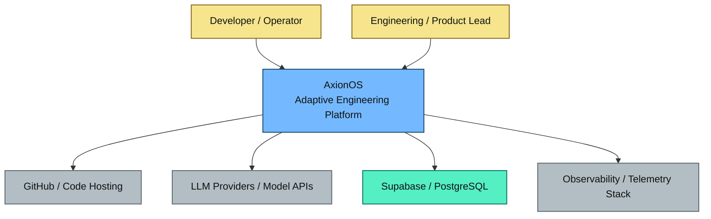

**Actors:**
- **Developer / Operator** — submits ideas, monitors execution, reviews artifacts
- **Engineering / Product Lead** — governs strategy, reviews proposals, approves promotions

**External Systems:**
- **GitHub** — publish artifacts, PRs, atomic commits
- **LLM Providers** — reasoning, generation (Gemini 2.5 Flash/Pro via Lovable AI Gateway)
- **Supabase / PostgreSQL** — persistence, auth, RLS, Edge Functions
- **Observability** — metrics, logs, telemetry events

---

## 2. Container Architecture

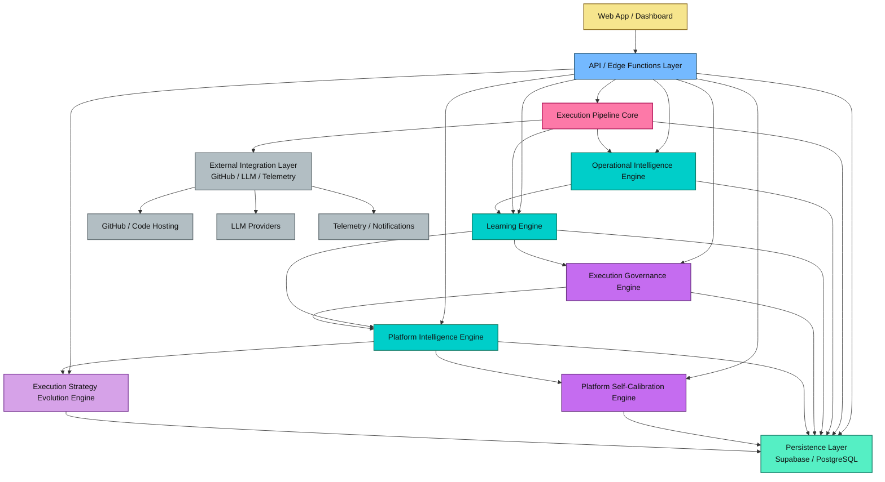

**Containers:**

| Container | Technology | Responsibility |
|-----------|-----------|----------------|
| Web App / Dashboard | React 18 + Vite + Tailwind + shadcn/ui | User interaction, observability views, governance UI |
| API / Edge Functions | Supabase Edge Functions (Deno) | All backend logic, ~200+ functions |
| Execution Pipeline Core | Edge Functions + shared modules | 32-stage deterministic pipeline |
| Operational Intelligence | Shared modules | Error patterns, repair routing, prevention |
| Learning Engine | Shared modules | Prompt optimization, agent memory, prediction |
| Execution Governance | Shared modules | Policy selection, portfolio, tenant tuning |
| Platform Intelligence | Shared modules | Aggregation, bottleneck detection, health model |
| Platform Self-Calibration | Shared modules | Bounded threshold tuning with rollback |
| Strategy Evolution | Shared modules | Variant experimentation and promotion |
| Persistence Layer | Supabase PostgreSQL | 80+ tables with RLS |
| External Integration | GitHub API v3, Lovable AI Gateway | Code hosting, LLM reasoning |

---

## 3. Component Architecture

### 3.1 Execution Pipeline Core

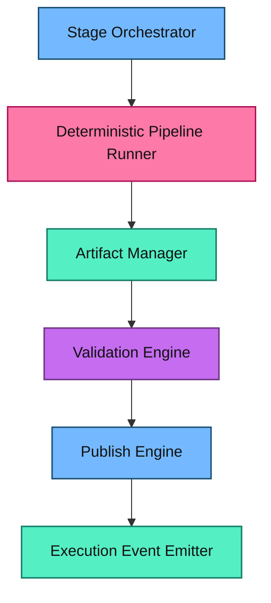

**Modules:**
- `pipeline-bootstrap.ts` — Pipeline lifecycle initialization with usage enforcement
- `dependency-scheduler.ts` — Kahn's algorithm, wave computation, 6 workers
- `pipeline-execution-orchestrator` / `pipeline-execution-worker` — DAG agent swarm
- `pipeline-helpers.ts` — Standardized logging, jobs, messages
- `autonomous-build-repair` — Self-healing builds from CI error logs
- `pipeline-fix-orchestrator` — Multi-iteration fix coordination
- `pipeline-preventive-validation` — Pre-generation guard
- `prevention-rule-engine` — Active prevention rule management
- `repair-routing-engine` — Adaptive strategy selection
- `error-pattern-library-engine` — Pattern extraction and indexing
- `observability-engine` / `initiative-observability-engine` — Telemetry
- `usage-limit-enforcer.ts` — Plan limits enforcement
- 50+ Edge Functions covering all 32 stages

**Persistence:** `initiative_jobs`, `active_prevention_rules`, `error_patterns`, `prevention_rule_candidates`, `repair_routing_log`, `pipeline_gate_permissions`, `stage_sla_configs`, `audit_logs`, `initiative_observability`

### 3.2 Operational Intelligence Engine

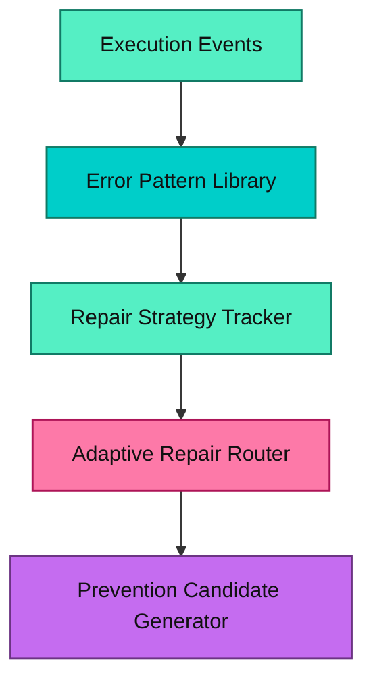

**Modules:**
- `error-pattern-library-engine` — Pattern extraction and indexing
- `repair-routing-engine` — Adaptive strategy selection based on historical success rates
- `prevention-rule-engine` — Active prevention rule management
- `repair-learning-engine` — Routing weight adaptation

**Persistence:** `error_patterns`, `repair_routing_log`, `prevention_rule_candidates`, `active_prevention_rules`, `repair_strategy_weights`

### 3.3 Learning Engine

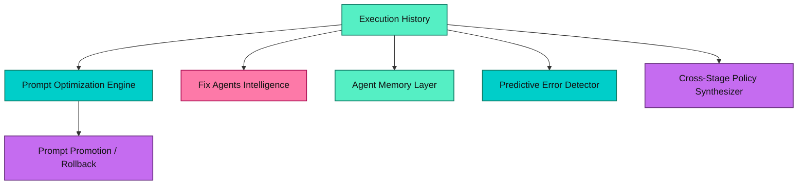

**Sub-layers:**

| Sub-layer | Sprint | Modules |
|-----------|--------|---------|
| Prompt Optimization + Rollback | 21-22 | `learning/prompt-variant-selector.ts`, `prompt-promotion-rules.ts`, `prompt-rollout-engine.ts`, `prompt-rollback-engine.ts`, `prompt-health-guard.ts` |
| Self-Improving Fix Agents v2 | 23 | `repair/repair-policy-engine.ts`, `repair-policy-updater.ts`, `repair-policy-explainer.ts`, `repair-memory-retriever.ts`, `retry-path-intelligence.ts` |
| Agent Memory Operationalization | 24 | `agent-memory/agent-memory-retriever.ts`, `agent-memory-injector.ts`, `agent-memory-writer.ts`, `agent-memory-quality.ts` |
| Predictive Error Detection | 25 | `predictive/predictive-risk-engine.ts`, `predictive-checkpoint-runner.ts`, `preventive-action-engine.ts`, `predictive-outcome-tracker.ts` |
| Cross-Stage Policy Synthesis (LA v2) | 26 | `cross-stage/cross-stage-policy-synthesizer.ts`, `cross-stage-policy-evaluator.ts`, `cross-stage-policy-runner.ts`, `cross-stage-policy-lineage.ts` |

### 3.4 Execution Governance Engine

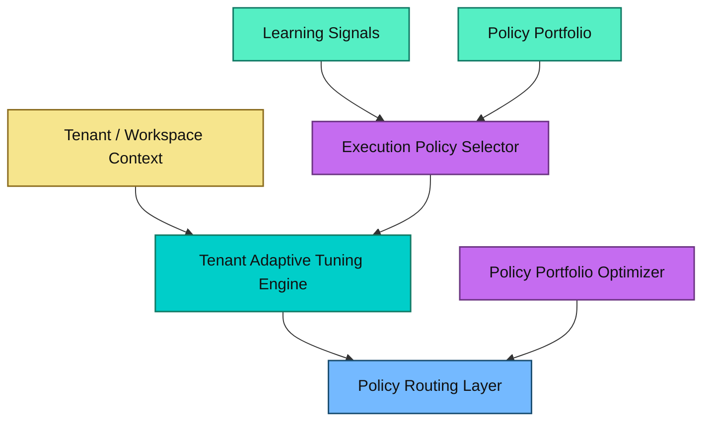

**Sub-layers:**

| Sub-layer | Sprint | Modules |
|-----------|--------|---------|
| Execution Policy Intelligence | 27 | `execution-policy/execution-context-classifier.ts`, `execution-policy-selector.ts`, `execution-policy-adjuster.ts`, `execution-policy-runner.ts`, `execution-policy-feedback.ts` |
| Portfolio Optimization | 28 | `execution-policy/execution-policy-portfolio-evaluator.ts`, `execution-policy-ranking-engine.ts`, `execution-policy-lifecycle-manager.ts`, `execution-policy-conflict-resolver.ts` |
| Tenant Adaptive Tuning | 29 | `tenant-policy/tenant-policy-tuning-engine.ts`, `tenant-policy-override-guard.ts`, `tenant-aware-policy-selector.ts`, `tenant-policy-drift-detector.ts` |

### 3.5 Platform Intelligence Engine

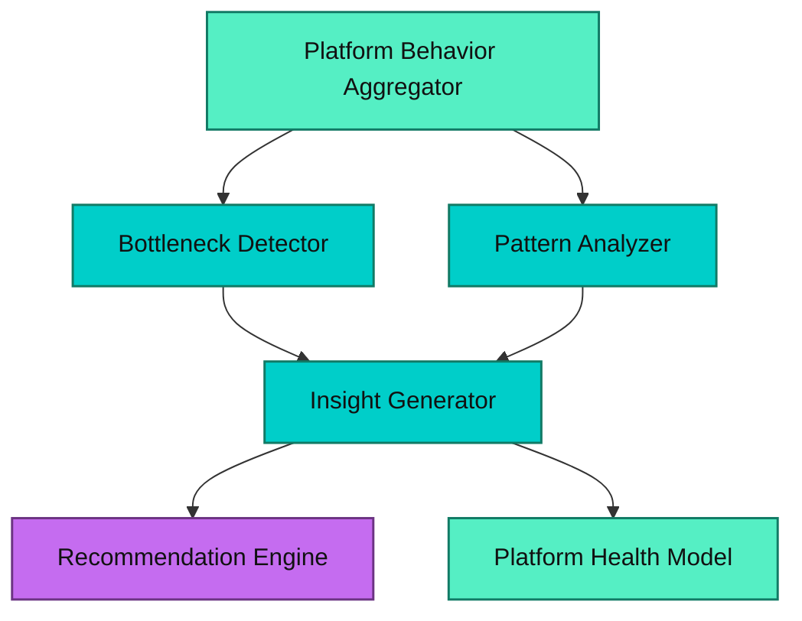

**Modules:** `platform-intelligence/platform-behavior-aggregator.ts`, `platform-bottleneck-detector.ts`, `platform-pattern-analyzer.ts`, `platform-insight-generator.ts`, `platform-recommendation-engine.ts`, `platform-health-model.ts`

**Health Indices:** reliability_index, execution_stability_index, repair_burden_index, cost_efficiency_index, deploy_success_index, policy_effectiveness_index

**Persistence:** `platform_insights`, `platform_recommendations`

### 3.6 Platform Self-Calibration Engine

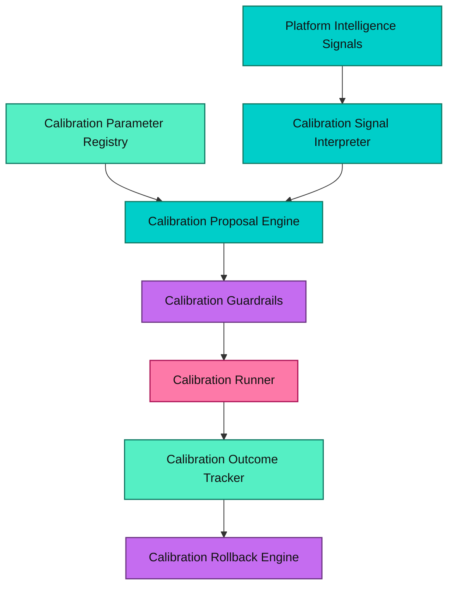

**Modules:** `platform-calibration/platform-calibration-signal-interpreter.ts`, `platform-calibration-proposal-engine.ts`, `platform-calibration-guardrails.ts`, `platform-calibration-runner.ts`, `platform-calibration-outcome-tracker.ts`, `platform-calibration-rollback-engine.ts`

**Persistence:** `platform_calibration_parameters`, `platform_calibration_proposals`, `platform_calibration_applications`, `platform_calibration_rollbacks`

**Forbidden Families:** pipeline_topology, governance_rules, billing_logic, plan_enforcement, execution_contracts, hard_safety_constraints

**Max delta:** 0.2 per calibration. Advisory-first by default.

### 3.7 Execution Strategy Evolution Engine

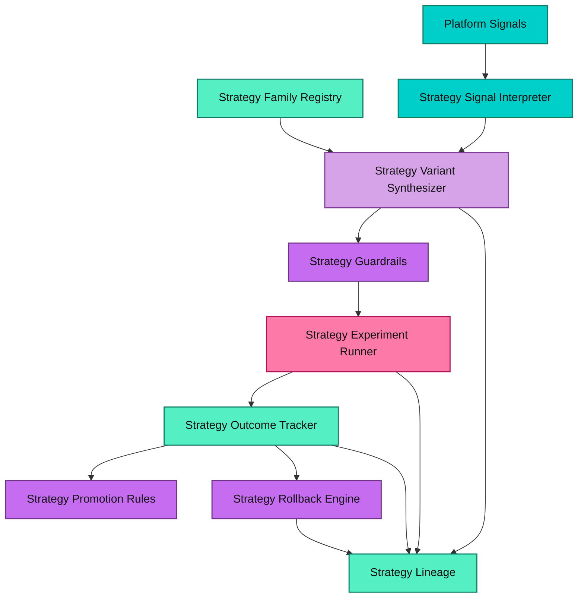

**Modules:** `execution-strategy/execution-strategy-signal-interpreter.ts`, `execution-strategy-variant-synthesizer.ts`, `execution-strategy-guardrails.ts`, `execution-strategy-experiment-runner.ts`, `execution-strategy-outcome-tracker.ts`, `execution-strategy-promotion-rules.ts`, `execution-strategy-rollback-engine.ts`, `execution-strategy-lineage.ts`

**Strategy Families:** repair_escalation_sequencing, retry_switching_heuristics, validation_intensity_ladders, predictive_checkpoint_ordering, review_escalation_timing, deploy_hardening_sequencing, context_enrichment_sequencing, strategy_fallback_ladders

**Persistence:** `execution_strategy_families`, `execution_strategy_variants`, `execution_strategy_experiments`, `execution_strategy_outcomes`

**Max delta:** 0.25 per mutation. Advisory-first default.

---

## 4. Architectural Principles

| Principle | Description |
|-----------|-------------|
| **Deterministic Core** | 32-stage pipeline executes in a fixed, reproducible order via DAG scheduling |
| **Bounded Adaptation** | All learning, calibration, and strategy evolution operate within declared envelopes |
| **Advisory-First by Default** | All intelligent systems produce recommendations; humans approve structural changes |
| **Rollback Everywhere** | Every promotion, calibration, and strategy experiment preserves rollback capability |
| **Explainability and Lineage** | Every decision, variant, and outcome is traceable with full provenance |
| **Forbidden Mutation Families** | Pipeline topology, governance rules, billing logic, plan enforcement, execution contracts, and hard safety constraints are immutable by automated systems |
| **Multi-Tenant Isolation** | All data scoped by `organization_id` with RLS enforcement |
| **Additive Learning** | Learning modules consume existing data; they never modify the kernel directly |
| **Human Authority** | All structural evolution requires human review and approval |

---

## 4B. Operational Decision Chain

> **Canonical Rule:** This is the official decision and execution flow of AxionOS. All operational behavior must respect this chain.

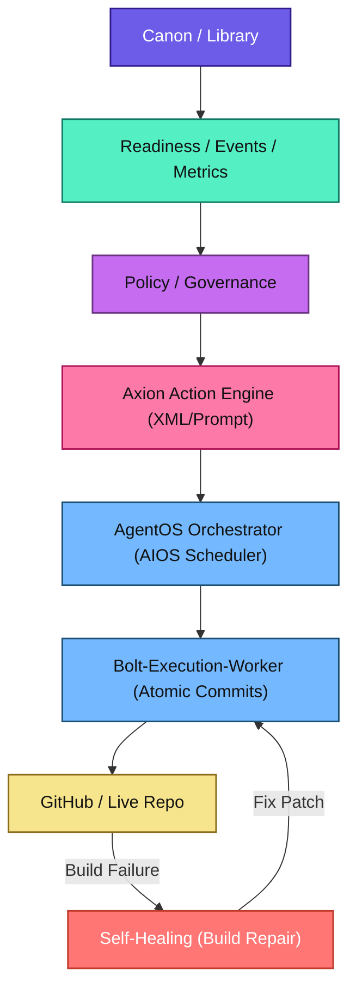

**Canonical Responsibility Rule:**

| Layer | Role |
|-------|------|
| **Canon** | informs |
| **Readiness** | evaluates |
| **Policy** | constrains |
| **Action Engine** | formalizes |
| **AgentOS** | orchestrates |
| **Executors** | act |

### 4B.1 Layer Responsibilities

#### Canon / Library

Provides validated operational knowledge. Includes canon entries, patterns, templates, conventions, rules, and playbooks. Canon does not execute actions and does not make operational decisions. Its function is to supply applicable knowledge for agents and system decisions.

**Key files:** `src/lib/canon/`, `supabase/functions/_shared/canon-*/`, `supabase/functions/canon-*/`

#### Readiness / Events / Metrics

Transforms system state into auditable signals. Includes metrics with source and confidence, system events, readiness evaluations, blockers, and warnings. This layer does not execute actions and does not make decisions. Its function is to describe the state of the system.

**Key files:** `src/lib/metrics/`, `src/lib/readiness/`

#### Policy / Governance

Determines operational permissions and limits. Evaluates risk, environment, compliance, approval requirements, and governance rules. This layer does not execute actions. Its function is to decide whether an action can happen and under what conditions.

**Key files:** `supabase/functions/_shared/agent-os/policy-engine.ts`, `supabase/functions/_shared/agent-os/governance.ts`, `supabase/functions/_shared/execution-policy/`

#### Action Engine (AE)

Transforms signals and evaluations into formal, traceable actions. Interprets triggers, maps triggers to intents, applies policy decisions, creates action records, and routes actions to execution. The AE does not directly execute agents. Its function is to formalize actions within the system.

**Key concepts:**
- **Action Trigger** — an event or signal that initiates the action pipeline
- **Action Intent** — a formal declaration of what the system wants to do
- **Execution Mode** — `auto | approval_required | manual_only | blocked`
- **Action Record** — an auditable record of the formalized action
- **Action Outcome** — the result of execution, feeding back into the learning loop

**Status:** Planned (not yet implemented). Domain-specific action engines exist for stabilization and predictive error prevention, but no central Action Engine exists yet.

#### AgentOS Orchestrator

Coordinates execution of formalized actions. Selects agents, assembles execution context, consults Canon/Library for knowledge injection, dispatches tasks, and tracks outcomes. Its function is to orchestrate operational execution.

**Key files:** `supabase/functions/_shared/agent-os/orchestrator.ts`, `supabase/functions/_shared/agent-os/registry.ts`, `supabase/functions/_shared/agent-os/selection.ts`

#### Agent Executor / Human Approval

The final execution layer. Can be automatic agents, human operators, or external systems. Its function is to perform the action in the real world.

### 4B.2 Responsibility Boundaries

These rules **must not** be violated:

1. **Canon / Library** never triggers actions directly
2. **Readiness / Metrics** never executes actions
3. **Policy** does not execute actions — it only constrains them
4. **Action Engine** does not execute agents directly — it formalizes and routes
5. **AgentOS** must not bypass Action Engine in governed flows
6. **Every important action must be traceable** — with context and justification
7. **No layer may assume the responsibilities of another layer**

### 4B.3 AE — Action Engine Block

The Action Engine is the architectural layer responsible for formalizing actions within AxionOS. It connects knowledge (Canon), state evaluation (Readiness/Metrics), and governance (Policy) with the agent execution system (AgentOS).

**AE Block Roadmap:**

| Sprint | Capability |
|--------|-----------|
| AE-01 | Action Domain Model — Trigger, Intent, ActionRecord, ActionOutcome types |
| AE-02 | Trigger Intake Layer — event/signal capture and normalization |
| AE-03 | Trigger to Intent Mapping — declarative rules engine |
| AE-04 | Policy-Aware Action Resolution — intent + policy = execution mode |
| AE-05 | Action Registry and Audit Trail — immutable action log |
| AE-06 | AgentOS Dispatch Contract — formal handoff from AE to Orchestrator |
| AE-07 | Human Approval Hooks — approval queue and resolution flow |
| AE-08 | Initial Operational Flows — first end-to-end governed actions |
| AE-09 | Action Center Integration — UI surface for action visibility |
| AE-10 | Recovery and Reversibility Hooks — rollback and escalation paths |

### 4B.4 System Maturity Phases

| Phase | Name | Status |
|-------|------|--------|
| Phase 1 | UI Scaffolding — Component structure, layout, navigation shells | Complete |
| Phase 2 | Navigation Contract — Role-based routing, surface separation | Complete |
| Phase 3 | Metrics and Data Integrity — Metric contract with source, confidence, updatedAt | Complete |
| Phase 4 | Readiness Engine — Deterministic readiness evaluation with named blockers | Complete |
| Phase 5 | Canon and Library Operationalization — Ingestion lifecycle, candidate pipeline, retrieval contract | Complete |
| Phase 6 | AgentOS Decision Contract — Policy engine, selection engine, capability model (contracts exist, not fully connected) | Partial |
| Phase 7 | Action Engine — Trigger/Intent/ActionRecord formalization | Planned |
| Phase 8 | Governance and Approval Flow — Approval queue, human-in-the-loop execution | Planned |
| Phase 9 | Self-Healing and Recovery — Autonomous error recovery with governance | Planned |
| Phase 10 | Learning Feedback Loop — Execution outcomes feed Canon and strategy evolution | Planned |

**Current system phase: Phase 5 complete, Phase 6 partial. Next target: Phase 7 (Action Engine).**

### 4B.5 System Brain Map

For a comprehensive visual map of all subsystems and their relationships, see:

> **[System Brain Map](diagrams/system-brain-map.md)** — canonical architectural brain map showing surfaces, knowledge, signals, policy, action engine, orchestration, execution, runtime, and learning loop.

This diagram is the canonical visual reference for developers, AI coding agents, and system operators.

---

## 5. Architectural Direction

### 5.1 Current — Adaptive Operational Organism — ✅ Level 10+ Complete

With all 138 sprints complete, 100+ architectural layers active, and the full stack from execution kernel through adaptive operational organism operational, AxionOS has achieved **Level 10+ maturity**.

All blocks from Foundation through AD are implemented and hardened. The system now operates as a governed adaptive organism with the following capabilities fully active:

- **Explain better** — ✅ PageGuidanceShell, ContextualCopilotDrawer, GovernanceMentorDrawer, CopilotTrigger, 4 copilot submodes, centralized content registries
- **Decide better** — ✅ Institutional Decision Engine, sovereign decision rights, role-aware experience, approval posture hints
- **Learn better** — ✅ Evidence-governed improvement loops, cross-stage learning, predictive detection, calibration, learning canonization
- **Coordinate better** — ✅ Multi-agent coordination (debate, working memory, bounded swarm), adaptive coordination, attention allocation
- **Operate autonomously (bounded)** — ✅ Bounded autonomous operations, autonomy ladder, rollback posture, outcome-based autonomy
- **Adapt institutionally** — ✅ Cross-context doctrine adaptation, institutional conflict resolution, federated intelligence, resilience governance
- **Govern sovereignty** — ✅ Memory constitution, sovereign decision rights, dependency sovereignty, strategic succession
- **Coordinate strategically** — ✅ Multi-horizon alignment, tradeoff arbitration, mission integrity, civilizational continuity simulation
- **Govern evolution** — ✅ Evolution proposal governance, architectural mutation control, reflective validation, kernel integrity guard
- **Canonize knowledge** — ✅ Canon stewardship, pattern library & retrieval, failure memory, external knowledge intake
- **Runtime sovereignty** — ✅ Live runtime feedback mesh, tenant doctrine, outcome-based autonomy, compounding advantage
- **Organism-level awareness** — ✅ Multi-loop governance, systemic health model, organism memory, organism console

### 5.2 Reality Check — System Maturity Assessment

AxionOS is no longer a concept. It has real, operational layers for execution, governance, memory, sovereignty, strategic coordination, reflexive governance, canonical knowledge, runtime sovereignty, and organism-level self-observation. However, it remains under active refinement.

**Strongest in:** Governance, orchestration, explainability, strategic control, tenant isolation, advisory intelligence, audit and lineage, canonical knowledge governance, reflexive self-regulation.

**Still maturing in:** End-to-end delivery reliability under edge-case conditions, runtime self-reconfiguration quality, adoption feedback loops, and cross-tenant intelligence precision.
- stack-specific conventions
- failure memory and repair strategies
- validated external knowledge updates

This canon is not a passive wiki. It is designed to be queried and applied directly by planning, execution, repair, and validation flows.

- Planning agents should consult architectural canon before generating implementation strategies.
- Execution agents should retrieve approved templates and conventions before producing code.
- Repair systems should consult historical failure patterns and successful mitigations.
- Validation agents should compare generated artifacts against canon-approved practices.

> **Operational Integration Principle:** In AxionOS, knowledge only counts as system capability when it is operationally connected to runtime behavior. A pattern not consumed by agents or functions is documentation, not implementation intelligence.

Block Y therefore represents applied, governed, versioned, and operationally integrated knowledge.

**Planned scope:**

| Sprint | Capability |
|--------|-----------|
| 115 | Canon Steward & Knowledge Governance Engine |
| 116 | Implementation Pattern Library & Retrieval Layer |
| 117 | Failure Memory & Repair Intelligence Archive |
| 118 | External Knowledge Intake & Canon Evolution Control |

**Architectural risk note:** The main risk of Block Y is becoming a decorative or bloated wiki. Its antidote is operational retrieval, governance, deprecation, and selective application rather than passive accumulation.

#### AxionOS Layered Architecture Overview

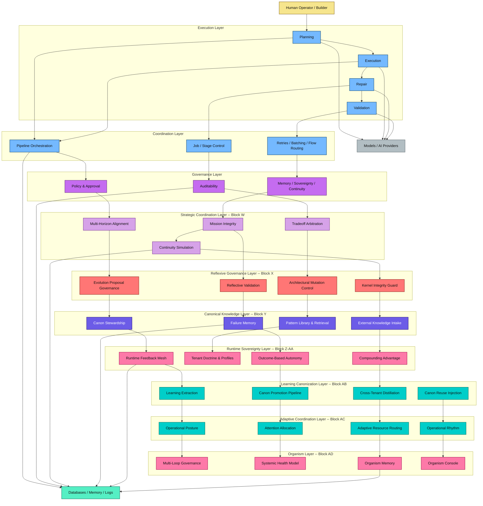

#### Runtime Knowledge Application Principle

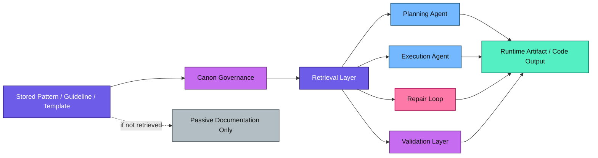

> A stored pattern becomes implementation intelligence only when it is selected, retrieved, and applied by runtime flows. Without operational use, the canon remains documentation rather than active system capability.

---

## 6. Capability Layers

```
   ═══════════════════════════════════════════════════════════════════
   TIER 17: ADAPTIVE OPERATIONAL ORGANISM (Block AD — Complete)
   ═══════════════════════════════════════════════════════════════════
   Multi-Loop Governance Orchestrator               ← Active (Sprint 135)
   Systemic Health Model                            ← Active (Sprint 136)
   Organism Memory Layers                           ← Active (Sprint 137)
   Adaptive Operational Organism Console            ← Active (Sprint 138)

   ═══════════════════════════════════════════════════════════════════
   TIER 16: ADAPTIVE COORDINATION (Block AC — Complete)
   ═══════════════════════════════════════════════════════════════════
   Operational Posture Engine                       ← Active (Sprint 131)
   Attention Allocation Engine                      ← Active (Sprint 132)
   Adaptive Resource Routing                        ← Active (Sprint 133)
   Operational Rhythm & Recovery Cycles             ← Active (Sprint 134)

   ═══════════════════════════════════════════════════════════════════
   TIER 15: LEARNING CANONIZATION (Block AB — Complete)
   ═══════════════════════════════════════════════════════════════════
   Learning Extraction Engine                       ← Active (Sprint 127)
   Canon Promotion Pipeline                         ← Active (Sprint 128)
   Cross-Tenant Pattern Distillation                ← Active (Sprint 129)
   Canon Reuse Injection                            ← Active (Sprint 130)

   ═══════════════════════════════════════════════════════════════════
   TIER 14: RUNTIME SOVEREIGNTY & OUTCOME COMPOUNDING (Block Z-AA — Complete)
   ═══════════════════════════════════════════════════════════════════
   Live Runtime Feedback Mesh                       ← Active (Sprint 119)
   Tenant Doctrine & Adaptive Operating Profiles v2 ← Active (Sprint 120)
   Outcome-Based Autonomy Engine                    ← Active (Sprint 121)
   Compounding Advantage & Moat Orchestrator        ← Active (Sprint 122)
   Runtime Execution Validation Harness             ← Active (Sprint 123)
   Autonomy Ladder Stabilization                    ← Active (Sprint 124)
   Tenant-Adaptive Regression Profiles              ← Active (Sprint 125)
   Cold Start Explainability Layer                  ← Active (Sprint 126)

   ═══════════════════════════════════════════════════════════════════
   TIER 13: CANONICAL KNOWLEDGE & IMPLEMENTATION INTELLIGENCE (Block Y — Complete)
   ═══════════════════════════════════════════════════════════════════
   Canon Steward & Knowledge Governance Engine      ← Active (Sprint 115)
   Implementation Pattern Library & Retrieval Layer ← Active (Sprint 116)
   Failure Memory & Repair Intelligence Archive     ← Active (Sprint 117)
   External Knowledge Intake & Canon Evolution Ctrl ← Active (Sprint 118)

   ═══════════════════════════════════════════════════════════════════
   TIER 12: REFLEXIVE GOVERNANCE LAYER (Block X — Complete)
   ═══════════════════════════════════════════════════════════════════
   Evolution Proposal Governance Engine             ← Active (Sprint 111)
   Architectural Mutation Control Layer             ← Active (Sprint 112)
   Reflective Validation & Self-Revision Audit      ← Active (Sprint 113)
   Kernel Integrity & Anti-Corrosion Guard          ← Active (Sprint 114)

   ═══════════════════════════════════════════════════════════════════
   TIER 11: STRATEGIC COORDINATION LAYER (Block W — Complete)
   ═══════════════════════════════════════════════════════════════════
   Multi-Horizon Strategic Alignment Engine         ← Active (Sprint 107)
   Institutional Tradeoff Arbitration System        ← Active (Sprint 108)
   Mission Integrity & Drift Prevention             ← Active (Sprint 109)
   Civilizational Continuity Simulation Layer       ← Active (Sprint 110)
     Cross-sprint causal signals active and bounded
     Constitution management UI and history/integration tabs operational
     Known maturity backlog: dimension/horizon mgmt UI limited,
       constitution-aware weight injection partial, bulk ops out of scope

   ═══════════════════════════════════════════════════════════════════
   TIER 10: USER-FACING INTELLIGENCE LAYER
   ═══════════════════════════════════════════════════════════════════
   Contextual Guidance & Copilot System            ← Active (Sprints 66-71+)
     - PageGuidanceShell (page-level guidance contracts)
     - ContextualCopilotDrawer (role-aware decision support)
     - GovernanceMentorDrawer (governance mentor mode)
     - CopilotTrigger (contextual activation)
     - WhyThisMattersNow / NextBestAction / ApprovalHint
     - 4 Copilot Submodes: product, workspace, governance_mentor, architecture_mentor
     - Centralized content registry (copilot-content.ts, governance-mentor-content.ts)

   ═══════════════════════════════════════════════════════════════════
   TIER 9: ARCHITECTURE RESEARCH & EVOLUTION LAYER
   ═══════════════════════════════════════════════════════════════════
   Architecture Hypothesis Engine                  ← Active (Sprint 91)
   Simulated Evolution Campaigns                   ← Active (Sprint 92)
   Cross-Tenant Pattern Synthesis                  ← Active (Sprint 93)
   Governed Architecture Promotion                 ← Active (Sprint 94)

   ═══════════════════════════════════════════════════════════════════
   TIER 8: DISTRIBUTED RUNTIME & DELIVERY LAYER
   ═══════════════════════════════════════════════════════════════════
   Distributed Job Control Plane                   ← Active (Sprint 87)
   Cross-Region Recovery                           ← Active (Sprint 88)
   Tenant-Isolated Scale Runtime                   ← Active (Sprint 89)
   Resilient Orchestration                         ← Active (Sprint 90)
   Delivery Causality Analysis                     ← Active (Sprint 83)
   Post-Deploy Learning                            ← Active (Sprint 84)
   Reliability-Aware Tuning                        ← Active (Sprint 85)
   Outcome Assurance 2.0                           ← Active (Sprint 86)

   ═══════════════════════════════════════════════════════════════════
   TIER 7: ECOSYSTEM & MARKETPLACE LAYER
   ═══════════════════════════════════════════════════════════════════
   Capability Packaging & Registry                 ← Active (Sprint 79)
   Trust & Entitlement Governance                  ← Active (Sprint 80)
   Partner Marketplace Pilot                       ← Active (Sprint 81)
   Outcome-Aware Capability Exchange               ← Active (Sprint 82)

   ═══════════════════════════════════════════════════════════════════
   TIER 6: MULTI-AGENT COORDINATION LAYER
   ═══════════════════════════════════════════════════════════════════
   Role Arbitration & Capability Routing 2.0       ← Active (Sprint 75)
   Debate & Resolution Protocol                    ← Active (Sprint 76)
   Shared Working Memory & Task-State Negotiation  ← Active (Sprint 77)
   Bounded Swarm Execution                         ← Active (Sprint 78)

   ═══════════════════════════════════════════════════════════════════
   TIER 5: SEMANTIC RETRIEVAL & STRATEGY LAYER
   ═══════════════════════════════════════════════════════════════════
   Layer 21: Semantic Retrieval & Embedding Memory ← Active (Sprint 36)
   Layer 17: Execution Strategy Evolution          ← Active (Sprint 32)

   ═══════════════════════════════════════════════════════════════════
   TIER 4: PLATFORM INTELLIGENCE & CALIBRATION LAYER
   ═══════════════════════════════════════════════════════════════════
   Layer 16: Platform Self-Calibration             ← Active (Sprint 31)
   Layer 15: Platform Intelligence Entry           ← Active (Sprint 30)

   ═══════════════════════════════════════════════════════════════════
   TIER 3: EXECUTION GOVERNANCE LAYER
   ═══════════════════════════════════════════════════════════════════
   Layer 14: Tenant/Workspace Adaptive Tuning      ← Active (Sprint 29)
   Layer 13: Execution Mode Portfolio Optimization  ← Active (Sprint 28)
   Layer 12: Execution Policy Intelligence         ← Active (Sprint 27)

   ═══════════════════════════════════════════════════════════════════
   TIER 2: LEARNING & INTELLIGENCE LAYER
   ═══════════════════════════════════════════════════════════════════
   Layer 11: Cross-Stage Policy Synthesis (LA v2)  ← Active (Sprint 26)
   Layer 10: Predictive Error Detection            ← Active (Sprint 25)
   Layer 9:  Agent Memory Operationalization       ← Active (Sprint 24)
   Layer 8:  Self-Improving Fix Agents v2          ← Active (Sprint 23)
   Layer 7:  Prompt Optimization + Rollback        ← Active (Sprints 21-22)
   Layer 6:  Proposal Quality & Calibration        ← Active (Sprints 19-20)
   Layer 5:  Engineering Memory Architecture       ← Cross-layer (Sprints 15-18)
   Layer 4:  Proposal Generation + Meta-Agents     ← Active (Sprints 13-14)

   ═══════════════════════════════════════════════════════════════════
   TIER 1: FOUNDATION LAYER
   ═══════════════════════════════════════════════════════════════════
   Layer 3:  Learning Agents v1                    ← Active (Sprint 12)
   Layer 2:  Commercial Readiness                  ← Active (Sprint 11)
   Layer 1:  Execution Kernel                      ← Active (Sprints 1-10)
              (Pipeline + Prevention + Routing + Governance + Observability)
```

Engineering Memory (Layer 5) is a **cross-layer infrastructure** that captures knowledge from all layers but does not interfere with their operation.

---

## 6. Agent Operating System (Agent OS) — v1.0 GA

The Agent OS is the runtime architecture governing how agents are selected, executed, governed and coordinated. It consists of 18 modules organized into 5 architectural planes.

> **Full specification:** [GOVERNANCE.md](GOVERNANCE.md) — canonical reference for planes, modules, agent types, contracts, safety boundaries, and events.

| Plane | Status | Key Modules |
|-------|--------|-------------|
| **Core** | ✅ Implemented | Runtime Protocol, Capability Model, Core Types |
| **Control** | ✅ Implemented | Selection Engine, Policy Engine, Governance Layer, Adaptive Routing |
| **Execution** | ✅ Implemented | Orchestrator, Coordination, Distributed Runtime, LLM/Tool Adapters |
| **Data** | ✅ Implemented | Artifact Store, Memory System, Observability |
| **Ecosystem** | ✅ Implemented | Marketplace, Capability Registry, Trust Scoring, Package Management |

---

## 7. Pipeline — 32-Stage Model

```
===============================================================
  VENTURE INTELLIGENCE LAYER (Stages 1-5)              FUTURE
===============================================================

  Stage 01: Idea Intake
  Stage 02: Opportunity Discovery Engine
  Stage 03: Market Signal Analyzer
  Stage 04: Product Validation Engine
  Stage 05: Revenue Strategy Engine

===============================================================
  DISCOVERY & ARCHITECTURE (Stages 6-10)               NOW
===============================================================

  Stage 06: Discovery Intelligence (pipeline-comprehension) -- 4 agents
  Stage 07: Market Intelligence (pipeline-architecture) -- 4 agents
  Stage 08: Technical Feasibility (pipeline-architecture-simulation)
  Stage 09: Project Structuring (pipeline-preventive-validation)
  Stage 10: Squad Formation (pipeline-squad)

===============================================================
  INFRASTRUCTURE & MODELING (Stages 11-16)             NOW
===============================================================

  Stage 11: Architecture Planning
  Stage 12: Domain Model Generation
  Stage 13: AI Domain Analysis
  Stage 14: Schema Bootstrap
  Stage 15: DB Provisioning
  Stage 16: Data Model Generation

===============================================================
  CODE GENERATION (Stages 17-19)                       NOW
===============================================================

  Stage 17: Business Logic Synthesis
  Stage 18: API Generation
  Stage 19: UI Generation

===============================================================
  VALIDATION & PUBLISH (Stages 20-23)                  NOW
===============================================================

  Stage 20: Validation Engine (Fix Loop + Deep Static + Drift Detection)
  Stage 21: Build Engine (Runtime Validation via CI)
  Stage 22: Test Engine (Autonomous Build Repair)
  Stage 23: Publish Engine (Atomic Git Tree API)

===============================================================
  GROWTH & EVOLUTION LAYER (Stages 24-32)
===============================================================

  Stage 24: Observability Engine                       NOW
  Stage 25: Product Analytics Engine                   LATER
  Stage 26: User Behavior Analyzer                     LATER
  Stage 27: Growth Optimization Engine                 LATER
  Stage 28: Adaptive Learning Engine                   NOW
  Stage 29: Product Evolution Engine                   LATER
  Stage 30: Architecture Evolution Engine              LATER
  Stage 31: Startup Portfolio Manager                  FUTURE
  Stage 32: System Evolution Engine                    FUTURE
```

---

## 8. Data Flow Between Layers

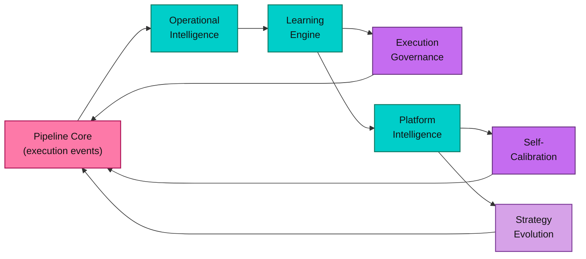

**Flow description:**
1. **Pipeline Core** emits execution events (success, failure, timing, cost)
2. **Operational Intelligence** extracts patterns, tracks repair strategies
3. **Learning Engine** optimizes prompts, builds memory, predicts errors, synthesizes cross-stage policies
4. **Execution Governance** selects policies based on learning signals, adapts per tenant
5. **Platform Intelligence** aggregates system-level behavior, detects bottlenecks
6. **Self-Calibration** proposes bounded threshold adjustments based on intelligence signals
7. **Strategy Evolution** proposes and tests strategy variants against baselines
8. All calibrations and strategy changes flow back into the pipeline as bounded adjustments

---

## 9. Safety Architecture

### Structural Safety Rules

1. **Recommendations do not execute changes.** All recommendations require human review.
2. **Artifacts do not execute changes.** Engineering artifacts are documents for review.
3. **Memory is not a mutation engine.** Engineering Memory is informational infrastructure only.
4. **Calibration is advisory-first.** Calibration signals diagnose; humans decide.
5. **Strategy evolution is bounded.** Variants stay within declared mutation envelopes.
6. **Human review remains required for structural evolution.** Any pipeline/governance/billing change requires human action.
7. **Tenant isolation is absolute.** All data scoped by `organization_id` with RLS enforcement.
8. **Learning is bounded and reversible.** Weight adjustments have min/max constraints.
9. **Forbidden domains are immutable.** Pipeline topology, governance, billing, enforcement, execution contracts, and hard safety constraints cannot be calibrated or mutated by any automated system.

---

## 10. AI Efficiency Layer

The AI Efficiency Layer optimizes token consumption, cost, and quality across all AI calls. It consists of four integrated engines orchestrated through the unified `callAI()` client (`_shared/ai-client.ts`).

### Canonical AI Routing Matrix
**File:** `_shared/ai-routing-matrix.ts`

The routing matrix is the single source of truth for all AI provider/model routing decisions. It classifies every AI call by task class and routes to the optimal provider/model combination.

**Primary Providers:**
- **DeepSeek** — Economy-first engine for high-volume, drafting, extraction
- **OpenAI (GPT-5-mini)** — High-confidence engine for structured output, governance, user-facing
- **OpenAI (GPT-5.4)** — Premium escalation for rare strategic/architecture reviews
- **Pollinations** — Optional experimental fallback only (disabled by default)
- **Lovable AI Gateway** — Transport fallback when no external API keys are configured (explicit OpenAI model names, never Gemini)

**Routing Tiers:**

| Tier | Default Provider | Model | Cost | Use Cases |
|------|-----------------|-------|------|-----------|
| Economy | DeepSeek | `deepseek-chat` | 0.2x | Classification, tagging, extraction, summarization, rewriting, drafting, embedding, prompt compression |
| Balanced | DeepSeek | `deepseek-chat` / `deepseek-reasoner` | 0.5x | First-pass code, workspace analysis, heavy reasoning (cost-sensitive), generic tasks |
| High Confidence | OpenAI | `gpt-5-mini` | 0.8x | Strict structured output, governance recommendations, user-facing responses, architecture reasoning, code refactor |
| Premium | OpenAI | `gpt-5.4` | 1.0x | Rare executive synthesis, premium architecture review, critical strategic decisions |

**Task Classification:** 14 task classes mapped to tiers: `simple_transform`, `extraction`, `summarization`, `drafting`, `workspace_analysis`, `code_generation`, `code_refactor`, `strict_structured_output`, `user_facing_response`, `governance_recommendation`, `architecture_reasoning`, `heavy_reasoning_cost_sensitive`, `premium_strategy`, `embedding_generation`, `prompt_compression`, `generic`.

**Pipeline Stage Mapping:** `_shared/ai-routing-matrix.ts` maps known pipeline stages to their canonical task class (e.g., `architecture` → `architecture_reasoning`, `api_generation` → `strict_structured_output`, `observability` → `extraction`).

### AI Router
**File:** `_shared/ai-router.ts`

Runtime resolution layer that handles:
- Provider availability checks (OpenAI key → DeepSeek key → Lovable Gateway)
- Heuristic complexity analysis when no explicit task class is provided
- Fallback chain assembly with provider swap
- Observability logging of all routing decisions

### Prompt Compression Engine
**File:** `_shared/prompt-compressor.ts`
**Result:** 60–90% token reduction while preserving engineering-critical information. Uses rule-based cleaning first, then AI-assisted compression for large prompts (>8000 chars).

### Semantic Cache Engine
**File:** `_shared/semantic-cache.ts`
**Table:** `ai_prompt_cache` (with `vector(768)` column)
**Threshold:** cosine similarity > 0.92 returns cached response. Tracks hit counts and tokens saved.

### Model Router (Legacy Bridge)
**File:** `_shared/model-router.ts`
Delegates to the canonical AI Router. Maintained for backward compatibility.

### Integration Flow
All modules integrate transparently in `callAI()` (`_shared/ai-client.ts`):
```
callAI() → compress → cache lookup → canonical route (matrix + availability) → LLM call (with retry + fallback chain) → cache store → return
```

**Provider Priority:** OpenAI (direct) → DeepSeek (direct) → Lovable AI Gateway (explicit OpenAI models, never Gemini defaults).

**Canonical Invariant:** Gemini is explicitly removed as a default route. AxionOS controls its own model selection based on task class, risk, and cost — not gateway defaults.

---

## 11. Edge Function Architecture

```
supabase/functions/
+-- Discovery & Architecture       (5 functions)
+-- Infrastructure & Modeling       (8 functions)
+-- Code Generation                 (3 functions)
+-- Validation & Publish            (6 functions)
+-- Growth & Evolution              (9 functions)
+-- Pipeline Control                (7 functions)
+-- Commercial Readiness            (2 functions -- Sprint 11)
+-- Learning Agents                 (6 functions -- Sprint 12)
+-- Meta-Agents                     (3 functions -- Sprint 13-14, 18)
+-- Engineering Memory              (2 functions -- Sprint 15, 17)
+-- Proposal Quality                (1 function -- Sprint 19)
+-- Advisory Calibration            (1 function -- Sprint 20)
+-- Prompt Optimization             (1 function -- Sprint 21-22)
+-- Repair Policy                   (1 function -- Sprint 23)
+-- Agent Memory                    (1 function -- Sprint 24)
+-- Predictive Error Detection      (2 functions -- Sprint 25)
+-- Cross-Stage Learning            (1 function -- Sprint 26)
+-- Execution Policy Intelligence   (1 function -- Sprint 27)
+-- Portfolio Optimization          (1 function -- Sprint 28)
+-- Tenant Adaptive Tuning          (1 function -- Sprint 29)
+-- Platform Intelligence           (1 function -- Sprint 30)
+-- Platform Self-Calibration       (1 function -- Sprint 31)
+-- Strategy Evolution              (1 function -- Sprint 32)
+-- Strategy Portfolio Governance   (1 function -- Sprint 33)
+-- Platform Self-Stabilization     (1 function -- Sprint 34)
+-- Engineering Advisor             (1 function -- Sprint 35)
+-- Semantic Retrieval              (1 function -- Sprint 36)
+-- Discovery Architecture          (1 function -- Sprint 37)
+-- Architecture Simulation         (1 function -- Sprint 38)
+-- Architecture Change Planning    (1 function -- Sprint 39)
+-- Architecture Rollout Sandbox    (1 function -- Sprint 40)
+-- Support                         (11 functions)
+-- _shared/                        (15+ helper modules)
    +-- agent-os/                   (14 Agent OS modules)
    +-- meta-agents/               (Meta-agent types, scoring, validation, memory, quality)
    +-- calibration/               (Calibration types, scoring, analysis service)
    +-- learning/                  (Prompt optimization, promotion, rollback)
    +-- repair/                    (Repair policies, strategies, memory, intelligence)
    +-- prevention/                (Prevention evaluator)
    +-- agent-memory/              (Agent memory retriever, injector, writer, quality)
    +-- predictive/                (Risk engine, checkpoint runner, preventive actions, outcome tracker)
    +-- cross-stage/               (Policy synthesizer, evaluator, runner, lineage)
    +-- execution-policy/          (Classifier, selector, adjuster, runner, feedback, portfolio, ranking, lifecycle, conflict)
    +-- tenant-policy/             (Tuning engine, override guard, selector, drift detector)
    +-- platform-intelligence/     (Behavior aggregator, bottleneck detector, pattern analyzer, insight generator, recommendation engine, health model)
    +-- platform-calibration/      (Signal interpreter, proposal engine, guardrails, runner, outcome tracker, rollback engine)
    +-- execution-strategy/        (Signal interpreter, variant synthesizer, guardrails, experiment runner, outcome tracker, promotion rules, rollback engine, lineage)
    +-- strategy-portfolio/        (Portfolio lifecycle, health scoring, conflict resolution)
    +-- platform-stabilization/    (Drift detector, oscillation detector, stability guard, safe modes)
    +-- engineering-advisor/       (Advisor synthesis, signal processor, review manager, explainer)
    +-- semantic-retrieval/        (Session manager, index manager, context builders, guardrails)
    +-- discovery-architecture/    (Signal correlation, recommendation generator, evidence linker)
    +-- architecture-simulation/   (Impact simulator, boundary analyzer, guardrails, review manager, explainer)
    +-- architecture-planning/     (Dependency planner, readiness assessor, validation/rollback blueprints, clustering, review)
    +-- architecture-rollout/      (Migration rehearsal, fragility analyzer, readiness assessor, rollback viability, sandbox guardrails)
```

---

## 12. Implementation Status

> **Canonical sprint-by-sprint record:** #axionos--sprint-ledger
> **Summary:** 138 sprints complete. 100+ architectural layers active. All blocks (Foundation through AD) implemented, validated, and hardened.

| Block | Sprints | Status |
|-------|---------|--------|
| Foundation + Operational Intelligence | 1–12 | ✅ Complete |
| Meta-Intelligence & Memory | 13–20 | ✅ Complete |
| Learning & Repair Intelligence | 21–26 | ✅ Complete |
| Execution Governance | 27–29 | ✅ Complete |
| Platform Intelligence & Calibration | 30–31 | ✅ Complete |
| Strategy Evolution & Governance | 32–33 | ✅ Complete |
| Platform Stabilization & Advisory | 34–37 | ✅ Complete |
| Architecture Intelligence | 38–40 | ✅ Complete |
| Architecture-Governed (J) | 41–43 | ✅ Complete |
| Architecture-Operating (K) | 44–45 | ✅ Complete |
| Architecture-Scaled (L) | 46–48 | ✅ Complete |
| Platform Convergence (M) | 49–70 | ✅ Complete |
| Governed Extensibility Bridge | 71 | ✅ Complete |
| Evidence-Governed Improvement Loop (N) | 72–74 | ✅ Complete |
| Advanced Multi-Agent Coordination (O) | 75–78 | ✅ Complete |
| Governed Capability Ecosystem (P) | 79–82 | ✅ Complete |
| Delivery Optimization & Outcome Assurance 2.0 (Q) | 83–86 | ✅ Complete |
| Distributed Runtime & Scaled Execution (R) | 87–90 | ✅ Complete |
| Research Sandbox for Architecture Evolution (S) | 91–94 | ✅ Complete |
| Governed Intelligence OS (T) | 95–98 | ✅ Complete |
| Adaptive Institutional Ecosystem (U) | 99–102 | ✅ Complete |
| Sovereign Institutional Intelligence (V) | 103–106 | ✅ Complete |
| Strategic Autonomy & Civilizational Coordination (W) | 107–110 | ✅ Complete |
| Reflexive Governance & Evolution Control (X) | 111–114 | ✅ Complete |
| Implementation Canon & Knowledge Governance (Y) | 115–118 | ✅ Complete |
| Runtime Sovereignty & Outcome Compounding (Z) | 119–122 | ✅ Complete |
| Runtime Proof & Adaptive Governance (AA) | 123–126 | ✅ Complete |
| Learning Canonization (AB) | 127–130 | ✅ Complete |
| Adaptive Coordination (AC) | 131–134 | ✅ Complete |
| Adaptive Operational Organism (AD) | 135–138 | ✅ Complete |

---

## 13. Database Schema (80+ tables)

### Core Tables
- `organizations`, `organization_members`, `profiles`
- `workspaces`, `initiatives`, `initiative_jobs`
- `agents`, `agent_messages`, `agent_memory`, `agent_outputs`

### Pipeline Tables
- `stories`, `story_phases`, `story_subtasks`
- `squads`, `squad_members`
- `planning_sessions`
- `code_artifacts`, `content_documents`, `adrs`

### Brain Tables
- `project_brain_nodes` (with `vector(768)` embedding)
- `project_brain_edges`
- `project_decisions`
- `project_errors`
- `project_prevention_rules`

### Governance Tables
- `pipeline_gate_permissions`
- `stage_sla_configs`
- `org_usage_limits`
- `audit_logs`
- `artifact_reviews`

### Efficiency Tables
- `ai_prompt_cache` (with `vector(768)` embedding, TTL, hit tracking)
- `ai_rate_limits`

### Knowledge Tables
- `org_knowledge_base`
- `git_connections`
- `supabase_connections`
- `validation_runs`
- `usage_monthly_snapshots`

### Commercial Tables (Sprint 11)
- `product_plans` — Starter / Pro / Enterprise with limits
- `billing_accounts` — Stripe-ready with period tracking
- `workspace_members` — Granular roles per workspace

### Learning Tables (Sprint 12)
- `prompt_strategy_metrics` — Prompt performance aggregation
- `strategy_effectiveness_metrics` — Repair strategy effectiveness
- `predictive_error_patterns` — Recurring failure predictions
- `repair_strategy_weights` — Adjusted routing weights
- `learning_recommendations` — Structured improvement suggestions
- `learning_records` — Learning foundation substrate

### Meta-Agent Tables (Sprint 13-14)
- `meta_agent_recommendations` — Architectural recommendations
- `meta_agent_artifacts` — Engineering proposals

### Engineering Memory Tables (Sprints 15-17)
- `engineering_memory_entries` — Core memory storage with type taxonomy
- `memory_links` — Typed relationships between memory entries
- `memory_retrieval_log` — Retrieval tracking
- `memory_summaries` — Periodic historical synthesis

### Proposal Quality Tables (Sprint 19)
- `proposal_quality_feedback` — Quality and outcome tracking
- `proposal_quality_summaries` — Periodic quality summaries

### Advisory Calibration Tables (Sprint 20)
- `advisory_calibration_signals` — Structured diagnostic signals
- `advisory_calibration_summaries` — Periodic calibration summaries

### Prompt Optimization Tables (Sprints 21-22)
- `prompt_variants` — Prompt variant registry with A/B testing
- `prompt_variant_executions` — Execution telemetry per variant
- `prompt_variant_metrics` — Aggregated variant performance metrics
- `prompt_variant_promotions` — Promotion events with lineage
- `prompt_rollout_windows` — Phased rollout tracking
- `prompt_promotion_health_checks` — Post-promotion health monitoring
- `prompt_rollback_events` — Rollback events

### Repair Policy Tables (Sprint 23)
- `repair_policy_profiles` — Memory-aware repair strategy profiles
- `repair_policy_decisions` — Logged repair decisions
- `repair_policy_adjustments` — Bounded, reversible adjustments

### Agent Memory Tables (Sprint 24)
- `agent_memory_profiles` — Per-agent persistent memory profiles
- `agent_memory_records` — Reusable memory units

### Predictive Error Detection Tables (Sprint 25)
- `predictive_risk_assessments` — Runtime risk scoring
- `predictive_runtime_checkpoints` — Checkpoint evaluations
- `predictive_preventive_actions` — Preventive actions

### Cross-Stage Learning Tables (Sprint 26)
- `cross_stage_learning_edges` — Learning graph edges
- `cross_stage_policy_profiles` — Synthesized cross-stage policies
- `cross_stage_policy_outcomes` — Policy outcome tracking

### Execution Policy Intelligence Tables (Sprint 27)
- `execution_policy_profiles` — Bounded execution policy modes
- `execution_policy_outcomes` — Outcome tracking per policy
- `execution_policy_decisions` — Audit trail of policy decisions

### Execution Mode Portfolio Tables (Sprint 28)
- `execution_policy_portfolio_entries` — Portfolio entries with scores
- `execution_policy_portfolio_recommendations` — Portfolio recommendations

### Tenant Adaptive Policy Tuning Tables (Sprint 29)
- `tenant_policy_preference_profiles` — Org/workspace preferences
- `tenant_policy_outcomes` — Tenant-specific outcomes
- `tenant_policy_recommendations` — Tenant recommendations

### Platform Intelligence Tables (Sprint 30)
- `platform_insights` — Platform-level insights
- `platform_recommendations` — Prioritized advisory recommendations

### Platform Self-Calibration Tables (Sprint 31)
- `platform_calibration_parameters` — Calibratable parameter registry
- `platform_calibration_proposals` — Calibration proposals
- `platform_calibration_applications` — Applied calibrations
- `platform_calibration_rollbacks` — Rollback records

### Execution Strategy Evolution Tables (Sprint 32)
- `execution_strategy_families` — Strategy family registry
- `execution_strategy_variants` — Bounded variant proposals
- `execution_strategy_experiments` — Controlled experiments
- `execution_strategy_outcomes` — Experiment outcome tracking

### Strategy Portfolio Governance Tables (Sprint 33)
- `strategy_portfolio_entries` — Strategy family portfolio entries
- `strategy_portfolio_health_snapshots` — Portfolio health snapshots
- `strategy_portfolio_recommendations` — Governance recommendations

### Platform Self-Stabilization Tables (Sprint 34)
- `platform_stability_signals` — Stability signals (drift, oscillation)
- `platform_stabilization_proposals` — Stabilization proposals
- `platform_stabilization_applications` — Applied stabilizations
- `platform_safe_mode_profiles` — Safe mode profiles

### Autonomous Engineering Advisor Tables (Sprint 35)
- `engineering_advisor_signals` — Cross-layer advisory signals
- `engineering_advisor_recommendations` — Advisory recommendations
- `engineering_advisor_reviews` — Recommendation review lifecycle

### Semantic Retrieval Tables (Sprint 36)
- `semantic_retrieval_sessions` — Retrieval sessions with audit
- `semantic_retrieval_feedback` — Retrieval usefulness feedback
- `semantic_index_profiles` — Index profiles per domain

### Discovery Architecture Tables (Sprint 37)
- `discovery_architecture_signals` — External/product signals
- `discovery_architecture_recommendations` — Architecture recommendations
- `discovery_architecture_evidence_links` — Evidence linkage

### Architecture Simulation Tables (Sprint 38)
- `architecture_change_proposals` — Change proposal registry
- `architecture_simulation_scope_profiles` — Simulation scope profiles
- `architecture_simulation_outcomes` — Simulation results
- `architecture_simulation_reviews` — Simulation review lifecycle

### Architecture Planning Tables (Sprint 39)
- `architecture_change_plans` — Implementation plans with blast radius
- `architecture_rollout_mode_profiles` — Rollout mode profiles
- `architecture_change_plan_reviews` — Plan review lifecycle

### Architecture Rollout Sandbox Tables (Sprint 40)
- `architecture_rollout_sandboxes` — Sandbox rehearsal environments
- `architecture_validation_hooks` — Validation hook registry
- `architecture_rollout_sandbox_outcomes` — Sandbox rehearsal results
- `architecture_rollout_governance_profiles` — Sandbox governance profiles
- `architecture_rollout_sandbox_reviews` — Sandbox review lifecycle

---

## 14. Technology Stack

| Layer | Technology |
|-------|-----------|
| Frontend | Vite + React 18 + TypeScript + Tailwind CSS + shadcn/ui |
| State Management | TanStack React Query + React Context |
| Backend | Supabase (PostgreSQL, Auth, Edge Functions, RLS) |
| AI Engine — Economy | DeepSeek (`deepseek-chat`, `deepseek-reasoner`) |
| AI Engine — High Confidence | OpenAI (`gpt-5-mini`) |
| AI Engine — Premium | OpenAI (`gpt-5.4` / `gpt-5.2`) |
| AI Engine — Fallback Transport | Lovable AI Gateway (explicit OpenAI models, no Gemini) |
| AI Efficiency Layer | Prompt compression + semantic cache + canonical routing matrix |
| Git Integration | GitHub API v3 (Tree API for atomic commits, PRs) |
| Deployment | Vercel/Netlify configs auto-generated |

### Multi-Tenancy Model

- **Organizations** → **Workspaces** → **Initiatives**
- RLS policies enforce isolation per `organization_id`
- Role-based access: `owner`, `admin`, `editor`, `reviewer`, `viewer`
- Auto-provisioning: first login creates a default org via `create_organization_with_owner` RPC

### System Maturity

> **Current:** Level 10+ — Adaptive Operational Organism ✅ (138 sprints complete)

---

## 15. Governing Principle

> The Agent OS is a contract-driven, plane-separated architecture. Decisions flow through Control, execution through Execution, state into Data, identity from Core, discovery via Ecosystem. No plane assumes another's responsibilities.
>
> **Core invariants:**
> - Learning is additive, auditable, bounded — it cannot mutate the kernel directly
> - Engineering Memory informs but never commands
> - Calibration signals diagnose; humans decide when and how tuning is applied
> - All structural evolution requires human review and approval
> - Tenant isolation is absolute (organization_id + RLS)
> - Forbidden mutation families: pipeline topology, governance rules, billing logic, plan enforcement, execution contracts, hard safety constraints
> - Every promotion, calibration, strategy experiment, and architecture change preserves rollback capability
> - All advisory layers remain bounded, explainable, and review-driven
> - Internal sophistication serves the product experience — unnecessary complexity must not leak into the default user-facing journey

---

## 16. Product Boundary Model

AxionOS distinguishes four architectural surface layers:

| Surface Layer | Audience | Purpose | Examples |
|---------------|----------|---------|----------|
| **Internal System Architecture** | Platform engineers | Governance, intelligence, memory, calibration, observability, ecosystem controls, policy engines, orchestration | All 54 architectural layers, Agent OS modules, learning/repair/calibration engines |
| **Advanced Operator Surface** | Operators / leads | Governance dashboards, risk posture, policy management, product ops, ecosystem readiness, audit | Operational observability tabs, governance reviews, policy frames, fitness dimensions |
| **Platform Governance Surface** | Platform reviewers / admins | Infrastructure controls, multi-tenant orchestration, advanced AI pipeline tooling | Routing, debates, working memory, swarm, marketplace, meta-agents, calibration, observability |
| **User-Facing Product Surface** | End users | Dashboard, Journey, Onboarding, Initiatives, Stories, Code, Deployments, AutoPilot | Pipeline stages, progress indicators, approval gates, deploy status |

### Role and Surface Access Model

| Role | Product | Workspace | Platform |
|------|---------|-----------|----------|
| **End User** | ✅ | — | — |
| **Operator** | ✅ | ✅ | — |
| **Tenant Owner** | ✅ | ✅ | — |
| **Platform Reviewer** | ✅ | ✅ | ✅ |
| **Platform Admin** | ✅ | ✅ | ✅ |

**Key principle:** Internal architecture powers the system. Operator surfaces expose governance and advanced controls. The **default product surface** should present the journey from idea to delivered software without unnecessary internal complexity.

---

## 17. Architectural Direction — Post-Block AD

With 138 sprints complete, all blocks from Foundation through Adaptive Operational Organism (AD) delivered and hardened, the platform has achieved Level 10+ maturity. 100+ architectural layers are active.

### Completed Canon (Sprints 1–138)

- ✅ All layers from execution kernel through adaptive operational organism
- ✅ 100+ architectural layers active
- ✅ Full operating canon with all planned blocks implemented and hardened
- ✅ 200+ Edge Functions deployed

### Implemented Blocks (N–W)

#### Block N — Evidence-Governed Improvement Loop (Sprints 72–74) — ✅ Complete

**Architectural contribution:** Structured evidence collection from pipeline outcomes, bounded improvement proposal generation, governed testing/promotion, and rollback-safe experimentation.

#### Block O — Advanced Multi-Agent Coordination (Sprints 75–78) — ✅ Complete

**Architectural contribution:** Advanced role arbitration, bounded debate and resolution, shared working memory and task-state negotiation, bounded swarm execution with checkpoints and rollback posture.

#### Block P — Governed Capability Ecosystem (Sprints 79–82) — ✅ Complete

**Architectural contribution:** Capability packaging with semantic versioning, trust/entitlement governance, partner marketplace pilot, outcome-aware capability exchange.

#### Block Q — Autonomous Delivery Optimization (Sprints 83–86) — ✅ Complete

**Architectural contribution:** Delivery outcome causality analysis, post-deploy learning assimilation, reliability-aware tuning, outcome assurance 2.0.

#### Block R — Advanced Distributed Runtime (Sprints 87–90) — ✅ Complete

**Architectural contribution:** Distributed job control plane, cross-region recovery, tenant-isolated scale runtime, resilient large-scale orchestration.

#### Block S — Research Sandbox (Sprints 91–94) — ✅ Complete

**Architectural contribution:** Architecture hypothesis engine, simulated evolution campaigns, cross-tenant pattern synthesis, human-governed architecture promotion.

#### Block T — Governed Intelligence OS (Sprints 95–98) — ✅ Complete

**Architectural contribution:** Institutional memory consolidation, doctrine & playbook synthesis, bounded autonomous operations, institutional decision engine.

#### Block U — Adaptive Institutional Ecosystem (Sprints 99–102) — ✅ Complete

**Architectural contribution:** Cross-context doctrine adaptation, institutional conflict resolution, federated intelligence boundaries with tenant isolation, resilience & continuity governance.

#### Block V — Sovereign Institutional Intelligence (Sprints 103–106) — ✅ Complete

**Architectural contribution:** Institutional memory constitution (amendment governance, protection rules, memory sovereignty), sovereign decision rights orchestration (authority delegation, escalation), dependency sovereignty & external reliance governance (substitution readiness, sovereignty posture), strategic succession & long-horizon continuity (knowledge concentration detection, handoff orchestration, transition risk assessment).

#### Block W — Strategic Autonomy & Civilizational Coordination (Sprints 107–110) — ✅ Complete & Hardened

**Architectural contribution:** Multi-horizon strategic alignment engine (short/medium/long-term coordination, urgency vs strategy governance), institutional tradeoff arbitration system (explicit sacrifice tracking, auditable tradeoff objects), mission integrity & drift prevention (telos compass, strategic/moral/operational drift detection), civilizational continuity simulation layer (long-horizon scenario modeling, regulatory/technology/capacity shift foresight).

**Hardening applied:** Cross-sprint causal signal integration (bounded, inspectable, max ±15% per signal / ±25% total), constitution management UI with governance lifecycle (draft/active/deprecated), history/integration tabs with trend visualization, scoring transparency and causal modifier cards.

**Known maturity backlog (non-blocking):** Dimension/horizon management UI still limited; constitution-aware runtime weight injection still partial; bulk subject operations intentionally out of scope; historical visualization can still be refined.

#### Block X — Reflexive Governance & Evolution Control (Sprints 111–114) — ✅ Complete

**Architectural contribution:** Evolution proposal governance engine (govern proposals for changing the system itself), architectural mutation control layer (reversibility, blast radius, coupling expansion, mutation legitimacy), reflective validation & self-revision audit (audit whether self-corrections actually improved the system), kernel integrity & anti-corrosion guard (protect the kernel against corrosion, bloat, existential drift, loss of legibility).

#### Tier 13 — Canonical Knowledge & Implementation Intelligence (Block Y — ✅ Complete)

Block Y introduces the Canonical Knowledge & Implementation Intelligence layer.

This layer governs how implementation knowledge is stored, validated, retrieved, and operationally applied across the system.

Its purpose is not to accumulate documentation, but to transform implementation knowledge into runtime-connected system capability.

Block Y enables AxionOS to maintain a governed implementation canon including:

- approved architectural patterns
- reusable implementation templates
- curated code snippets
- stack-specific conventions
- failure memory and repair strategies
- validated external knowledge updates

This canon is not passive documentation.
It is designed to be queried and applied directly by system agents and pipeline stages.

Planning agents consult architectural canon before generating implementation strategies.

Execution agents retrieve approved templates and conventions before producing code.

Repair systems consult historical failure patterns and successful mitigation strategies.

Validation agents compare generated artifacts against canon-approved practices.

In AxionOS, knowledge only counts as system capability when it is operationally connected to runtime behavior.

A pattern not consumed by agents or functions is documentation, not implementation intelligence.

Block Y therefore introduces a governed knowledge system that is applied, versioned, auditable, and operationally integrated.

#### Tier 14 — Runtime Sovereignty & Outcome Compounding (Block Z — ✅ Complete)

Block Z introduces runtime sovereignty and outcome compounding.

Its purpose is to close the loop between generated software and live operational behavior, transforming runtime evidence into adaptive operating doctrine, bounded autonomy, and compounding system advantage.

This layer does not introduce unrestricted autonomy.
All governance constraints from previous layers remain active, including human authority over structural change and prohibition of autonomous architecture mutation.

Block Z focuses on four capabilities:

- **Live Runtime Feedback Mesh** — Connects deployment artifacts, runtime events, incidents, and repair outcomes into a unified outcome lineage model.

- **Tenant Doctrine & Adaptive Operating Profiles** — Derives evidence-based operating profiles for each organization based on runtime behavior, rollout patterns, rollback posture, and incident response tendencies.

- **Outcome-Based Autonomy Engine** — Implements graduated autonomy levels based on historical success, rollback behavior, incident frequency, and doctrine alignment.

- **Compounding Advantage Orchestrator** — Detects and consolidates operational strengths that emerge over time across stacks, workflows, and tenant domains.

**Architectural note:** Runtime sovereignty must always remain subordinate to governance layers introduced in Block X and Block Y. Block Z expands operational learning, not structural authority.

### Operational Lessons Learned

The validation/fix loop phase during Block W execution exposed a structural gap:

- **Observation:** AxionOS governance and observability are significantly stronger than its runtime self-reconfiguration capability.
- **Symptom:** Oversized artifact batches (6-8 per request) triggered 30+ sequential AI calls in a single edge function, exceeding the 60-second timeout. Jobs remained in `running` state indefinitely, creating orphaned execution slots.
- **Resolution:** Manual reduction of batch sizes (from 8 to 2), auto-cleanup of stale jobs, and frontend retry logic.
- **Structural insight:** The system could *detect* and *explain* problems (governance, observability, audit) but could not *autonomously reconfigure* its own execution parameters (batch size, timeout, retry posture) in response. This gap — between strategic awareness and runtime adaptation — is the direct motivation for Block X.

### Governing Constraint

Advisory-first, governance-before-autonomy. No autonomous architecture mutation. Internal sophistication serves the product experience — it does not replace it. All future blocks must preserve rollback capability, tenant isolation, and human authority over structural change.

---

## Architecture / Documentation Boundaries

- **ARCHITECTURE.md** (this file) defines system structure — containers, components, layers, data flow, safety rules
- **GOVERNANCE.md** defines Agent OS module reference — planes, modules, contracts, events; this file summarizes Agent OS but defers to GOVERNANCE.md for full specs
- **CANON_INTELLIGENCE_ENGINE.md** defines the Canon Intelligence Engine architecture — Agent–Contract model, canonization workflow
- **AXION_CONTEXT.md** provides quick context restoration for humans
- **AXION_PRIMER.md** provides ultra-short cognitive anchor for AI
- **docs/registry/** contains lightweight canonical metadata (sprints.yml, doc-authority.yml)
- **docs/README.md** is the navigation and maintenance guide

> Diagrams in this file use **Mermaid** for GitHub rendering. PlantUML versions are in `docs/diagrams/` for corporate export.


# AxionOS — Sprint Ledger

> Sprint-by-sprint implementation record. **Canonical source for sprint status.**
> Last updated: 2026-03-11 · 138 sprints complete (Blocks Foundation through AD)
>
> For architecture detail → [ARCHITECTURE.md](ARCHITECTURE.md)
> For agent/module specs → [GOVERNANCE.md](GOVERNANCE.md)

## Governing Principles

- No autonomous architecture mutation — all structural changes require human approval
- Governance before autonomy — autonomy is earned through evidence, bounded, and reversible
- Learning candidates produce structured proposals only; they cannot modify canon automatically
- Rollback posture is mandatory for any elevated autonomy class

---

## Sprint Table

| Sprint | Block | Name | Layer | Status |
|--------|-------|------|-------|--------|
| 1 | Foundation | Initiative Brief Formalization | Execution Kernel | ✅ |
| 2 | Foundation | Initiative Simulation Engine | Execution Kernel | ✅ |
| 3 | Foundation | Deploy Contract Completion | Execution Kernel | ✅ |
| 4 | Foundation | Product-Level Observability | Execution Kernel (Observability) | ✅ |
| 5 | Foundation | Onboarding & Product Packaging | Execution Kernel | ✅ |
| 6 | Foundation | Evidence-Oriented Repair Loop | Execution Kernel (Repair) | ✅ |
| 7 | Foundation | Error Pattern Library & Learning Foundation | Execution Kernel (Prevention) | ✅ |
| 8 | Foundation | Preventive Engineering Layer | Execution Kernel (Prevention) | ✅ |
| 9 | Foundation | Adaptive Repair Routing | Execution Kernel (Routing) | ✅ |
| 10 | Foundation | Learning Agents Foundation | Execution Kernel (Learning Substrate) | ✅ |
| 11 | Foundation | Commercial Readiness / Billing | Commercial Readiness Layer | ✅ |
| 12 | Foundation | Learning Agents v1 (5 engines) | Learning Agents Layer | ✅ |
| 13 | Foundation | Meta-Agents v1 | Meta-Agent Coordination Layer | ✅ |
| 14 | Foundation | Controlled Meta-Agent Actions | Proposal Generation Layer | ✅ |
| 15 | Foundation | Engineering Memory Foundation | Engineering Memory Architecture | ✅ |
| 16 | Foundation | Memory Retrieval Surfaces | Engineering Memory Architecture | ✅ |
| 17 | Foundation | Memory Summaries | Engineering Memory Architecture | ✅ |
| 18 | Foundation | Memory-Aware Meta-Agents | Meta-Agent + Memory | ✅ |
| 19 | Foundation | Proposal Quality Feedback Loop | Proposal Quality & Calibration Layer | ✅ |
| 20 | Foundation | Advisory Calibration Layer | Proposal Quality & Calibration Layer | ✅ |
| 21 | Foundation | Prompt Optimization Engine (A/B testing) | Prompt Optimization Layer | ✅ |
| 22 | Foundation | Bounded Promotion & Rollback Guard | Prompt Optimization Layer | ✅ |
| 23 | Foundation | Self-Improving Fix Agents v2 | Repair Intelligence Layer | ✅ |
| 24 | Foundation | Agent Memory Layer Operationalization | Agent Memory Layer | ✅ |
| 25 | Foundation | Predictive Error Detection | Predictive Detection Layer | ✅ |
| 26 | Foundation | Learning Agents v2 (Cross-Stage Policy) | Cross-Stage Learning Layer | ✅ |
| 27 | Foundation | Execution Policy Intelligence | Execution Governance Layer | ✅ |
| 28 | Foundation | Execution Mode Portfolio Optimization | Execution Governance Layer | ✅ |
| 29 | Foundation | Workspace / Tenant Adaptive Policy Tuning | Execution Governance Layer | ✅ |
| 30 | Foundation | Platform Intelligence Entry | Platform Intelligence Layer | ✅ |
| 31 | Foundation | Platform Self-Calibration | Platform Calibration Layer | ✅ |
| 32 | Foundation | Execution Strategy Evolution | Strategy Evolution Layer | ✅ |
| 33 | Foundation | Strategy Portfolio Governance | Strategy Portfolio Governance Layer | ✅ |
| 34 | Foundation | Platform Self-Stabilization | Platform Stabilization Layer | ✅ |
| 35 | Foundation | Autonomous Engineering Advisor | Engineering Advisory Layer | ✅ |
| 36 | Foundation | Semantic Retrieval & Embedding Memory | Semantic Retrieval Layer | ✅ |
| 37 | Foundation | Discovery-Driven Architecture Signals | Discovery Architecture Layer | ✅ |
| 38 | Foundation | Architecture Change Simulation & Governance | Architecture Simulation Layer | ✅ |
| 39 | Foundation | Architecture Change Planning & Rollout Readiness | Architecture Planning Layer | ✅ |
| 40 | Foundation | Architecture Rollout Sandbox | Architecture Rollout Sandbox Layer | ✅ |
| 41 | J | Architecture Rollout Pilot Governance | Architecture Pilot Layer | ✅ |
| 42 | J | Controlled Architecture Migration Execution | Architecture Migration Layer | ✅ |
| 43 | J | Architecture Portfolio Governance | Architecture Portfolio Layer | ✅ |
| 44 | K | Architecture Fitness Functions | Architecture Fitness Layer | ✅ |
| 45 | K | Autonomous Change Advisory Orchestrator | Change Advisory Orchestration Layer | ✅ |
| 46 | L | Platform Self-Stabilization v2 | Platform Stabilization v2 Layer | ✅ |
| 47 | L | Tenant-Aware Architecture Modes | Tenant Architecture Layer | ✅ |
| 48 | L | Economic Optimization Layer | Economic Optimization Layer | ✅ |
| 49 | M | Platform Convergence Layer | Platform Convergence Layer | ✅ |
| 50 | M | Convergence Governance & Promotion Layer | Convergence Governance Layer | ✅ |
| 51 | M | Institutional Convergence Memory Layer | Convergence Memory Layer | ✅ |
| 52 | M | Operating Profiles & Policy Packs | Operating Profiles Layer | ✅ |
| 53 | M | Product Intelligence Entry | Product Intelligence Layer | ✅ |
| 54 | M | Product Intelligence Operating Layer | Product Intelligence Operations Layer | ✅ |
| 55 | M | Product Opportunity Portfolio Governance | Product Opportunity Governance Layer | ✅ |
| 56 | M | Controlled Ecosystem Readiness Layer | Ecosystem Readiness Layer | ✅ |
| 57 | M | Capability Exposure Governance Layer | Capability Exposure Governance Layer | ✅ |
| 58 | M | External Trust & Admission Layer | External Trust & Admission Layer | ✅ |
| 59 | M | Ecosystem Simulation & Sandbox Layer | Ecosystem Simulation Layer | ✅ |
| 60 | M | Limited Marketplace Pilot Layer | Limited Marketplace Pilot Layer | ✅ |
| 61 | M | Capability Registry Governance Layer | Capability Registry Governance Layer | ✅ |
| 62 | M | Multi-Party Policy & Revenue Governance | Multi-Party Policy & Revenue Governance Layer | ✅ |
| 63 | M | Institutional Outcome Assurance Layer | Institutional Outcome Assurance Layer | ✅ |
| 64 | M | Canon Integrity & Drift Governance | Canon Integrity & Drift Governance Layer | ✅ |
| 65 | M | Operating Completion Layer | Operating Completion Layer | ✅ |
| 66 | M | User Journey Orchestration Layer | User Journey Orchestration Layer | ✅ |
| 67 | M | Role-Based Experience Layer | Role-Based Experience Layer | ✅ |
| 68 | M | One-Click Delivery & Deploy Assurance | One-Click Delivery Layer | ✅ |
| 69 | M | Onboarding, Templates & Vertical Starters | Onboarding & Templates Layer | ✅ |
| 70 | M | Adoption Intelligence & Customer Success | Adoption Intelligence Layer | ✅ |
| 71 | — | Governed Extensibility & Developer Experience | Extensibility Foundation Layer | ✅ |
| 72 | N | Evidence Capture & Improvement Ledger | Evidence Capture Layer | ✅ |
| 73 | N | Improvement Candidate Distillation Engine | Improvement Candidate Layer | ✅ |
| 74 | N | Sandbox Benchmarking & Promotion Governance | Sandbox Benchmark Layer | ✅ |
| 75 | O | Role Arbitration & Capability Routing 2.0 | Capability Routing Layer | ✅ |
| 76 | O | Multi-Agent Debate & Resolution Layer | Agent Debate Layer | ✅ |
| 77 | O | Shared Working Memory & Task-State Negotiation | Shared Memory Layer | ✅ |
| 78 | O | Bounded Swarm Execution | Swarm Execution Layer | ✅ |
| 79 | P | Capability Packaging & Registry UX | Capability Packaging Layer | ✅ |
| 80 | P | Trust, Entitlements & Approval Flows | Trust & Entitlement Layer | ✅ |
| 81 | P | Creator / Partner Pilot Marketplace | Pilot Marketplace Layer | ✅ |
| 82 | P | Outcome-Aware Capability Marketplace | Outcome Marketplace Layer | ✅ |
| 83 | Q | Delivery Outcome Causality Layer | Delivery Causality Layer | ✅ |
| 84 | Q | Post-Deploy Learning & Feedback Assimilation | Post-Deploy Learning Layer | ✅ |
| 85 | Q | Reliability-Aware Delivery Tuning | Reliability Tuning Layer | ✅ |
| 86 | Q | Outcome Assurance 2.0 | Outcome Assurance Layer | ✅ |
| 87 | R | Distributed Job Control Plane | Distributed Control Layer | ✅ |
| 88 | R | Cross-Region Execution & Recovery | Cross-Region Layer | ✅ |
| 89 | R | Tenant-Isolated Scale Runtime | Scale Runtime Layer | ✅ |
| 90 | R | Resilient Large-Scale Orchestration | Resilient Orchestration Layer | ✅ |
| 91 | S | Architecture Hypothesis Engine | Architecture Hypothesis Layer | ✅ |
| 92 | S | Simulated Evolution Campaigns | Evolution Campaign Layer | ✅ |
| 93 | S | Cross-Tenant Pattern Synthesis | Pattern Synthesis Layer | ✅ |
| 94 | S | Human-Governed Architecture Promotion | Architecture Promotion Layer | ✅ |
| 95 | T | Institutional Memory Consolidation | Institutional Memory Layer | ✅ |
| 96 | T | Doctrine & Playbook Synthesis | Doctrine Synthesis Layer | ✅ |
| 97 | T | Bounded Autonomous Operations | Autonomous Operations Layer | ✅ |
| 98 | T | Institutional Decision Engine | Decision Engine Layer | ✅ |
| 99 | U | Cross-Context Doctrine Adaptation | Doctrine Adaptation Layer | ✅ |
| 100 | U | Institutional Conflict Resolution Engine | Conflict Resolution Layer | ✅ |
| 101 | U | Federated Intelligence Boundaries | Federated Intelligence Layer | ✅ |
| 102 | U | Resilience & Continuity Governance | Continuity Governance Layer | ✅ |
| 103 | V | Institutional Memory Constitution | Memory Constitution Layer | ✅ |
| 104 | V | Sovereign Decision Rights Orchestration | Sovereign Decision Layer | ✅ |
| 105 | V | Dependency Sovereignty & External Reliance Governance | Dependency Sovereignty Layer | ✅ |
| 106 | V | Strategic Succession & Long-Horizon Continuity | Strategic Succession Layer | ✅ |
| 107 | W | Multi-Horizon Strategic Alignment Engine | Strategic Alignment Layer | ✅ |
| 108 | W | Institutional Tradeoff Arbitration System | Tradeoff Arbitration Layer | ✅ |
| 109 | W | Mission Integrity & Drift Prevention | Mission Integrity Layer | ✅ |
| 110 | W | Civilizational Continuity Simulation Layer | Continuity Simulation Layer | ✅ |
| 111 | X | Evolution Proposal Governance Engine | Evolution Governance Layer | ✅ |
| 112 | X | Architectural Mutation Control Layer | Mutation Control Layer | ✅ |
| 113 | X | Reflective Validation & Self-Revision Audit | Reflective Validation Layer | ✅ |
| 114 | X | Kernel Integrity & Anti-Corrosion Guard | Kernel Integrity Layer | ✅ |
| 115 | Y | Canon Steward & Knowledge Governance Engine | Knowledge Governance Layer | ✅ |
| 116 | Y | Implementation Pattern Library & Retrieval Layer | Pattern Retrieval Layer | ✅ |
| 117 | Y | Failure Memory & Repair Intelligence Archive | Failure Memory Layer | ✅ |
| 118 | Y | External Knowledge Intake & Canon Evolution Control | Knowledge Intake Layer | ✅ |
| 119 | Z | Live Runtime Feedback Mesh | Runtime Feedback Layer | ✅ |
| 120 | Z | Tenant Doctrine & Adaptive Operating Profiles v2 | Adaptive Profiles Layer | ✅ |
| 121 | Z | Outcome-Based Autonomy Engine | Autonomy Engine Layer | ✅ |
| 122 | Z | Compounding Advantage & Moat Orchestrator | Compounding Advantage Layer | ✅ |
| 123 | AA | Runtime Execution Validation Harness | Runtime Validation Layer | ✅ |
| 124 | AA | Autonomy Ladder Stabilization | Autonomy Stabilization Layer | ✅ |
| 125 | AA | Tenant-Adaptive Regression Profiles | Regression Profile Layer | ✅ |
| 126 | AA | Cold Start Explainability Layer | Cold Start Layer | ✅ |
| 127 | AB | Learning Extraction Engine | Learning Extraction Layer | ✅ |
| 128 | AB | Canon Promotion Pipeline | Canon Promotion Layer | ✅ |
| 129 | AB | Cross-Tenant Pattern Distillation | Cross-Tenant Distillation Layer | ✅ |
| 130 | AB | Canon Reuse Injection | Canon Reuse Injection Layer | ✅ |
| 131 | AC | Operational Posture Engine | Operational Posture Layer | ✅ |
| 132 | AC | Attention Allocation Engine | Attention Allocation Layer | ✅ |
| 133 | AC | Adaptive Resource Routing | Adaptive Resource Routing Layer | ✅ |
| 134 | AC | Operational Rhythm & Recovery Cycles | Operational Rhythm Layer | ✅ |
| 135 | AD | Multi-Loop Governance Orchestrator | Multi-Loop Governance Layer | ✅ |
| 136 | AD | Systemic Health Model | Systemic Health Model Layer | ✅ |
| 137 | AD | Organism Memory Layers | Organism Memory Layer | ✅ |
| 138 | AD | Adaptive Operational Organism Console | Organism Console Layer | ✅ |

---

## Block Summary

| Block | Sprints | Name | Status |
|-------|---------|------|--------|
| Foundation | 1–40 | Execution Kernel + Intelligence + Governance + Architecture | ✅ Complete |
| J | 41–43 | Architecture-Governed | ✅ Complete |
| K | 44–45 | Architecture-Operating | ✅ Complete |
| L | 46–48 | Architecture-Scaled | ✅ Complete |
| M | 49–70 | Platform Convergence → Customer Success | ✅ Complete |
| — | 71 | Governed Extensibility | ✅ Complete |
| N | 72–74 | Evidence-Governed Improvement Loop | ✅ Complete |
| O | 75–78 | Advanced Multi-Agent Coordination | ✅ Complete |
| P | 79–82 | Governed Capability Ecosystem & Marketplace | ✅ Complete |
| Q | 83–86 | Autonomous Delivery Optimization & Assurance 2.0 | ✅ Complete |
| R | 87–90 | Advanced Distributed Runtime & Scaled Execution | ✅ Complete |
| S | 91–94 | Research Sandbox for Architecture Evolution | ✅ Complete |
| T | 95–98 | Governed Intelligence OS | ✅ Complete |
| U | 99–102 | Adaptive Institutional Ecosystem | ✅ Complete |
| V | 103–106 | Sovereign Institutional Intelligence | ✅ Complete |
| W | 107–110 | Strategic Autonomy & Civilizational Coordination | ✅ Complete |
| X | 111–114 | Reflexive Governance & Evolution Control | ✅ Complete |
| Y | 115–118 | Implementation Canon & Knowledge Governance | ✅ Complete |
| Z | 119–122 | Runtime Sovereignty & Outcome Compounding | ✅ Complete |
| AA | 123–126 | Runtime Proof & Adaptive Governance | ✅ Complete |
| AB | 127–130 | Learning Canonization | ✅ Complete |
| AC | 131–134 | Adaptive Coordination | ✅ Complete |
| AD | 135–138 | Adaptive Operational Organism | ✅ Complete |

---

## Edge Function Registry (Summary)

| Category | Functions | Sprints |
|----------|----------|---------|
| Foundation (pipeline, validation, publish, repair, learning) | ~100 | 1–70 |
| Multi-Agent Coordination | 4 | 75–78 |
| Capability Ecosystem & Marketplace | 4 | 79–82 |
| Delivery Optimization | 4 | 83–86 |
| Distributed Runtime | 4 | 87–90 |
| Architecture Research | 4 | 91–94 |
| Governed Intelligence OS | 4 | 95–98 |
| Adaptive Institutional Ecosystem | 4 | 99–102 |
| Sovereign Institutional Intelligence | 4 | 103–106 |
| Strategic Autonomy & Civilizational Coordination | 4 | 107–110 |
| Reflexive Governance & Evolution Control | 4 | 111–114 |
| Implementation Canon & Knowledge Governance | 4 | 115–118 |
| Runtime Sovereignty & Outcome Compounding | 4 | 119–122 |
| Runtime Proof & Adaptive Governance | 4 | 123–126 |
| Learning Canonization | 4 | 127–130 |
| Adaptive Coordination | 4 | 131–134 |
| Adaptive Operational Organism | 4 | 135–138 |
| **Total** | **~165** | |


