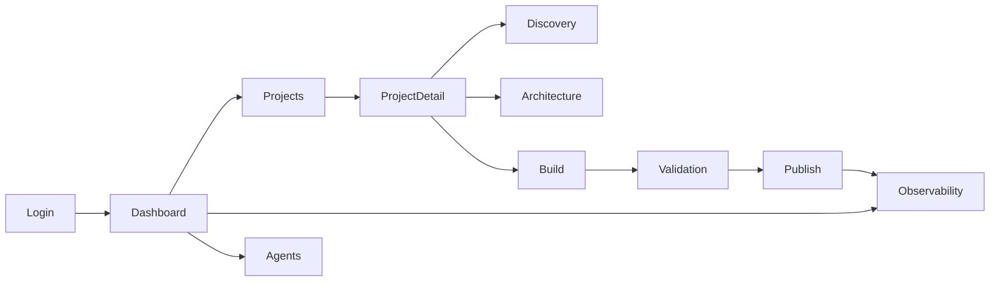
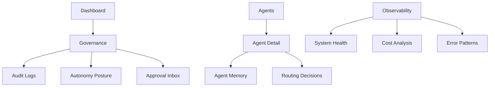

# AxionOS Interface Blueprint

> Canonical UI architecture reference for AxionOS.
> No UI changes should be introduced without alignment with this blueprint.

---

## Product Definition

**AxionOS** is an autonomous intelligent infrastructure platform that governs AI-driven pipelines, agents, validation systems, and operational intelligence.

**Tagline:**
> AxionOS — Autonomous Intelligent Infrastructure

**Primary goal of the interface:**
Provide clear operational visibility and controlled interaction with autonomous systems.

**The UI must prioritize:**

- Clarity
- Operational awareness
- System governance
- Observability
- Safe interaction with autonomous agents

---

## Navigation Architecture

### Main Navigation Sidebar

| Item | Description |
|---|---|
| **Dashboard** | Global system overview — health indicators, active pipelines, agent status, recent events. Entry point after login. |
| **Projects** | List and manage initiatives. Each project follows the canonical pipeline: Discovery → Architecture → Engineering → Validation → Deploy. |
| **Agents** | View, inspect, and govern AI agents. Shows agent swarm status, routing decisions, memory profiles, and authority boundaries. |
| **Pipelines** | Observe and control active pipeline executions. Shows stage progression, SLA compliance, repair loops, and approval gates. |
| **Observability** | Unified operational intelligence — performance, costs, quality metrics, error patterns, predictive signals, and live system telemetry. |
| **Governance** | Autonomy posture, approval workflows, decision logs, audit trail, and policy configuration. The control surface for human oversight. |
| **Modes** | Surface switcher between Builder Mode (build & ship) and Owner Mode (governance & operations). Role-aware access. |
| **Settings** | Organization settings, billing, connections, team management, and system configuration. |

---

## Primary User Flow



### Secondary Flows



---

## Screen Specifications

### Dashboard

| Attribute | Details |
|---|---|
| **Purpose** | Provide a global overview of AxionOS system state. |
| **Components** | System health indicators, active pipelines summary, agent status cards, recent events feed, quick action bar. |
| **Primary Actions** | Create Project, Open Observability, Inspect Agents. |
| **Secondary Actions** | View recent events, check SLA status, switch mode. |
| **States** | `normal` · `loading` · `empty` · `error` |
| **Navigation** | Dashboard → Projects · Dashboard → Observability · Dashboard → Agents · Dashboard → Governance |

### Projects (Initiatives)

| Attribute | Details |
|---|---|
| **Purpose** | List, create, and manage software initiatives flowing through the autonomous pipeline. |
| **Components** | Initiative list with status badges, pipeline progress indicator, outcome cards, creation prompt. |
| **Primary Actions** | Create Initiative, Open Initiative Detail, Delete Initiative. |
| **Secondary Actions** | Filter by status, search, sort by date/priority. |
| **States** | `normal` · `loading` · `empty` · `processing` · `error` |
| **Navigation** | Projects → ProjectDetail → Pipeline Stages |

### Project Detail

| Attribute | Details |
|---|---|
| **Purpose** | Deep view of a single initiative — pipeline progress, agent outputs, artifacts, and observability. |
| **Components** | Pipeline stage tracker, artifact list, agent message log, observability card, action buttons per stage. |
| **Primary Actions** | Run Next Stage, Approve Stage, Rollback to Stage, Delete Initiative. |
| **Secondary Actions** | View agent outputs, inspect code artifacts, export evidence. |
| **States** | `draft` · `in_progress` · `pending_review` · `completed` · `failed` · `rolled_back` |
| **Navigation** | ProjectDetail → Discovery · Architecture · Engineering · Validation · Deploy |

### Agents

| Attribute | Details |
|---|---|
| **Purpose** | Inspect and govern the AI agent swarm. |
| **Components** | Agent cards with role/status, authority boundaries, memory profile summary, routing history. |
| **Primary Actions** | Inspect Agent, View Memory, Review Routing Decisions. |
| **Secondary Actions** | Filter by role, filter by status. |
| **States** | `normal` · `loading` · `empty` |
| **Navigation** | Agents → AgentDetail → Memory · Routing |

### Observability

| Attribute | Details |
|---|---|
| **Purpose** | Unified operational intelligence and system telemetry. |
| **Components** | Performance metrics, cost breakdown, quality scores, error pattern charts, repair loop stats, live signals. |
| **Primary Actions** | Drill into metric, filter by time range, export report. |
| **Secondary Actions** | Compare periods, toggle metric categories. |
| **States** | `normal` · `loading` · `error` · `no_data` |
| **Navigation** | Observability → SystemHealth · Costs · Quality · Patterns · Live |

### Governance

| Attribute | Details |
|---|---|
| **Purpose** | Human oversight of autonomous operations — approvals, audit, autonomy posture. |
| **Components** | Pending approvals list, autonomy posture controls, audit log, decision trail, policy editor. |
| **Primary Actions** | Approve/Reject Decision, Adjust Autonomy Posture, Export Audit. |
| **Secondary Actions** | Search audit logs, filter by agent/pipeline. |
| **States** | `normal` · `loading` · `pending_actions` · `all_clear` |
| **Navigation** | Governance → AuditLogs · AutonomyPosture · ApprovalInbox |

### Settings

| Attribute | Details |
|---|---|
| **Purpose** | Organization configuration, billing, connections, and team management. |
| **Components** | Org info form, team member list, billing overview, connection manager, API key management. |
| **Primary Actions** | Update Settings, Manage Team, View Billing. |
| **Secondary Actions** | Add/remove connections, manage API keys. |
| **States** | `normal` · `loading` · `error` |
| **Navigation** | Settings → Team · Billing · Connections |

---

## Interface Layout Rules

### Global Layout Structure

```
┌──────────────────────────────────────────────────────┐
│                     Top Bar                          │
├────────────┬─────────────────────────┬───────────────┤
│            │                         │               │
│  Left      │    Main Content         │  Optional     │
│  Sidebar   │    Panel                │  Right Info   │
│  Nav       │                         │  Panel        │
│            │                         │               │
├────────────┴─────────────────────────┴───────────────┤
│              System Alerts (overlay)                  │
└──────────────────────────────────────────────────────┘
```

### Rules

| Rule | Description |
|---|---|
| **Sidebar persistence** | Left sidebar must remain persistent and collapsible across all authenticated views. |
| **Top bar** | Shows current workspace, system status indicators, and mode switcher. |
| **Main panel** | Changes content based on navigation selection. Always fills available space. |
| **Right panel** | Optional contextual panel for detail views, copilot, or supplementary information. |
| **System alerts** | Critical alerts are always visible as overlay toasts. Never hidden behind navigation. |
| **Responsive** | Sidebar collapses to icon-only on smaller viewports. Main content remains primary. |

---

## Interaction Rules

| Rule | Rationale |
|---|---|
| **Destructive actions must require confirmation** | Prevents accidental data loss. Use confirmation dialogs with explicit action naming. |
| **Autonomous actions must display system intent** | Users must understand what the system is about to do before it acts. Advisory-first principle. |
| **Pipeline actions must show progress states** | Every stage transition must have visible feedback — progress bars, elapsed time, stage indicators. |
| **Errors must be observable and explainable** | Error states must include context, not just generic messages. Link to evidence when available. |
| **Loading states must be visible** | Every async operation must show a loading indicator. No silent waits. |
| **Approval gates must be explicit** | Human approval requirements must be visually distinct and impossible to bypass accidentally. |
| **Rollback must always be available** | Users must have a clear path to undo or rollback any pipeline action. |

---

## Design System

### Color Palette

The official AxionOS color system uses a hybrid palette combining **TRIADIC** and **SQUARE** RGB harmony.

#### Primary Palette (Triadic Base)

| Name | RGB | HEX | Usage |
|---|---|---|---|
| **Primary Blue** | `0, 163, 255` | `#00A3FF` | Primary actions, active states, links |
| **Primary Purple** | `138, 43, 226` | `#8A2BE2` | Governance indicators, premium features |
| **Primary Cyan** | `0, 212, 201` | `#00D4C9` | Success states, intelligence signals, health |

#### Square Expansion Palette

| Name | RGB | HEX | Usage |
|---|---|---|---|
| **Accent Orange** | `255, 149, 0` | `#FF9500` | Warnings, attention signals, SLA alerts |
| **Accent Magenta** | `255, 0, 140` | `#FF008C` | Critical errors, destructive actions, urgent |

#### Surface & Text

| Name | RGB | HEX | Usage |
|---|---|---|---|
| **Deep Background** | `12, 12, 16` | `#0C0C10` | App background |
| **Surface Panel** | `20, 20, 26` | `#14141A` | Cards, panels, sidebar |
| **Text Primary** | `240, 240, 240` | `#F0F0F0` | Headings, primary content |
| **Text Secondary** | `160, 160, 170` | `#A0A0AA` | Labels, descriptions, metadata |

### CSS Variables

```css
:root {
  /* Primary Triadic */
  --axion-primary-blue: #00A3FF;
  --axion-primary-purple: #8A2BE2;
  --axion-primary-cyan: #00D4C9;

  /* Square Accents */
  --axion-accent-orange: #FF9500;
  --axion-accent-magenta: #FF008C;

  /* Surfaces */
  --axion-bg-deep: #0C0C10;
  --axion-surface: #14141A;

  /* Text */
  --axion-text-primary: #F0F0F0;
  --axion-text-secondary: #A0A0AA;
}
```

---

## UI Style Direction

The visual language of AxionOS is:

- **Dark** — dark-first interface, optimized for long operational sessions
- **Minimal** — reduced visual noise, generous whitespace, focused content
- **High-tech** — precision typography, monospace accents, system-grade aesthetics
- **Observability-focused** — data-dense where needed, clear hierarchy always
- **Inspired by developer infrastructure tools**

### Reference Products

| Product | Inspiration Aspect |
|---|---|
| **Linear** | Navigation clarity, keyboard-first, minimal chrome |
| **Vercel** | Dark aesthetic, deployment flows, status indicators |
| **Raycast** | Command palette, speed, focused interactions |
| **Supabase Studio** | Data management UI, table views, function editors |
| **Datadog** | Observability dashboards, metric visualization, alert systems |
| **Stripe Dashboard** | Clean data presentation, billing flows, developer experience |

---

## Iconography

| Rule | Description |
|---|---|
| **Style** | Simple line icons (Lucide icon set) |
| **Base color** | Monochrome — inherits text color |
| **State colors** | Colored accents only for active states, warnings, or errors |
| **Size** | 16px (nav items), 20px (page headers), 14px (inline) |
| **Consistency** | One icon per concept — never mix icon styles within a surface |

---

## Future Expansion

This blueprint is designed to be extensible. Future interface areas may include:

| Area | Description |
|---|---|
| **AI Model Governance** | Visual control over model selection, routing policies, and cost budgets |
| **Strategy Control** | Multi-horizon alignment, tradeoff arbitration, mission integrity surfaces |
| **System Evolution Monitoring** | Architecture research, hypothesis testing, canon evolution tracking |
| **Autonomous Decision Logs** | Full decision trail with confidence scores, evidence refs, and rollback paths |

---

> **This file is the canonical reference for AxionOS interface evolution.**
> No UI changes should be introduced without alignment with this blueprint.
