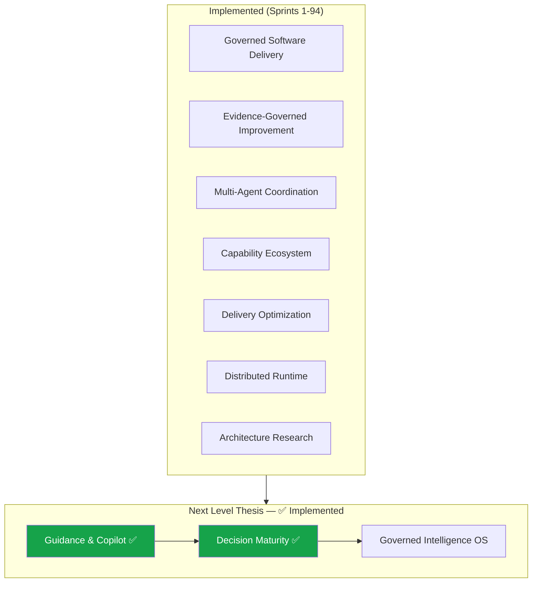

# AxionOS — System Evolution Roadmap

> **Vision**: AxionOS is a governed self-improving software factory that transforms ideas into governed, validated, delivered software.
>
> **Product promise**: From idea to delivered software.
>
> **Current Mode**: Level 5 — Institutional Engineering Memory
> **Current Maturity**: Level 5 ✅ Active
> **Last strategic change (2026-03-09):** 94 sprints complete. All blocks (Foundation through S) complete. Full canon implemented.
>
> **Sprint details:** [PLAN.md](PLAN.md) · **Architecture:** [ARCHITECTURE.md](ARCHITECTURE.md)
>
> Last updated: 2026-03-09

## Document Authority

| Scope | Rule |
|-------|------|
| **Owns** | Current maturity level, strategic direction, implementation horizons, macro capability blocks, post-94 strategic thesis |
| **Must not define** | Sprint-by-sprint execution ledger (→ PLAN.md), module inventory (→ AGENTS.md), detailed architecture (→ ARCHITECTURE.md), pipeline contracts (→ PIPELINE_CONTRACTS.md) |
| **Derived from** | PLAN.md for sprint completion status; ARCHITECTURE.md for layer count |
| **Update rule** | Update when strategic block, maturity, or horizon changes |

---

## Current Status

| Dimension | State |
|-----------|-------|
| **Platform Stage** | Level 5 — Institutional Engineering Memory |
| **System State** | 77+ architectural layers active |
| **Kernel Status** | Stable and operational |
| **Commercial Status** | Plans, billing, usage enforcement — hardened |
| **Learning Status** | Active, rule-based, auditable, cross-stage coordinated |
| **Meta-Agents Status** | v1.4 active — memory-aware + quality feedback + advisory calibration |
| **Platform Intelligence** | Active — system-level observability + health model |
| **Platform Calibration** | Active — bounded threshold tuning + guardrails + rollback |
| **Platform Stabilization** | Active — drift detection + oscillation suppression + safe modes |
| **Engineering Advisor** | Active — cross-layer advisory synthesis + review workflow |
| **Semantic Retrieval** | Active — unified embedding-backed retrieval across domains |
| **Discovery Architecture** | Active — external/product signal correlation + architecture recommendations |
| **Architecture Intelligence** | Active — simulation, planning, sandbox, pilot, migration, portfolio, fitness |
| **Change Advisory Orchestrator** | Active — unified change sequencing, conflict resolution, advisory agendas |
| **Platform Convergence** | Active — convergence detection, governance, institutional memory |
| **Operating Profiles** | Active — reusable, governed, versioned profiles and policy packs |
| **Product Intelligence** | Active — product signals, opportunity governance, ecosystem readiness |
| **Ecosystem Governance** | Active — capability exposure, trust/admission, simulation, bounded pilot, registry, multi-party |
| **Institutional Assurance** | Active — outcome assurance, canon integrity, operating completion |
| **Product Experience** | Active — user journey orchestration, role-based experience, one-click delivery, onboarding, adoption intelligence |
| **Evidence-Governed Improvement** | Active — evidence capture, candidate distillation, sandbox benchmarking, promotion governance |
| **Multi-Agent Coordination** | Active — role arbitration, debate & resolution, shared working memory, bounded swarm execution |
| **Capability Ecosystem** | Active — capability packaging, trust/entitlements, partner marketplace, outcome-aware marketplace |
| **Delivery Optimization** | Active — delivery causality, post-deploy learning, reliability tuning, outcome assurance 2.0 |
| **Distributed Runtime** | Active — distributed job control, cross-region recovery, tenant-isolated scale, resilient orchestration |
| **Architecture Research** | Active — hypothesis engine, simulated evolution, cross-tenant synthesis, governed promotion |
| **Execution Mode** | Sprint-based implementation |

---

## Strategic Directive

AxionOS has completed **94 implementation sprints** spanning the full capability arc from deterministic execution through architecture research and governed promotion. The internal architecture is mature, coherent, and self-governing. All planned and reserved blocks have been implemented.

**Post-Sprint 94 Strategic Position:**

The platform has reached its **full canon implementation**. Every block from Foundation through Block S (Research Sandbox for Architecture Evolution) is complete. The internal architecture — governance, intelligence, memory, calibration, observability, ecosystem controls, policy engines, orchestration, multi-agent coordination, delivery optimization, distributed runtime, and architecture research — is mature and operational.

The strategic direction achieved through Sprint 94 is the **complete realization of the governed self-improving software factory**:

> **"From idea to delivered software."**

Internal sophistication serves the visible product experience. The user-facing journey is clear, legible, and governed. The platform now operates with evidence-governed improvement, advanced multi-agent coordination, a governed capability ecosystem, delivery optimization, distributed runtime, and architecture research capabilities.

---

## AxionOS Next Level Thesis

With all 94 sprints complete, AxionOS is entering a new maturity phase: **Governed Intelligence & Decision Maturity**.

This means the next level of AxionOS is not simply "more modules" or "more internal complexity." It is the conversion of existing sophistication into four higher-order capabilities:
- **explain better** — ✅ contextual guidance and copilot systems **implemented** (PageGuidanceShell, ContextualCopilotDrawer, GovernanceMentorDrawer, 4 copilot submodes)
- **decide better** — ✅ role-aware decision support with evidence **implemented** (role-based experience hooks, approval posture, next-best-action recommendations)
- **learn better** — ✅ evidence-governed improvement loops **active** (Blocks N through S complete)
- **coordinate better** — ✅ multi-agent coordination **operational** (debate, working memory, bounded swarm)

**Core Thesis:** AxionOS has evolved from a governed software factory into a governed intelligence operating system for software delivery, decision support, and evidence-based system evolution.

### What has been achieved

The four pillars of the Next Level Thesis are **implemented**:

| Pillar | Status | Key Components |
|--------|--------|---------------|
| **Explain Better** | ✅ Active | PageGuidanceShell, ContextualCopilotDrawer, GovernanceMentorDrawer, CopilotTrigger, WhyThisMattersNow, NextBestAction, ApprovalHint, centralized content registries |
| **Decide Better** | ✅ Active | Role-based experience (useRoleBasedExperience), copilot submodes (product, workspace, governance_mentor, architecture_mentor), approval posture hints |
| **Learn Better** | ✅ Active | Evidence-governed improvement (Block N), cross-stage learning, predictive error detection, calibration, strategy evolution |
| **Coordinate Better** | ✅ Active | Role arbitration (Sprint 75), debate & resolution (Sprint 76), shared working memory (Sprint 77), bounded swarm (Sprint 78) |

### What this phase now focuses on (post-implementation)

- deepening copilot intelligence with AI-assisted contextual recommendations
- refining role-aware guidance quality based on adoption signals
- improving cross-layer advisory synthesis legibility
- strengthening the feedback loop between guidance, adoption, and platform intelligence

### What this phase does NOT prioritize

- open marketplace expansion beyond current governed pilot
- premature distributed runtime scale-out
- autonomous architecture mutation
- theatrical autonomy without governance



**Rule:** No autonomous architecture mutation. All changes human-approved. Governance before autonomy.

---

## Implementation Horizons

```
   COMPLETE (1–94)
   ──────────────────────────────────────────────────────────────────────────────►
   Foundation → Learning → Meta → Memory → Gov →
   Intelligence → Calibration → Strategy →
   Stabilization → Advisory → Semantic →
   Discovery → Architecture → Pilot → Migration →
   Portfolio → Fitness → Change Advisory →
   Convergence → Op Profiles → Product Intelligence →
   Ecosystem → Assurance → Canon → Operating Completion →
   Product Experience → Extensibility →
   Evidence-Governed Improvement →
   Multi-Agent Coordination →
   Governed Capability Ecosystem →
   Delivery Optimization →
   Distributed Runtime →
   Architecture Research ✅

   PLANNED (95–98)
   ──────────────────────────────────────────────────────────────────────────────►
   Block T — Governed Intelligence OS
   Sprint 95: Institutional Memory Consolidation
   Sprint 96: Doctrine & Playbook Synthesis
   Sprint 97: Bounded Autonomous Operations
   Sprint 98: Institutional Decision Engine
```

---

## Completed Canon (Sprints 1–94)

> **Full sprint-by-sprint record:** [PLAN.md](PLAN.md)

| Block | Sprints | Capability Summary |
|-------|---------|-------------------|
| Foundation | 1–10 | 32-stage pipeline, DAG orchestration, CI validation, self-healing, prevention, routing, governance |
| Operational Intelligence | 11–12 | Commercial readiness, billing, usage enforcement, learning agents v1 |
| Meta-Intelligence & Memory | 13–20 | Memory-aware meta-agents, engineering memory, quality feedback, advisory calibration |
| Learning & Repair | 21–26 | Prompt A/B testing, repair policies, agent memory, predictive detection, cross-stage synthesis |
| Execution Governance | 27–29 | Policy intelligence, portfolio optimization, tenant adaptive tuning |
| Platform Intelligence & Calibration | 30–31 | Health model, bounded threshold calibration |
| Strategy Evolution & Governance | 32–33 | Strategy variant experimentation, portfolio governance |
| Platform Stabilization & Advisory | 34–37 | Self-stabilization, engineering advisor, semantic retrieval, discovery architecture |
| Architecture Intelligence | 38–40 | Change simulation, planning, rollout sandbox |
| Block A — Architecture-Governed | 41–43 | Pilot governance, migration execution, portfolio governance |
| Block B — Architecture-Operating | 44–45 | Fitness functions, change advisory orchestrator |
| Block C — Architecture-Scaled | 46–48 | Stabilization v2, tenant architecture modes, economic optimization |
| Block D — Platform Convergence | 49 | Advisory-first convergence detection, specialization vs fragmentation, candidate building |
| Block E — Convergence Governance | 50 | Governed lifecycle for promotion, merge, retention, deprecation, retirement decisions |
| Block F — Institutional Convergence Memory | 51 | Durable, queryable convergence knowledge with evidence lineage and pattern extraction |
| Block G — Operating Profiles & Policy Packs | 52 | Reusable, governed, versioned operating profiles with bounded overrides and policy packs |
| Block H — Product Intelligence Entry | 53 | Bounded, advisory-first product signal correlation, friction clustering, opportunity detection |
| Block I — Product-Intelligent Expansion | 54–56 | Product intelligence operations, opportunity portfolio governance, controlled ecosystem readiness |
| Block J — Trusted Ecosystem Foundation | 57–59 | Capability exposure governance, external trust & admission, ecosystem simulation & sandbox |
| Block K — Controlled Ecosystem Activation | 60–62 | Limited marketplace pilot, capability registry governance, multi-party policy & revenue governance |
| Block L — System Roundness & Operating Completion | 63–65 | Institutional outcome assurance, canon integrity & drift governance, operating completion |
| Block M — Product Experience & Delivery Maturity | 66–70 | User journey orchestration, role-based experience, one-click delivery & deploy assurance, onboarding/templates/starters, adoption intelligence & customer success |
| Sprint 71 — Governed Extensibility | 71 | Platform extensions registry, approval-based activation, compatibility checks, audit trail, operator surface |
| Block N — Evidence-Governed Improvement Loop | 72–74 | Evidence capture & improvement ledger, improvement candidate distillation, sandbox benchmarking & promotion governance |
| Block O — Advanced Multi-Agent Coordination | 75–78 | Role arbitration & capability routing 2.0, multi-agent debate & resolution, shared working memory & task-state negotiation, bounded swarm execution |
| Block P — Governed Capability Ecosystem | 79–82 | Capability packaging & registry UX, trust/entitlements/approval flows, creator/partner pilot marketplace, outcome-aware capability marketplace |
| Block Q — Delivery Optimization & Outcome Assurance 2.0 | 83–86 | Delivery outcome causality, post-deploy learning & feedback assimilation, reliability-aware delivery tuning, outcome assurance 2.0 |
| Block R — Distributed Runtime & Scaled Execution | 87–90 | Distributed job control plane, cross-region execution & recovery, tenant-isolated scale runtime, resilient large-scale orchestration |
| Block S — Research Sandbox for Architecture Evolution | 91–94 | Architecture hypothesis engine, simulated evolution campaigns, cross-tenant pattern synthesis, human-governed architecture promotion |

---

## Block Structure Summary

| Block | Name | Sprints | Status |
|-------|------|---------|--------|
| Foundation | Foundation through Architecture Intelligence | 1–40 | ✅ Complete |
| A | Architecture-Governed | 41–43 | ✅ Complete |
| B | Architecture-Operating | 44–45 | ✅ Complete |
| C | Architecture-Scaled | 46–48 | ✅ Complete |
| D | Platform Convergence | 49 | ✅ Complete |
| E | Convergence Governance | 50 | ✅ Complete |
| F | Institutional Convergence Memory | 51 | ✅ Complete |
| G | Operating Profiles & Policy Packs | 52 | ✅ Complete |
| H | Product Intelligence Entry | 53 | ✅ Complete |
| I | Product-Intelligent Expansion | 54–56 | ✅ Complete |
| J | Trusted Ecosystem Foundation | 57–59 | ✅ Complete |
| K | Controlled Ecosystem Activation | 60–62 | ✅ Complete |
| L | System Roundness & Operating Completion | 63–65 | ✅ Complete |
| M | Product Experience & Delivery Maturity | 66–70 | ✅ Complete |
| — | Governed Extensibility (Bridge Sprint) | 71 | ✅ Complete |
| N | Evidence-Governed Improvement Loop | 72–74 | ✅ Complete |
| O | Advanced Multi-Agent Coordination | 75–78 | ✅ Complete |
| P | Governed Capability Ecosystem & Early Marketplace | 79–82 | ✅ Complete |
| Q | Autonomous Delivery Optimization & Outcome Assurance 2.0 | 83–86 | ✅ Complete |
| R | Advanced Distributed Runtime & Scaled Execution | 87–90 | ✅ Complete |
| S | Research Sandbox for Architecture Evolution | 91–94 | ✅ Complete |

---

## Maturity Progression

| Phase | Sprints | State | Description |
|-------|---------|-------|-------------|
| Foundation | 1–40 | ✅ Complete | Architecture-aware: consciousness + rehearsal |
| Governed | 41–43 | ✅ Complete | Architecture-governed: real pilot + migration + portfolio |
| Operating | 44–45 | ✅ Complete | Architecture-operating: fitness + orchestration |
| Scaled | 46–48 | ✅ Complete | Architecture-scaled: stability + tenants + economics |
| Convergence | 49–52 | ✅ Complete | Platform convergence, governance, memory, operating profiles |
| Product Intelligence | 53–56 | ✅ Complete | Product signals, opportunity governance, ecosystem readiness |
| Trusted Ecosystem | 57–59 | ✅ Complete | Capability exposure, trust/admission, simulation |
| Ecosystem Activation | 60–62 | ✅ Complete | Marketplace pilot, registry governance, multi-party governance |
| Operating Completion | 63–65 | ✅ Complete | Outcome assurance, canon integrity, operating completion |
| Product Experience | 66–70 | ✅ Complete | Journey orchestration, role-based experience, delivery assurance, onboarding, adoption intelligence |
| Governed Extensibility | 71 | ✅ Complete | Platform extensions, approval-based activation, compatibility, audit trail |
| Evidence-Governed Improvement | 72–74 | ✅ Complete | Evidence capture, candidate distillation, sandbox benchmarking, promotion governance |
| Multi-Agent Coordination | 75–78 | ✅ Complete | Role arbitration, debate/resolution, shared working memory, bounded swarm execution |
| Governed Capability Ecosystem | 79–82 | ✅ Complete | Capability packaging, trust/entitlements, partner marketplace, outcome-aware marketplace |
| Delivery Optimization | 83–86 | ✅ Complete | Delivery causality, post-deploy learning, reliability tuning, outcome assurance 2.0 |
| Distributed Runtime | 87–90 | ✅ Complete | Distributed job control, cross-region recovery, tenant-isolated scale, resilient orchestration |
| Architecture Research | 91–94 | ✅ Complete | Hypothesis engine, simulated evolution, cross-tenant synthesis, governed promotion |

---

## Active Kernel

> **Full module inventory:** [AGENTS.md](AGENTS.md) · **Architecture details:** [ARCHITECTURE.md](ARCHITECTURE.md)

All 77+ architectural layers are operational. The kernel includes the 32-stage deterministic pipeline, DAG execution engine, AI efficiency layer, all learning/repair/governance/intelligence/advisory/architecture layers, the economic optimization layer, the convergence and governance layers, the institutional memory and operating profiles layers, the product intelligence layers, the ecosystem governance layers, the institutional assurance and canon integrity layers, the user journey orchestration layer, the role-based experience layer, the delivery assurance layer, the onboarding/templates layer, the adoption intelligence layer, the governed extensibility layer, the evidence-governed improvement layers, the multi-agent coordination layers, the governed capability ecosystem layers, the delivery optimization layers, the distributed runtime layers, and the architecture research layers.

---

## System Maturity

| Level | Name | Status |
|-------|------|--------|
| Level 1 | Code Generator | ✅ |
| Level 2 | Software Builder | ✅ |
| Level 3 | Autonomous Engineering System | ✅ Complete |
| Level 4 | Self-Learning Software Factory | ✅ Complete |
| Level 4.5 | Meta-Aware Engineering Platform | ✅ Complete |
| Level 5 | Institutional Engineering Memory | ✅ Current |

> **Current position:** Level 5 — Institutional Engineering Memory active.
> **Execution mode:** Sprint-based implementation.

---

## Governing Principle

> Ninety-four sprints complete. All blocks (Foundation through S) are complete. Full canon implemented.
> Internal architecture is mature: governance, intelligence, memory, calibration, observability, ecosystem controls, policy engines, orchestration, multi-agent coordination, delivery optimization, distributed runtime, architecture research — all active.
> Product experience is mature: user journey orchestration, role-based surfaces, one-click delivery, guided onboarding, adoption intelligence — all active.
> The platform delivers on the promise: **from idea to delivered software**.
> Internal sophistication serves the product experience — it does not replace it.
> **Next phase: Governed Intelligence & Decision Maturity** — contextual guidance, copilot systems, decision quality, evidence-governed learning.
> Rule: governance before autonomy. No autonomous architecture mutation. All changes human-approved.
