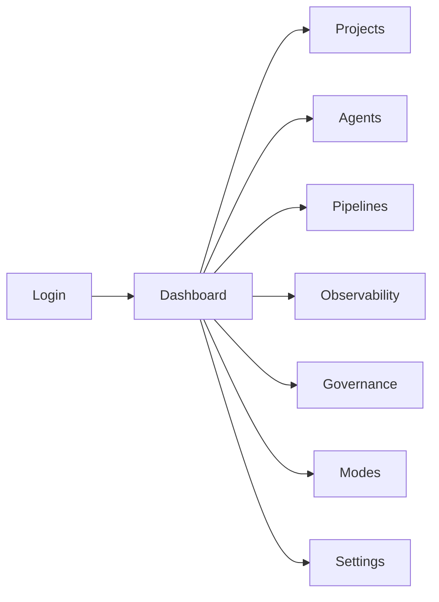
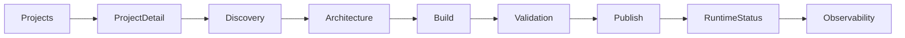
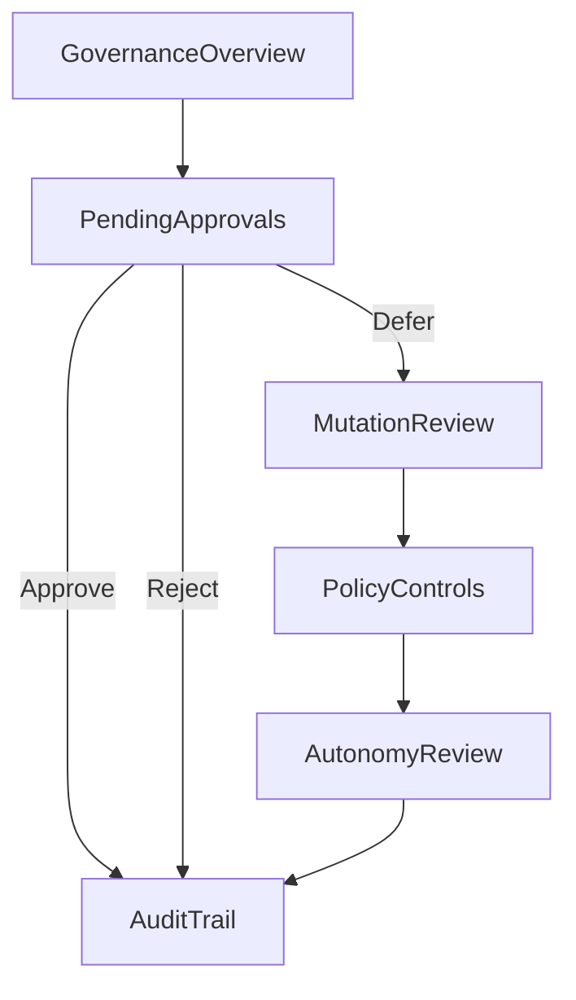
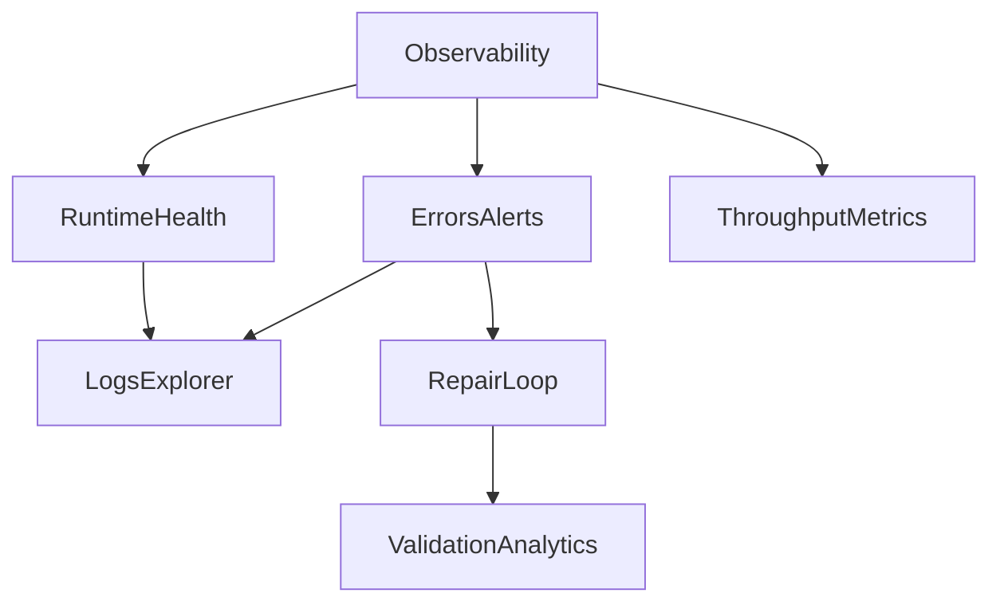
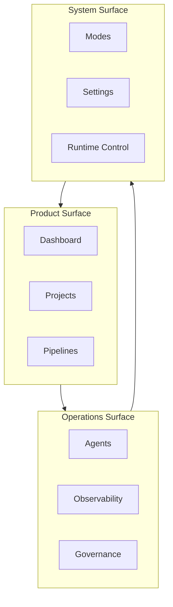

# AxionOS UI Blueprint

> Canonical reference for interface architecture, design system, screen map, and navigation flows.
> No UI changes should be introduced without alignment with this blueprint.

---

## Product Positioning

**AxionOS** — Autonomous Intelligent Infrastructure

AxionOS is a high-tech platform for governed AI pipelines, agents, observability, governance, runtime intelligence, and controlled autonomous operations.

**Primary Goal:** Provide clear operational visibility and controlled interaction with autonomous systems.

**UI Priorities:**
- Clarity
- Operational awareness
- System governance
- Observability
- Safe interaction with autonomous agents

**Visual Language:** Dark, premium, futuristic, minimal, technical, operational, trustworthy, infrastructure-grade.

**References:** Linear, Vercel, Raycast, Supabase Studio, Datadog, Stripe Dashboard.

---

## Dashboard Mockup

The main Dashboard is an operational control view, not a marketing page.

### Sections

**1. System Status Bar**
- System health indicator (healthy/warning/critical)
- Uptime percentage
- Latency metric
- Last incident timestamp
- Global status badge

**2. KPI Grid (6 cards)**
| Metric | Source | Icon |
|--------|--------|------|
| Initiatives | Total + deployed count | GitBranch |
| Active Agents | Agents with deliveries | Bot |
| Pipeline Rate | Success percentage | Activity |
| Validation | Deploy success rate | CheckCircle2 |
| Monthly Cost | Accumulated USD | Cpu |
| Pending Review | Artifacts waiting | Clock |

**3. Runtime Activity (left panel, 3/5 width)**
- Recent events feed with status icons
- Deploy, repair, validation, alert, rollback events
- Timestamps in relative format
- Pipeline throughput bar chart (24h)

**4. Governance & Autonomy (right panel, 2/5 width)**
- Pending approvals count
- Blocked actions count
- Policy violations
- Autonomy score
- Doctrine compliance progress bar

**5. Quick Actions**
- New Project
- Inspect Agents
- Observability
- Governance
- Runtime Logs

---

## App Shell Layout

```
┌─────────────────────────────────────────────────────────┐
│ Top Bar: Logo | Subtitle | Search | Notifications | User│
├──────────┬──────────────────────────────┬───────────────┤
│          │                              │               │
│ Sidebar  │      Main Content Area       │ Context Panel │
│ (nav)    │      (scrollable)            │ (optional)    │
│          │                              │               │
│ 240px    │         flex-1               │   380px       │
│          │                              │               │
├──────────┴──────────────────────────────┴───────────────┤
```

### Layout Rules
- Sidebar: persistent, collapsible to icon-only (56px)
- Top bar: sticky, 44px height, semi-transparent with backdrop blur
- Content: responsive, max-width 1600px
- Context panel: slide-in, 380px, for logs/details/insights
- Desktop: full layout
- Tablet: sidebar collapsed by default
- Mobile: sidebar as overlay

### Supported Patterns
- Table-heavy screens (full-width tables)
- Metrics dashboards (grid cards)
- Detail panels (header + tabs + content)
- Modals (centered, backdrop)
- Slide-over inspectors (right panel)
- Command palette (⌘K, centered overlay)

---

## Tailwind Design System

### Color Tokens (HSL)

#### Brand Palette (Triadic + Square Harmony)

| Token | HSL | HEX | Usage |
|-------|-----|-----|-------|
| `--axion-blue` | 198 100% 50% | #00A3FF | Primary actions, links, focus rings |
| `--axion-purple` | 271 76% 53% | #8A2BE2 | Accent, governance indicators |
| `--axion-cyan` | 176 100% 42% | #00D4C9 | Platform surface, success accent |
| `--axion-orange` | 35 100% 50% | #FF9500 | Warnings, quick actions |
| `--axion-magenta` | 327 100% 50% | #FF008C | Alerts, critical highlights |

#### Surface System

| Token | HSL | HEX | Usage |
|-------|-----|-----|-------|
| `--surface-deep` | 240 14% 5% | #0C0C10 | Page background |
| `--surface-1` | 240 12% 9% | #14141A | Cards, panels |
| `--surface-2` | 240 12% 12% | #1A1A22 | Elevated cards, hover states |
| `--surface-3` | 240 12% 15% | #22222C | Active states, selected items |
| `--surface-border` | 240 12% 19% | #2B2B36 | Borders, dividers |

#### Text Hierarchy

| Token | HSL | HEX | Usage |
|-------|-----|-----|-------|
| `--text-primary` | 0 0% 94% | #F0F0F0 | Headings, primary text |
| `--text-secondary` | 240 5% 65% | #A0A0AA | Descriptions, labels |
| `--text-muted` | 240 4% 51% | #7C7C88 | Timestamps, metadata |

#### State Colors

| Token | HSL | HEX | Usage |
|-------|-----|-----|-------|
| `--success` | 160 84% 39% | #10B981 | Success states, healthy |
| `--warning` | 38 92% 50% | #F59E0B | Warnings, pending |
| `--info` | 217 91% 60% | #3B82F6 | Information, links |
| `--destructive` | 0 84% 60% | #EF4444 | Errors, critical |

### Typography

| Element | Font | Weight | Size |
|---------|------|--------|------|
| Display headings | Space Grotesk | 600-700 | 24-32px |
| Body headings | Space Grotesk | 500-600 | 16-20px |
| Body text | Inter | 400 | 14px |
| Labels | Inter | 500 | 11-12px, uppercase tracking |
| Monospace (IDs, logs) | JetBrains Mono | 400 | 12-13px |

### Spacing Scale
- `gap-1` (4px) — tight grouping
- `gap-2` (8px) — within cards
- `gap-3` (12px) — between related cards
- `gap-4` (16px) — between sections
- `gap-6` (24px) — major section spacing
- `p-4` (16px) — standard card padding
- `p-6` (24px) — content area padding

### Border Radius
- `rounded-sm` (2px) — badges, tags
- `rounded-md` (6px) — buttons, inputs
- `rounded-lg` (8px) — cards, panels
- `rounded-xl` (12px) — modals, dropdowns

### Shadows
- Cards: `shadow-sm` or none (rely on borders)
- Modals: `shadow-xl`
- Dropdowns: `shadow-xl`
- Elevated panels: `shadow-lg`

### Component Styles

**Cards:**
```
border-border/40 bg-card/80
hover:border-border/60 transition-colors
```

**Buttons:**
- Default: `bg-primary text-primary-foreground`
- Ghost: `hover:bg-muted/30`
- Outline: `border-border/40 hover:border-primary/30 hover:bg-primary/5`

**Badges:**
- Status: `text-[10px] font-mono border-{color}/30 text-{color}`

**Tables:**
- Header: `text-[11px] uppercase tracking-wider text-muted-foreground`
- Rows: `hover:bg-muted/20 transition-colors`
- Borders: `border-border/30`

**Inputs:**
- `bg-surface-2 border-border/40 focus:ring-primary/50`

---

## Screen Map

### 1. Authentication
| Screen | Purpose | Key Components | Primary Actions |
|--------|---------|----------------|-----------------|
| Login | User authentication | Email/password form | Sign in |
| Create Account | Registration | Registration form | Create account |
| Forgot Password | Recovery | Email input | Send reset link |

### 2. Dashboard
| Screen | Purpose | Key Components | Primary Actions |
|--------|---------|----------------|-----------------|
| Main Dashboard | Global operational overview | KPIs, status bar, runtime feed, governance panel | Quick actions |
| Workspace Overview | Workspace-specific view | Workspace metrics, team, recent activity | Switch workspace |

### 3. Projects
| Screen | Purpose | Key Components | Primary Actions |
|--------|---------|----------------|-----------------|
| Projects List | All initiatives | Filterable table, status badges | Create project, filter |
| Project Detail | Initiative deep-dive | Tabs (discovery/arch/build/validate/publish) | Edit, advance stage |
| Discovery | Idea exploration | Stories, requirements, scope | Define scope |
| Architecture | System design | ADRs, component diagram | Review architecture |
| Build | Development | Code artifacts, subtasks, agent assignments | Execute, assign |
| Validation | Quality gates | Test results, validation rules | Approve/reject |
| Publish | Deployment | Deploy config, pre-flight checks | Deploy |
| Runtime Status | Post-deploy monitoring | Health metrics, logs, rollback history | Rollback, repair |

### 4. Agents
| Screen | Purpose | Key Components | Primary Actions |
|--------|---------|----------------|-----------------|
| Agents List | All AI agents | Table with status, role, performance | Create, configure |
| Agent Detail | Agent inspection | Config, memory, capabilities | Edit, disable |
| Agent Performance | Metrics per agent | Success rate, latency, cost | Optimize |
| Agent Memory | Knowledge base | Memory entries, relevance scores | Prune, export |
| Agent Policies | Control rules | Policy definitions, constraints | Edit policy |

### 5. Pipelines
| Screen | Purpose | Key Components | Primary Actions |
|--------|---------|----------------|-----------------|
| Pipelines List | All pipelines | Status, last run, duration | Trigger, filter |
| Pipeline Detail | Execution view | Stage visualization, logs | Retry, cancel |
| Execution History | Past runs | Table with status, duration, cost | Inspect, compare |
| Repair Loop | Auto-repair tracking | Repair attempts, success rate | Review, approve |
| Pre-flight Validation | Deploy checks | Validation rules, results | Override, fix |
| Publish Queue | Pending deploys | Queue position, dependencies | Promote, hold |

### 6. Observability
| Screen | Purpose | Key Components | Primary Actions |
|--------|---------|----------------|-----------------|
| Global Observability | System-wide metrics | Charts, alerts, trends | Drill down |
| Runtime Health | Infrastructure status | Service health, uptime, latency | Investigate |
| Errors & Alerts | Error tracking | Error list, stack traces, frequency | Acknowledge, fix |
| Validation Analytics | Quality metrics | Pass/fail rates, trends | Filter by stage |
| Throughput Metrics | Performance data | Requests/sec, processing time | Set thresholds |
| Logs Explorer | Log search | Searchable log viewer, filters | Search, export |

### 7. Governance
| Screen | Purpose | Key Components | Primary Actions |
|--------|---------|----------------|-----------------|
| Governance Overview | Policy status | Active policies, compliance score | Review |
| Pending Approvals | Action queue | Approval requests with context | Approve, reject, defer |
| Policy Controls | Rule management | Policy definitions, enforcement | Create, edit |
| Mutation Review | Change control | Proposed mutations, impact | Approve, block |
| Autonomy Review | Autonomy posture | Domain scores, boundaries | Adjust posture |
| Audit Trail | History | All governance actions, timestamps | Search, export |

### 8. Modes
| Screen | Purpose | Key Components | Primary Actions |
|--------|---------|----------------|-----------------|
| Modes Overview | Active modes | Surface, strategy, runtime modes | Switch mode |
| Surface Modes | UI customization | Builder/Owner mode config | Toggle |
| Strategy Modes | Operational strategy | Aggressive/conservative posture | Configure |
| Runtime Modes | Execution config | Auto-repair, validation depth | Adjust |

### 9. Settings
| Screen | Purpose | Key Components | Primary Actions |
|--------|---------|----------------|-----------------|
| Workspace Settings | Org config | Name, branding, defaults | Save |
| User Settings | Personal config | Profile, preferences, theme | Update |
| Roles & Access | RBAC management | Role list, permissions | Assign roles |
| API / Integrations | External connections | API keys, webhooks, connectors | Connect, revoke |
| Environment Controls | Runtime config | Feature flags, limits, quotas | Toggle, set |

### 10. Canon Intelligence (Owner Mode — Implemented)
| Screen | Purpose | Key Components | Primary Actions |
|--------|---------|----------------|-----------------|
| Canon Intelligence Hub | Institutional knowledge management | Knowledge Library, Ingestion, Governance, Application domains | Browse, query, review |
| Pattern Library | Reusable patterns from execution | Pattern cards, confidence scores, domain tags | Search, inspect, promote |
| Canon Graph | Knowledge relationship visualization | Node graph, lineage links, trust scores | Explore, drill down |
| Governance & Lineage | Knowledge trust and provenance | Lineage chains, renewal triggers, revalidation workflows | Review, approve, renew |
| Skills Pipeline | Canon → Skills extraction | Extraction status, skill bundles, engineering skills | Run extraction, review |
| Knowledge Renewal | Staleness detection and revalidation | Renewal triggers, revalidation workflows, confidence recovery | Trigger renewal, review |

### 11. Future Areas (Reserved)
| Screen | Purpose |
|--------|---------|
| Doctrine Packs | Governance template marketplace |
| Compounding Advantage | Strategic moat tracking |
| Strategic Control | Long-term strategy alignment |

---

## Navigation Flows

### Main Navigation



### Project Lifecycle



### Governance Review Flow



### Runtime Observability Flow



### High-Level Architecture Map



---

## UX Rules

### Destructive Actions
- All destructive actions MUST require explicit confirmation
- Confirmation dialogs must state what will be destroyed
- Use destructive button variant (red)

### Autonomous Actions
- Autonomous actions MUST display system intent and confidence
- Show what the system proposes to do before executing
- Always provide a way to cancel or override

### Governance Actions
- Critical governance actions MUST be explicit (no silent auto-approve)
- Show impact analysis before approval
- Record all decisions in audit trail

### State Design
Every screen must handle:
- **Normal** — data loaded, interactive
- **Loading** — skeleton/spinner, non-blocking
- **Empty** — helpful empty state with call-to-action
- **Error** — clear error message with retry option
- **Blocked** — explain why and how to unblock

### Feedback
- Operator always needs clear feedback on action results
- Use toast notifications for transient feedback
- Use inline alerts for persistent warnings
- Loading states must be visible (never silent loading)

### Clarity Over Excess
- Interface must privilege clarity over visual excess
- No decorative elements without function
- Every element must earn its space
- Prefer data density over whitespace waste

---

## Future Expansion Notes

The blueprint is designed for extensibility. Future areas include:
- AI Model Governance
- Strategy Control
- System Evolution Monitoring
- Autonomous Decision Logs
- Canon & Knowledge Governance
- Runtime Sovereignty
- Doctrine Packs
- Compounding Advantage

---

**This file is the canonical reference for AxionOS interface evolution.**
**No UI changes should be introduced without alignment with this blueprint.**
