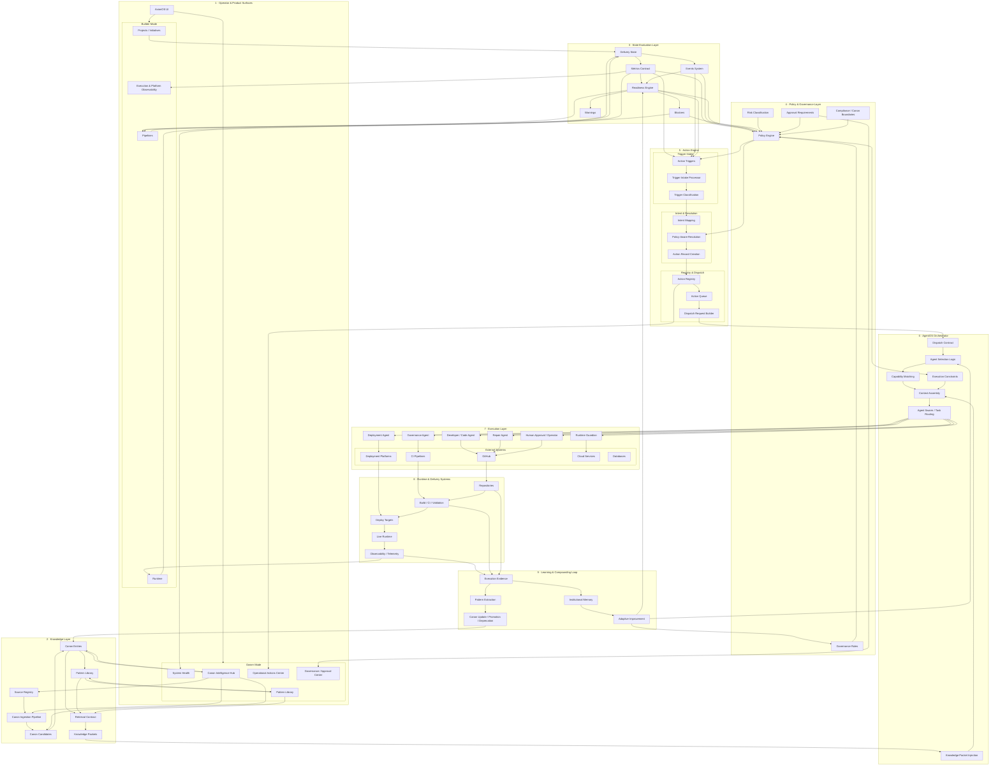

# AxionOS System Brain Map — V2

> **Purpose:** Canonical high-level architectural map for developers, AI coding agents, system operators, and future contributors.
> **Version:** 2.0
> **Last Updated:** 2026-03-11

---

## What This Document Is

This is the **canonical architectural brain map** of AxionOS — a comprehensive diagram showing all major subsystems, their internal structure, contracts between layers, governance boundaries, domain objects, and the direction of information and action flow.

It is designed to be:

- **Readable** — understand the full system at a glance
- **Canonical** — the official reference for system topology
- **Navigable** — locate any subsystem and understand its role
- **Contractual** — see the binding interfaces between layers
- **Governed** — identify which flows require policy or human approval

**Canonical operational principle:**

> Canon informs, signals evaluate, policy constrains, Action Engine formalizes, AgentOS orchestrates, executors act, evidence learns.

---

## Brain Map V2

---

## Section Reference

### 1. Surfaces

The UI is the visible face of the system, split by operational role:

- **Builder Mode** — operates initiatives, pipelines, runtime, and observability
- **Owner Mode** — operates platform health, canonical knowledge, governance, and operational actions

All surfaces connect downward to internal subsystems and receive upward feedback from signals, telemetry, and governance state.

### 2. Knowledge Layer

Where AxionOS learns, organizes, and delivers institutional knowledge:

| Component | Role |
|-----------|------|
| **Source Registry** | Tracks all knowledge sources |
| **Canon Ingestion Pipeline** | Normalizes, validates, and processes incoming knowledge |
| **Canon Candidates** | Staging area for knowledge awaiting promotion |
| **Canon Entries** | Validated, authoritative knowledge |
| **Pattern Library** | Structured catalog of patterns, anti-patterns, and operational guides |
| **Retrieval Contract** | Query interface for knowledge consumers |
| **Knowledge Packets** | Assembled knowledge bundles injected into agent context |

**Flow:** Sources → Ingestion → Candidates → Canon → Patterns → Retrieval → Knowledge Packets

**Contract:** Knowledge Packets are the sole interface through which agents consume canonical knowledge. No agent reads Canon directly.

### 3. State Evaluation Layer

Where the system measures and interprets its operational state:

| Component | Role |
|-----------|------|
| **Delivery State** | Aggregated state from projects, pipelines, and runtime |
| **Metrics Contract** | Quantitative measurements of system behavior |
| **Events System** | Discrete system events (build, deploy, failure, etc.) |
| **Readiness Engine** | Evaluates whether a stage or initiative is ready to proceed |
| **Blockers / Warnings** | Identified impediments or risks |

**Flow:** Projects / Pipelines / Runtime → Delivery State → Metrics / Events → Readiness → Blockers / Warnings

**Contract:** Signals feed both the Policy Engine (for constraint evaluation) and the Action Engine (for trigger generation). No action is created without signal evidence.

### 4. Policy & Governance Layer

Where operational limits and governance boundaries are enforced:

| Component | Role |
|-----------|------|
| **Policy Engine** | Evaluates rules against context, produces structured decisions |
| **Governance Rules** | Organizational and system-level rules |
| **Risk Classification** | Categorizes actions by risk level |
| **Approval Requirements** | Determines which actions require human approval |
| **Compliance Boundaries** | Canon-derived compliance constraints |

**Inputs:** Metrics, events, readiness state, blockers

**Outputs:** Execution constraints, approval requirements, blocked actions

**Contract:** `PolicyContext + PolicyRule[] → PolicyDecision`. The Policy Engine is a pure evaluation function — it does not execute tasks, select agents, or mutate state.

### 5. Action Engine

Where signals become formalized, traceable operational actions. This is the operational decision layer with a full internal pipeline:

| Component | Sprint | Role |
|-----------|--------|------|
| **Action Triggers** | AE-01 | Domain events that initiate the action lifecycle |
| **Trigger Intake** | AE-02 | Receives and validates triggers from any source |
| **Trigger Classification** | AE-02 | Classifies triggers by type and source |
| **Intent Mapping** | AE-02 | Maps classified triggers to structured ActionIntents |
| **Policy-Aware Resolution** | AE-03 | Resolves intents into policy-governed ActionRecords |
| **Action Record Creation** | AE-03 | Creates the formal, auditable action record |
| **Action Registry** | AE-04 | Central registry tracking all actions and status transitions |
| **Action Queue** | AE-04 | Ordered queue of actions ready for dispatch |
| **Dispatch Request Builder** | AE-05 | Bridges Action Engine to AgentOS via structured dispatch requests |

**Flow:** Triggers → Intake → Classification → Intent → Resolution → Record → Registry → Queue → Dispatch

**Trigger Sources:** metrics, events, readiness, policy decisions

**Key Domain Objects:**
- `ActionTrigger` — event that initiates the pipeline
- `ActionIntent` — what the action aims to achieve
- `ActionRecord` — the governed, auditable action with status lifecycle
- `ActionDispatchRequest` — the bridge to AgentOS

**Approval Hook (AE-07):** Actions flagged as `approval_required` are held in the registry with status `waiting_approval` until the `ApprovalManager` receives a valid decision.

**Operational Flows (AE-07):**
- `readiness_complete` → `deploy_initiative`
- `build_failed` → `assign_repair_task`
- `deploy_failed` → `open_investigation`
- `runtime_degraded` → `rollback_release`
- `policy_violation` → `freeze_pipeline`

### 6. AgentOS Orchestrator

Where execution is coordinated and agents are dispatched:

| Component | Role |
|-----------|------|
| **Dispatch Contract** | Receives dispatch requests from Action Engine |
| **Agent Selection Logic** | Selects the best agent for the task |
| **Capability Matching** | Matches task requirements to agent capabilities |
| **Context Assembly** | Assembles execution context from knowledge, constraints, and task data |
| **Knowledge Packet Injection** | Injects canonical knowledge into agent context |
| **Execution Constraints** | Policy-derived limits on agent behavior |
| **Agent Swarm / Task Routing** | Routes tasks to agents or agent groups |

**Inputs:** Dispatch Request, Knowledge Packets, Policy Constraints

**Output:** Agent Dispatch to Execution Layer

**Contract:** No agent is dispatched without a valid `ActionDispatchRequest` containing policy constraints and knowledge context.

### 7. Execution Layer

Where actions are performed by agents and humans:

| Actor | Responsibility |
|-------|---------------|
| **Developer Agent** | Code generation, refactoring, implementation |
| **Repair Agent** | Failure investigation, fix generation |
| **Deployment Agent** | Build, deploy, release management |
| **Runtime Guardian** | Runtime monitoring, degradation response |
| **Governance Agent** | Policy enforcement, compliance verification |
| **Human Operator** | Approval, oversight, structural decisions |

**External Systems:** GitHub, CI pipelines, deployment platforms, cloud services, databases

### 8. Runtime & Delivery Systems

Where software moves from code to production:

**Flow:** Repositories → CI / Build → Deploy Targets → Live Runtime → Telemetry

**Contract:** Telemetry is the mandatory feedback channel. All runtime behavior must produce observable evidence that feeds the learning system.

### 9. Learning & Compounding Loop

Where the system builds institutional intelligence over time:

| Component | Role |
|-----------|------|
| **Execution Evidence** | Raw observations from execution |
| **Pattern Extraction** | Identifies recurring patterns from evidence |
| **Canon Update** | Promotes, deprecates, or updates canonical knowledge |
| **Institutional Memory** | Durable organizational knowledge |
| **Adaptive Improvement** | Applies learnings to improve governance, routing, and readiness |

**Flow:**
- Telemetry / CI / Repo → Evidence → Pattern Extraction → Canon Update → Canon
- Evidence → Memory → Improvement → Governance Rules / Agent Selection / Readiness

**Contract:** Learning is always advisory. Canon promotion requires governance review. No autonomous structural mutation.

---

## Governed Flows

The following flows are **governed** — they require policy evaluation or human approval before proceeding:

| Flow | Governance Requirement |
|------|----------------------|
| **Action Resolution** | Every intent must pass through Policy-Aware Resolution |
| **Agent Dispatch** | Constrained by Policy Engine output |
| **Human Approval Hooks** | Actions with `approval_required` mode are held until approved |
| **Canon Promotion** | Requires governance review before candidates become canon |
| **Structural System Changes** | Require human approval — no autonomous mutation |

---

## Contracts Between Layers

| From | To | Contract |
|------|----|----------|
| Knowledge → AgentOS | Knowledge Packets | Agents consume knowledge only via assembled packets |
| Signals → Policy | PolicyContext | Structured signal data for rule evaluation |
| Signals → Action Engine | ActionTrigger | Typed triggers with source evidence |
| Policy → Action Engine | PolicyDecision | Constraints, mode, approval requirements |
| Action Engine → AgentOS | ActionDispatchRequest | Fully governed dispatch with constraints and context |
| AgentOS → Executors | WorkInput + ExecutionContext | Goal, constraints, artifacts, memory |
| Executors → Runtime | Commits / Deploys | Code and configuration changes |
| Runtime → Learning | Telemetry / Evidence | Observable execution data |
| Learning → Knowledge | Canon Update | Pattern promotion, deprecation |
| Learning → Governance | Adaptive Improvement | Updated rules and readiness criteria |

---

## Information Flow Direction

| Direction | What Flows |
|-----------|-----------|
| **Top → Down** | Knowledge, signals, constraints, formalized actions, dispatch, execution |
| **Bottom → Up** | Evidence, patterns, canon updates, improvements |
| **Left → Right** (within layers) | Processing within a subsystem |

---

## Canonical One-Liner

> **Canon informs, signals evaluate, policy constrains, Action Engine formalizes, AgentOS orchestrates, executors act, evidence learns.**

---

## Source of Truth

This diagram must stay synchronized with:

- **[ARCHITECTURE.md](../ARCHITECTURE.md)** — Section 4B: Operational Decision Chain
- **[AXION_CONTEXT.md](../AXION_CONTEXT.md)** — Operational context and subsystem roles
- **[GOVERNANCE.md](../GOVERNANCE.md)** — Agent OS contracts and governance reference
- **[CANON_INTELLIGENCE_ENGINE.md](../CANON_INTELLIGENCE_ENGINE.md)** — Knowledge layer architecture
