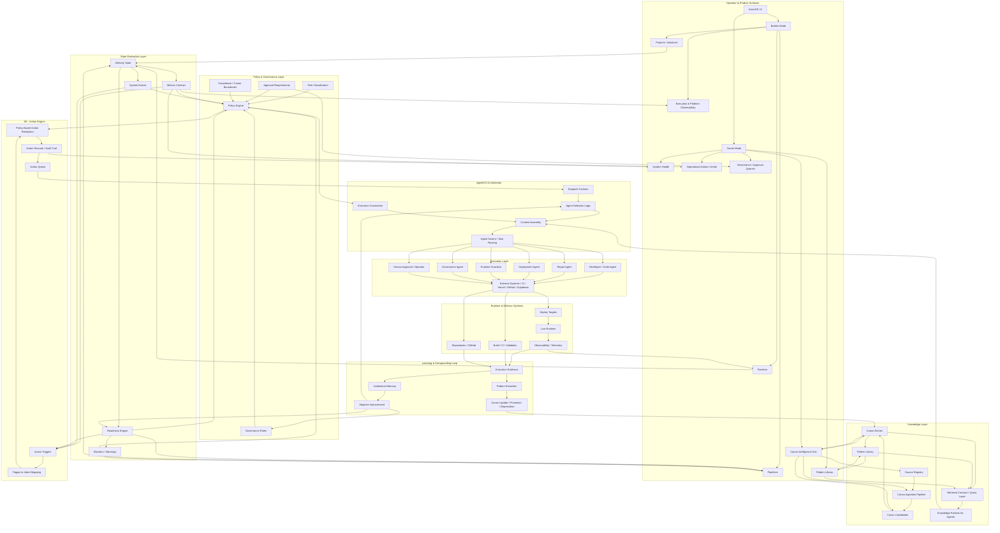

# AxionOS System Brain Map

> **Purpose:** Canonical high-level architectural map for developers, AI coding agents, system operators, and future contributors.
> **Last Updated:** 2026-03-11

---

## What This Document Is

This is the **visual brain map** of AxionOS — a single diagram showing all major subsystems, their relationships, and the direction of information and action flow.

It is designed to be:

- **Readable** — understand the full system at a glance
- **Canonical** — the official reference for system topology
- **Navigable** — locate any subsystem and understand its role

**Canonical reading principle:**

> Canon informs, signals evaluate, policy constrains, Action Engine formalizes, AgentOS orchestrates, executors act, evidence learns.

---

## Brain Map

---

## How to Read This Diagram

### 1. Surfaces

The UI is the visible face of the system:

- **Builder** operates initiatives, pipelines, and runtime
- **Owner** operates platform health, canon, governance, and actions

### 2. Knowledge Layer

Where AxionOS learns, organizes, and delivers knowledge:

- **Sources** → **Ingestion** → **Candidates** → **Canon** → **Patterns** → **Retrieval** → **Knowledge Packets**

### 3. State Evaluation Layer

Where the system measures and interprets its state:

- **Delivery State** → **Metrics**, **Events**, **Readiness** → **Blockers/Warnings**

### 4. Policy & Governance

Where operational limits are enforced:

- **Risk**, **Compliance**, **Approval Requirements**, **Governance Rules** → **Policy Engine**

### 5. Action Engine

Where signals become formal actions:

- **Triggers** → **Intents** → **Policy-Aware Resolution** → **Action Records** → **Action Queue**

### 6. AgentOS Orchestrator

Where execution is coordinated:

- **Dispatch** → **Selection** → **Context Assembly** (with Knowledge Packets + Constraints) → **Swarm**

### 7. Execution Layer

Where actions are performed:

- **Code Agents**, **Repair Agents**, **Deploy Agents**, **Runtime Guardians**, **Governance Agents**, **Human Operators** → **External Systems**

### 8. Learning & Compounding Loop

Where the system builds institutional intelligence over time:

- **Evidence** → **Pattern Extraction** → **Canon Update** → Canon
- **Evidence** → **Memory** → **Improvement** → Governance Rules, Agent Selection, Readiness

---

## Information Flow Direction

| Direction | What Flows |
|-----------|-----------|
| **Top → Down** | Knowledge, signals, constraints, formalized actions, dispatch, execution |
| **Bottom → Up** | Evidence, patterns, canon updates, improvements |
| **Left → Right** (within layers) | Processing within a subsystem |

---

## Governed Flows

The following flows are **governed** — they require policy evaluation before proceeding:

- Action Engine resolution (requires Policy input)
- AgentOS dispatch (constrained by Policy)
- Human Approval hooks (escalation from Action Engine or AgentOS)
- Canon promotion (requires governance review)
- Structural mutations (require human approval)

---

## Canonical One-Liner

> **Canon informs, signals evaluate, policy constrains, Action Engine formalizes, AgentOS orchestrates, executors act, evidence learns.**

---

## Source of Truth

This diagram must stay synchronized with:

- **[ARCHITECTURE.md](../ARCHITECTURE.md)** — Section 4B: Operational Decision Chain
- **[AXION_CONTEXT.md](../AXION_CONTEXT.md)** — Operational context and subsystem roles
- **[GOVERNANCE.md](../GOVERNANCE.md)** — Agent OS contracts and governance reference